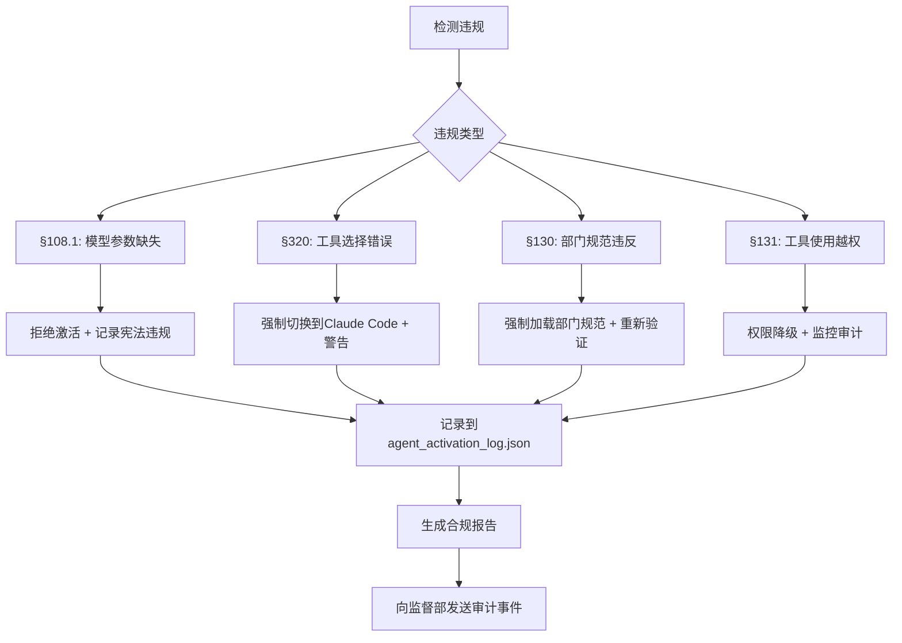

# Agent 参数矩阵规范 - Phase 16

**版本**: v1.0.0 (Phase 16 设计验收)
**宪法依据**: §108.1模型参数强制指定子原则、§320 L2+项目Claude Code强制使用原则、§130部门规范统一适用原则、§131部门工具使用约束
**最后更新**: 2026-03-09
**关联文档**: `authority-core-design-phase16.md` (Authority Core 设计)
**目标**: 为 Negentropy-Lab 建立统一的Agent参数矩阵，确保部门Agent的宪法合规性

---

## 1. 设计目标

### 1.1 核心问题
当前 `Negentropy-Lab` 的Agent管理存在以下问题：
- Agent模型参数未显式指定，依赖默认配置
- 部门身份与权限边界模糊
- Claude Code使用边界不明确，存在OpenClaw违规风险
- 能力权限缺乏统一管理

### 1.2 解决方案
建立 **Agent参数矩阵**：
1. **显式模型参数**：每个Agent必须明确指定model、provider、trustLevel
2. **部门参数模板**：按部门定义标准配置模板
3. **能力权限矩阵**：基于部门角色定义能力权限
4. **Claude Code边界**：明确L2+项目强制使用Claude Code CLI

### 1.3 宪法合规要求
- **§108.1**：所有sessions_spawn操作必须显式指定model参数
- **§320**：L2+项目必须使用Claude Code CLI开发
- **§130**：部门Agent必须遵守部门规范统一适用原则
- **§131**：部门Agent必须遵守部门特定的工具使用约束

---

## 2. 部门Agent分类与模型参数

### 2.1 部门分类矩阵

| 部门 | 代码 | 宪法层级 | 标准模型 | 备用模型 | 模型Tier | 默认Provider |
|------|------|----------|----------|----------|----------|--------------|
| **办公厅主任** | `OFFICE` | T0 (核心层) | `zai/glm-5` | `minimax/MiniMax-M2.5` | Tier 0 | zai |
| **科技部** | `TECHNOLOGY` | T0 (部门层) | `minimax/MiniMax-M2.5` | `zai/glm-4.7` | Tier 1 | minimax |
| **外交部** | `FOREIGN_AFFAIRS` | T0 (部门层) | `minimax/MiniMax-M2.1` | `minimax/MiniMax-M2.5` | Tier 1 | minimax |
| **监督部** | `MOS` | T0 (部门层) | `zai/glm-4.7-flash` | `minimax/MiniMax-M2.5` | Tier 2 | zai |
| **内阁** | `CABINET` | T0 (协调层) | `zai/glm-5` | `minimax/MiniMax-M2.5` | Tier 0 | zai |
| **测试Agent** | `TEST` | T2 (测试层) | `simulated` | - | Tier 3 | simulated |

**宪法依据**：
- **§108 异构模型策略公理**：办公厅主任使用Tier 0，执行层使用Tier 1/2
- **DS-003 模型选择矩阵**：部门专用模型策略

### 2.2 模型参数强制指定要求

#### 2.2.1 sessions_spawn 操作模板

```json
{
  "model": "minimax/MiniMax-M2.5",  // §108.1: 必须显式指定
  "provider": "minimax",            // 必须显式指定
  "agentId": "technology_agent_001",
  "department": "TECHNOLOGY",
  "role": "minister",
  "trustLevel": 0.9,
  "capabilities": ["observe:*", "propose:*", "invoke:tool:*"],
  "instructions": "前置 departments/technology/AGENTS.md 和 IDENTITY.md 内容\n我是科技部长，必须在Claude Code CLI会话中开发",
  "constitutionReferences": ["§108.1", "§320", "§130", "§131"]
}
```

#### 2.2.2 违反§108.1的后果

| 违规类型 | 检测方法 | 系统响应 | 宪法依据 |
|----------|----------|----------|----------|
| **未指定model参数** | `scripts/check_activation_compliance.py` | 拒绝激活，记录宪法违规 | §108.1 |
| **使用默认Tier 0模型** | 监控实际使用模型 | 警告并切换到部门标准模型 | §108 |
| **模型与部门不匹配** | 部门-模型映射表校验 | 强制纠正，记录审计事件 | §130 |

### 2.3 Claude Code使用边界矩阵

#### 2.3.1 工具选择决策树

```
是否为L2+项目？
├── 是 → 必须使用Claude Code CLI (§320)
│   ├── 科技部项目 → 使用MiniMax M2.5标准流程
│   ├── 其他部门 → 使用部门指定模型
│   └── 记录会话到 ~/.claude/sessions/
└── 否 → 允许使用OpenClaw
    ├── L0/L1简单任务 → OpenClaw允许
    ├── 行政协调 → OpenClaw允许
    └── 非开发性任务 → OpenClaw允许
```

#### 2.3.2 Claude Code标准流程

```bash
# 科技部L2+项目标准命令模板
python scripts/claude_compat.py --run -- "基于DS-050实现[功能]，遵守§119主题驱动开发" --model "MiniMax-M2.5"

# 命令优先级
1. claude-minimax (优先)
2. python scripts/claude_compat.py --run (兼容层)
3. 直接claude命令 + --model参数 (最后备选)

# 环境验证命令
python scripts/claude_compat.py --check  # 验证CLI可用性
echo $ANTHROPIC_MODEL                    # 应该输出: "MiniMax-M2.5"
```

#### 2.3.3 OpenClaw使用禁令

**严禁使用OpenClaw进行**：
- ❌ L2+项目代码开发
- ❌ 生产级系统重构
- ❌ 宪法合规验证
- ❌ 技术资产创建

**允许使用场景**：
- ✅ 行政协调
- ✅ 非开发性任务
- ✅ L0/L1简单任务
- ✅ 文档编辑与整理

---

## 3. 能力权限矩阵

### 3.1 权限类型定义

| 权限类型 | 代码 | 描述 | 宪法依据 |
|----------|------|------|----------|
| **观察权限** | `observe:*` | 读取状态，查看信息 | §152 |
| **提案权限** | `propose:*` | 提交Mutation提案 | §101 |
| **提交权限** | `commit:*` | 直接提交状态变更 | §130 |
| **工具调用权限** | `invoke:tool:*` | 调用MCP工具 | §320 |
| **治理权限** | `govern:*` | 参与治理决策 | §102 |
| **分发权限** | `dispatch:*` | 分发任务给其他Agent | §110 |

### 3.2 部门权限矩阵

| 部门 | 默认权限 | 扩展权限 | 权限限制 |
|------|----------|----------|----------|
| **办公厅主任** | `observe:*`, `propose:*`, `commit:*`, `govern:*`, `dispatch:*` | `invoke:tool:*` | 无 |
| **科技部** | `observe:*`, `propose:*`, `invoke:tool:*` | `commit:technology:*` | 仅限科技部管辖范围 |
| **外交部** | `observe:*`, `propose:foreign_affairs:*` | `invoke:tool:communication:*` | 严禁访问其他部门文件 (§301) |
| **监督部** | `observe:*`, `propose:*`, `govern:monitoring:*` | `invoke:tool:audit:*` | 只读访问其他部门状态 |
| **内阁** | `observe:*`, `propose:*`, `dispatch:*` | `invoke:tool:coordination:*` | 无提交权限，仅协调 |

### 3.3 角色权限细分

#### 3.3.1 部长级 (Minister)
- **权限**: 部门内 `commit:*` + `dispatch:*`
- **责任**: 部门决策与任务分发
- **宪法约束**: 必须严格遵守部门AGENTS.md规范

#### 3.3.2 工作级 (Worker)
- **权限**: `observe:*` + `propose:*` (部门内)
- **责任**: 执行具体任务
- **宪法约束**: 无提交权限，所有变更需部长批准

#### 3.3.3 专家级 (Specialist)
- **权限**: `observe:*` + `propose:*` + `invoke:tool:*` (特定工具)
- **责任**: 专业技术支持
- **宪法约束**: 工具使用受部门限制

### 3.4 权限验证流程

```typescript
// 权限验证伪代码
function validatePermission(agent: AgentSessionState, requiredCapability: string): boolean {
    // 1. 检查部门权限
    if (!agent.capabilities.has(requiredCapability)) {
        return false;
    }

    // 2. 检查部门隔离 (§301)
    if (requiredCapability.includes("commit:")) {
        const targetDept = extractDepartmentFromPath(targetPath);
        if (agent.department !== targetDept) {
            return false; // 跨部门提交禁止
        }
    }

    // 3. 检查工具使用约束 (§131)
    if (requiredCapability.startsWith("invoke:tool:")) {
        const toolType = extractToolType(requiredCapability);
        if (!isToolAllowedForDepartment(agent.department, toolType)) {
            return false;
        }
    }

    return true;
}
```

---

## 4. Agent会话状态参数

### 4.1 AgentSessionState 参数矩阵

基于 `authority-core-design-phase16.md` 中定义的 `AgentSessionState`，详细参数如下：

| 字段 | 类型 | 必填 | 默认值 | 验证规则 | 宪法依据 |
|------|------|------|--------|----------|----------|
| `id` | string | 是 | - | UUID v4格式 | §106 |
| `name` | string | 是 | - | 部门前缀: `[部门]_[角色]_[序号]` | §106 |
| `department` | string | 是 | - | 必须为已注册部门代码 | §130 |
| `role` | string | 是 | - | `minister`/`worker`/`specialist` | §130 |
| `model` | string | 是 | - | 必须为部门允许模型列表内 | §108.1 |
| `provider` | string | 是 | - | `minimax`/`zai`/`simulated` | §108.1 |
| `trustLevel` | number | 否 | 1.0 | [0.0, 1.0] | §130 |
| `lane` | string | 否 | "default" | 并发通道标识 | §110 |
| `currentLoad` | number | 否 | 0 | [0.0, 1.0] | §110 |
| `lease` | string | 否 | "" | 任务租约ID | §110 |
| `lastHeartbeat` | number | 自动 | Date.now() | 时间戳 | §110 |
| `available` | boolean | 否 | true | - | §110 |

### 4.2 部门标准配置模板

#### 4.2.1 科技部Agent模板

```typescript
const techAgentTemplate: Partial<AgentSessionState> = {
    department: "TECHNOLOGY",
    role: "minister", // 或 "worker", "specialist"
    model: "minimax/MiniMax-M2.5",
    provider: "minimax",
    trustLevel: 0.9,
    capabilities: new Map([
        ["observe:*", "enabled"],
        ["propose:*", "enabled"],
        ["invoke:tool:*", "enabled"],
        ["commit:technology:*", "enabled"], // 仅部长有提交权限
    ]),
    lane: "development",
};
```

#### 4.2.2 外交部Agent模板

```typescript
const foreignAffairsAgentTemplate: Partial<AgentSessionState> = {
    department: "FOREIGN_AFFAIRS",
    role: "minister",
    model: "minimax/MiniMax-M2.1",
    provider: "minimax",
    trustLevel: 0.8,
    capabilities: new Map([
        ["observe:*", "enabled"],
        ["propose:foreign_affairs:*", "enabled"],
        ["invoke:tool:communication:*", "enabled"],
        // 无commit权限，无跨部门访问权限
    ]),
    lane: "diplomacy",
};
```

#### 4.2.3 监督部Agent模板

```typescript
const mosAgentTemplate: Partial<AgentSessionState> = {
    department: "MOS",
    role: "monitor",
    model: "zai/glm-4.7-flash",
    provider: "zai",
    trustLevel: 1.0, // 监督部需要最高信任等级
    capabilities: new Map([
        ["observe:*", "enabled"], // 可观察所有部门状态
        ["propose:*", "enabled"],
        ["govern:monitoring:*", "enabled"],
        ["invoke:tool:audit:*", "enabled"],
        // 无commit权限，仅监控
    ]),
    lane: "monitoring",
};
```

### 4.3 会话生命周期参数

| 生命周期阶段 | 参数 | 默认值 | 宪法依据 |
|--------------|------|--------|----------|
| **注册** | `maxRegistrationAttempts` | 3 | §106 |
| **心跳** | `heartbeatInterval` | 30秒 | §110 |
| **超时** | `sessionTimeout` | 5分钟 | §110 |
| **负载均衡** | `maxConcurrentTasks` | 5 | §110 |
| **恢复** | `maxRecoveryAttempts` | 3 | §110 |

---

## 5. Claude Code开发规范

### 5.1 L2+项目判定标准

使用 `project_complexity_analyzer.py` 进行L2+判定：

```bash
python3 scripts/core_index/analyzers/project_complexity_analyzer.py \
  --task "实现权威状态核心" \
  --output-level
```

**L2+判定标准**：
1. **代码行数** > 500行
2. **架构复杂度** > 中等（涉及多个模块交互）
3. **宪法影响** > 中等（影响核心宪法原则）
4. **测试要求** > 需要完整测试套件
5. **文档要求** > 需要详细设计文档

### 5.2 Claude Code会话管理

#### 5.2.1 会话记录要求

```bash
# 标准会话记录结构
~/.claude/sessions/
├── 2026-03-09_authority-core-phase16/
│   ├── 01-design-discussion.md
│   ├── 02-schema-implementation.md
│   ├── 03-mutation-pipeline.md
│   └── README.md (包含宪法引用和验收标准)
```

#### 5.2.2 宪法引用要求

每个Claude Code会话必须包含宪法引用头部：

```markdown
# Claude Code会话记录
**项目**: Authority Core - Phase 16
**宪法依据**: §108.1, §320, §130, §101, §102
**模型**: minimax/MiniMax-M2.5
**开发规范**: departments/technology/AGENTS.md v4.3.0
```

### 5.3 工具选择验证脚本

```bash
# 工具选择合规性验证
python3 scripts/claude_code/validate_tool_choice.py \
  --task "实现AuthorityState Schema" \
  --tool claude_code_cli \
  --model "MiniMax-M2.5" \
  --constitution-check
```

**验证结果处理**：
- **通过**：允许使用Claude Code CLI
- **警告**：需要人工复核工具选择
- **拒绝**：必须使用OpenClaw（非L2+项目）

---

## 6. 部门规范统一适用实施

### 6.1 规范继承机制

#### 6.1.1 sessions_spawn指令模板

```json
{
  "model": "[部门标准模型]",
  "instructions": "前置 [部门]/AGENTS.md 和 IDENTITY.md 内容\n[部门身份声明]\n\n宪法约束:\n1. §108.1: 必须使用指定模型参数\n2. §320: L2+项目必须使用Claude Code CLI\n3. §130: 必须遵守部门规范统一适用\n4. §131: 必须遵守部门工具使用约束",
  "environment": {
    "DEPARTMENT": "[部门代码]",
    "CONSTITUTION_REFS": "§108.1 §320 §130 §131"
  }
}
```

#### 6.1.2 身份认知验证要求

**正确身份认知**（必须）：
- "我是[部门]部长，必须在Claude Code CLI会话中开发"
- "我遵守[部门]/AGENTS.md中的所有规范"
- "我的模型参数是[model]，符合§108.1要求"

**错误身份认知禁止**：
- "我是[部门]子代理，使用OpenClaw的write工具就是开发"
- "我可以忽略模型参数要求"
- "我可以访问其他部门文件"

### 6.2 宪法合规检查清单

#### 6.2.1 Agent激活前检查
- [ ] **§108.1合规**：model参数显式指定
- [ ] **§320合规**：工具选择符合L2+项目要求
- [ ] **§130合规**：部门规范正确前置
- [ ] **§131合规**：部门工具使用约束明确
- [ ] **身份认知正确**：Agent指令包含正确身份声明

#### 6.2.2 Agent激活后验证
```bash
# 激活后验证脚本
python3 scripts/core_index/validators/verify_tech_activation.py \
  --agent [agent_id] \
  --mode full \
  --output compliance_report.json
```

**验证项目**：
1. **模型参数验证**：实际使用模型是否为指定模型
2. **身份认知验证**：Agent自我认知是否正确
3. **宪法知识验证**：Agent是否掌握相关宪法条文
4. **工具使用验证**：Agent是否遵守工具约束

### 6.3 违规处理流程



---

## 7. 实施与验收标准

### 7.1 Phase 16 验收标准

#### 7.1.1 参数矩阵实施
- [ ] `AgentSessionState` Schema 包含所有必需字段
- [ ] 部门标准配置模板可用
- [ ] 权限验证函数实现
- [ ] 模型参数验证逻辑实现

#### 7.1.2 宪法合规实施
- [ ] §108.1 验证：所有Agent激活必须指定model参数
- [ ] §320 验证：L2+项目使用Claude Code CLI
- [ ] §130 验证：部门规范正确继承
- [ ] §131 验证：部门工具使用约束生效

#### 7.1.3 工具链实施
- [ ] `validate_tool_choice.py` 脚本可用
- [ ] `project_complexity_analyzer.py` L2+判定准确
- [ ] `verify_tech_activation.py` 验证脚本可用
- [ ] Claude Code会话记录规范建立

### 7.2 测试用例矩阵

| 测试场景 | 输入 | 预期结果 | 宪法依据 |
|----------|------|----------|----------|
| **科技部Agent激活** | model="minimax/MiniMax-M2.5" | 激活成功 | §108.1 |
| **未指定model参数** | model=null | 激活拒绝 | §108.1 |
| **L2+项目OpenClaw开发** | tool="openclaw", complexity="L2+" | 工具选择拒绝 | §320 |
| **跨部门提交尝试** | dept="TECHNOLOGY", target="FOREIGN_AFFAIRS" | 权限拒绝 | §130, §301 |
| **外交部越权访问** | path="departments/technology/AGENTS.md" | 访问拒绝 | §301 |

### 7.3 监控与审计

#### 7.3.1 监控指标
- **模型合规率**：指定model参数的Agent比例
- **工具选择合规率**：L2+项目正确使用Claude Code的比例
- **部门规范继承率**：正确前置部门规范的Agent比例
- **权限违规率**：越权访问尝试次数

#### 7.3.2 审计记录
所有Agent激活操作记录到 `memory/agent_activation_log.json`：

```json
{
  "timestamp": "2026-03-09T10:30:00Z",
  "agentId": "technology_agent_001",
  "department": "TECHNOLOGY",
  "model": "minimax/MiniMax-M2.5",
  "constitutionCompliance": {
    "§108.1": "PASS",
    "§320": "PASS",
    "§130": "PASS",
    "§131": "PASS"
  },
  "verificationResult": {
    "identityCheck": "PASS",
    "toolChoice": "Claude Code CLI",
    "permissions": ["observe:*", "propose:*", "invoke:tool:*"]
  }
}
```

---

## 8. 后续阶段扩展

### Phase 17 (Agent Runtime)
- 扩展：实时Agent负载监控与动态调度
- 依赖：本规范中的AgentSessionState架构
- 目标：实现Agent自动扩缩容

### Phase 18 (治理升级)
- 扩展：基于trustLevel的动态权限调整
- 依赖：本规范中的trustLevel字段
- 目标：实现信任链与权限委托

### Phase 19 (协同升级)
- 扩展：跨部门Agent协作协议
- 依赖：本规范中的部门权限矩阵
- 目标：实现安全跨部门协作

### Phase 20 (多节点)
- 扩展：分布式Agent会话同步
- 依赖：本规范中的会话状态设计
- 目标：支持多节点Agent部署

---

**宪法声明**：本参数矩阵规范是Agent管理的宪法级约束，所有Agent激活、配置、工具选择必须严格遵守本规范。任何偏差必须通过正式的宪法豁免流程审批。

**维护者**：办公厅主任 (Office Director)
**审批状态**：设计验收通过
**生效时间**：Phase 16 实施开始时
