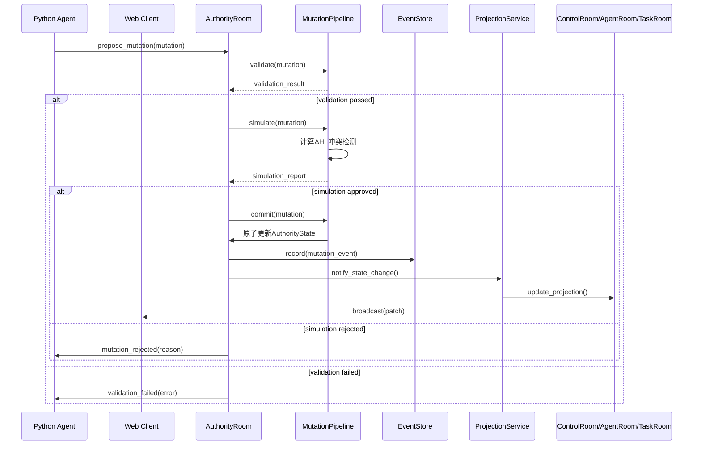

# Authority Core 设计规范 - Phase 16

**版本**: v1.0.0 (Phase 16 设计验收)
**宪法依据**: §101单一真理源原则、§102熵减原则、§103文档优先公理、§130部门规范统一适用原则
**最后更新**: 2026-03-09
**关联文档**: `authoritative-agent-server-transformation-plan.md` (蓝图v0.1)
**目标**: 为 Negentropy-Lab 建立单一权威根状态核心，支持 Mutation Pipeline 与投影机制

---

## 模块边界参考

本设计涉及的 authority、governance、interfaces 与 integration 边界，请同步参照 [module-map.md](./module-map.md)。

## 1. 设计目标

### 1.1 核心问题
当前 `Negentropy-Lab` 存在多个事实源：
- `ControlRoom`、`AgentRoom`、`TaskRoom` 各自持有独立状态
- 状态变更缺乏统一的审计链条
- Agent 协作缺乏权威状态同步

### 1.2 解决方案
建立 **Authority Core** 架构：
1. **单一权威根状态** `AuthorityState` (Colyseus Schema)
2. **权威房间** `AuthorityRoom` 作为唯一状态写入点
3. **Mutation Pipeline** 统一状态变更入口
4. **投影机制** 旧Room降级为投影视图

### 1.3 宪法合规要求
- **§101**: `AuthorityState` 成为系统状态唯一真理源
- **§102**: 所有变更通过 `MutationPipeline` 计算熵值影响
- **§103**: 设计先于实现，本规范为开发依据
- **§130**: Agent 权限与部门身份统一管理

---

## 2. AuthorityState Schema 设计

### 2.1 根状态结构 (TypeScript)

```typescript
// server/schema/AuthorityState.ts
import { Schema, MapSchema, type, ArraySchema } from "@colyseus/schema";

// 系统基础状态
class SystemState extends Schema {
    @type("string") mode: string = "normal"; // normal, recovery, lockdown
    @type("string") status: string = "active";
    @type("number") systemTime: number = Date.now();
    @type("string") version: string = "1.0.0";
}

// 多维熵值状态 (基于§504扩展)
class EntropyState extends Schema {
    @type("number") global: number = 0.3;
    @type("number") financial: number = 0.0;    // H_fin
    @type("number") biological: number = 0.0;   // H_bio (预留)
    @type("number") social: number = 0.0;       // H_soc
    @type("number") task: number = 0.0;         // H_task
    @type("number") system: number = 0.0;       // H_sys
    @type({ map: "number" }) thresholds = new MapSchema<number>(); // 各维度阈值
}

// 部门注册状态
class DepartmentState extends Schema {
    @type("string") name: string;
    @type("string") role: string;
    @type("boolean") active: boolean = true;
    @type("number") lastHeartbeat: number = Date.now();
}

// Agent 会话状态
class AgentSessionState extends Schema {
    @type("string") id: string;
    @type("string") name: string;
    @type("string") department: string;         // 所属部门
    @type("string") role: string;               // 角色 (minister, worker, specialist)
    @type({ map: "string" }) capabilities = new MapSchema<string>(); // 能力权限
    @type("string") model: string;              // 显式指定模型 (§108.1)
    @type("string") provider: string;           // 提供商 (minimax, zai, simulated)
    @type("number") trustLevel: number = 1.0;   // 信任等级 [0.0, 1.0]
    @type("string") lane: string = "default";   // 并发通道
    @type("number") currentLoad: number = 0;    // 当前负载 [0.0, 1.0]
    @type("string") lease: string = "";         // 任务租约
    @type("number") lastHeartbeat: number = Date.now();
    @type("boolean") available: boolean = true;
}

// 任务状态
class TaskState extends Schema {
    @type("string") id: string;
    @type("string") title: string;
    @type("string") department: string;         // 负责部门
    @type("string") status: string;             // pending, processing, completed, failed
    @type("number") priority: number = 1;
    @type("number") createdAt: number = Date.now();
    @type("number") updatedAt: number = Date.now();
}

// 工作流状态
class WorkflowState extends Schema {
    @type("string") id: string;
    @type("string") type: string;               // orchestration, choreography
    @type("string") status: string;             // running, waiting, completed
    @type({ map: "string" }) outputs = new MapSchema<string>(); // 输出结果
}

// 治理状态 (冲突裁决、提案)
class GovernanceState extends Schema {
    @type({ map: "string" }) policies = new MapSchema<string>(); // 治理策略
    @type({ array: "string" }) mutationQueue = new ArraySchema<string>(); // Mutation队列
    @type({ map: "string" }) proposals = new MapSchema<string>(); // 待决策提案
    @type({ map: "boolean" }) approvals = new MapSchema<boolean>(); // 部门批准状态
    @type({ map: "string" }) sanctions = new MapSchema<string>(); // 制裁措施
}

// 工具调用状态
class ToolState extends Schema {
    @type({ map: "string" }) registry = new MapSchema<string>(); // 工具注册表
    @type({ map: "string" }) activeCalls = new MapSchema<string>(); // 活跃调用
    @type({ map: "number" }) quotas = new MapSchema<number>(); // 配额限制
}

// 审计状态
class AuditState extends Schema {
    @type("string") eventCursor: string = "";   // 最后处理事件ID
    @type("string") lastDecisionId: string = ""; // 最后决策ID
    @type("number") integrity: number = 1.0;    // 数据完整性评分 [0.0, 1.0]
}

// 权威根状态
export class AuthorityState extends Schema {
    // 基础系统状态
    @type(SystemState) system = new SystemState();

    // 熵值治理状态
    @type(EntropyState) entropy = new EntropyState();

    // 部门注册
    @type({ map: DepartmentState }) departments = new MapSchema<DepartmentState>();

    // Agent 会话管理
    @type({ map: AgentSessionState }) agents = new MapSchema<AgentSessionState>();

    // 任务管理
    @type({ map: TaskState }) tasks = new MapSchema<TaskState>();

    // 工作流管理
    @type({ map: WorkflowState }) workflows = new MapSchema<WorkflowState>();

    // 治理状态
    @type(GovernanceState) governance = new GovernanceState();

    // 工具调用状态
    @type(ToolState) tools = new ToolState();

    // 审计状态
    @type(AuditState) audit = new AuditState();

    // 元数据
    @type("string") roomId: string = "";
    @type("number") createdAt: number = Date.now();
    @type("number") lastUpdate: number = Date.now();
}
```

### 2.2 状态树路径索引

| 状态路径 | 类型 | 描述 | 宪法依据 |
|----------|------|------|----------|
| `system.mode` | string | 系统模式 (normal/recovery/lockdown) | §102 |
| `entropy.global` | number | 全局加权熵值 $H_{global}$ | §504 |
| `departments["technology"]` | DepartmentState | 科技部注册信息 | §130 |
| `agents[agentId].model` | string | Agent显式指定模型 | §108.1 |
| `agents[agentId].capabilities` | Map<string> | Agent能力权限 | §130 |
| `tasks[taskId].department` | string | 任务负责部门 | §130 |
| `governance.mutationQueue` | Array<string> | Mutation提案队列 | §101 |
| `tools.registry[toolId]` | string | MCP工具注册信息 | §320 |
| `audit.integrity` | number | 审计完整性评分 | §151 |

---

## 3. AuthorityRoom 设计与生命周期

### 3.1 房间配置

```typescript
// server/rooms/AuthorityRoom.ts
import { Room, Client } from "colyseus";
import { AuthorityState } from "../schema/AuthorityState";
import { MutationPipeline } from "../services/authority/MutationPipeline";
import { EventStore } from "../services/authority/EventStore";
import { ProjectionService } from "../services/authority/ProjectionService";

export class AuthorityRoom extends Room<AuthorityState> {
    private mutationPipeline: MutationPipeline;
    private eventStore: EventStore;
    private projectionService: ProjectionService;

    onCreate(options: any) {
        // 初始化权威状态
        this.setState(new AuthorityState());
        this.state.roomId = this.roomId;

        // 初始化服务
        this.mutationPipeline = new MutationPipeline(this.state);
        this.eventStore = new EventStore();
        this.projectionService = new ProjectionService(this.state);

        // 设置状态同步频率 (1Hz)
        this.setPatchRate(1000);

        // 设置仿真循环 (1Hz)
        this.setSimulationInterval((deltaTime) => this.update(deltaTime), 1000);

        // 注册消息处理器
        this.setupMessageHandlers();

        // 初始化默认部门
        this.initializeDefaultDepartments();

        logger.info(`[AuthorityRoom] 权威房间创建: ${this.roomId}`);
    }

    // ... 详细实现见后续章节
}
```

### 3.2 消息处理器设计

| 消息类型 | 处理器方法 | 权限要求 | 宪法依据 |
|----------|------------|----------|----------|
| `propose_mutation` | `handleProposeMutation` | `propose:*` | §101 |
| `query_state` | `handleQueryState` | `observe:*` | §152 |
| `register_agent` | `handleRegisterAgent` | 部门身份验证 | §130 |
| `heartbeat` | `handleHeartbeat` | 有效会话 | §110 |

---

## 4. Mutation Pipeline 详细流程

### 4.1 Mutation 数据结构

```typescript
interface MutationProposal {
    // 标识信息
    mutationId: string;          // UUID v4
    proposer: string;            // 提议者 (agentId 或 system)
    timestamp: number;           // 提案时间戳

    // 目标与内容
    targetPath: string;          // 状态路径 (如 "agents.agent123.capabilities")
    operation: "set" | "add" | "remove" | "update"; // 操作类型
    payload: any;                // 变更负载

    // 治理信息
    reason: string;              // 变更理由
    requiredCapabilities: string[]; // 所需能力权限
    riskLevel: "low" | "medium" | "high"; // 风险评估
    expectedDeltaEntropy: number; // 预期熵值变化 ΔH

    // 追踪信息
    traceId: string;             // 分布式追踪ID
    parentMutationId?: string;   // 父变更ID (用于工作流)
}
```

### 4.2 Pipeline 七阶段流程

```
Proposal -> Validate -> Simulate -> Vote/Policy -> Commit -> Patch Broadcast -> Audit
```

#### 阶段1: Proposal (提案)
- **输入**: Client/Agent 发送 `propose_mutation` 消息
- **处理**: 生成 `mutationId`, 记录到 `governance.mutationQueue`
- **输出**: 返回 `mutation_received` 确认

#### 阶段2: Validate (验证)
- **权限验证**: 检查 `proposer` 是否具有 `requiredCapabilities`
- **语法验证**: 检查 `targetPath` 是否存在且可写
- **宪法验证**: 检查是否违反核心宪法约束 (§101, §102)
- **输出**: 验证结果 (pass/reject + reason)

#### 阶段3: Simulate (模拟)
- **沙盒执行**: 在临时副本上执行变更
- **熵值评估**: 计算 `actualDeltaEntropy` (使用 measure_entropy.py)
- **冲突检测**: 检查与其他活跃变更的冲突
- **输出**: 模拟报告 (包括风险评分)

#### 阶段4: Vote/Policy (投票/策略)
- **自动策略**: 低风险变更自动批准 (`riskLevel="low" && |ΔH|<0.1`)
- **部门投票**: 高风险变更触发部门加权投票
- **内阁裁决**: 跨部门冲突由内阁办公厅裁决
- **输出**: 批准结果 (approved/rejected)

#### 阶段5: Commit (提交)
- **原子写入**: 在 AuthorityState 上执行变更
- **状态更新**: 更新相关状态时间戳
- **租约释放**: 如有相关任务租约，释放之
- **输出**: 状态版本号递增

#### 阶段6: Patch Broadcast (补丁广播)
- **增量计算**: Colyseus 自动计算状态差异
- **定向广播**: 仅向订阅相关路径的客户端发送
- **投影更新**: 触发 ProjectionService 更新旧Room投影
- **输出**: WebSocket patch 消息

#### 阶段7: Audit (审计)
- **事件记录**: 写入 EventStore (append-only)
- **完整性更新**: 更新 `audit.integrity` 评分
- **追溯索引**: 建立 mutationId -> eventId 映射
- **输出**: 审计事件记录

### 4.3 宪法合规检查点

| 检查点 | 检查内容 | 失败处理 | 宪法依据 |
|--------|----------|----------|----------|
| **V1** | proposer 是否有 `requiredCapabilities` | 拒绝: PERMISSION_DENIED | §130 |
| **V2** | targetPath 是否在可写白名单内 | 拒绝: PATH_READONLY | §301 |
| **V3** | expectedDeltaEntropy 是否 ≤ 0 | 警告: 需人工复核 | §102 |
| **V4** | 是否违反部门隔离原则 | 拒绝: ISOLATION_VIOLATION | §301 |
| **V5** | 是否使用指定模型参数 | 拒绝: MODEL_PARAM_MISSING | §108.1 |

---

## 5. 旧Room投影映射机制

### 5.1 投影服务设计

```typescript
// server/services/authority/ProjectionService.ts
export class ProjectionService {
    private authorityState: AuthorityState;

    constructor(authorityState: AuthorityState) {
        this.authorityState = authorityState;
    }

    // 为 ControlRoom 生成投影
    getControlRoomProjection(): ControlRoomState {
        return {
            systemMode: this.authorityState.system.mode,
            globalEntropy: this.authorityState.entropy.global,
            activeAgents: this.countActiveAgents(),
            pendingTasks: this.countTasksByStatus("pending"),
            // ... 其他控制面板所需字段
        };
    }

    // 为 AgentRoom 生成投影
    getAgentRoomProjection(): AgentRegistryState {
        return {
            agents: this.filterAgentsByDepartment(),
            stats: {
                total: this.authorityState.agents.size,
                active: this.countActiveAgents(),
                // ... 其他统计
            }
        };
    }

    // 为 TaskRoom 生成投影
    getTaskRoomProjection(): TaskBoardState {
        return {
            tasks: this.filterTasksByStatus(["pending", "processing"]),
            departments: this.getDepartmentWorkload(),
            // ... 其他任务看板字段
        };
    }
}
```

### 5.2 投影映射表

| 旧Room类型 | 投影数据源 | 更新触发条件 | 迁移状态 |
|------------|------------|--------------|----------|
| **ControlRoom** | `system.*`, `entropy.*`, 聚合统计 | 系统模式/熵值变化 | Phase 16: 只读投影 |
| **AgentRoom** | `agents.*`, `departments.*` | Agent注册/心跳/状态变化 | Phase 16: 只读投影 |
| **TaskRoom** | `tasks.*`, 工作负载统计 | 任务创建/状态更新 | Phase 16: 只读投影 |
| **ConfigRoom** | `system.*`, 阈值配置 | 配置变更 | Phase 17: 配置写入通过Mutation |

### 5.3 迁移路径

**Phase 16** (本阶段):
- 旧Room改为只读投影客户端
- 状态写入统一走 `AuthorityRoom.propose_mutation`
- 旧Room消息转发到 AuthorityRoom

**Phase 17**:
- 旧Room逐步弃用，客户端直接连接 AuthorityRoom
- 提供专用投影API (`/api/projection/{roomType}`)

**Phase 18**:
- 完全移除旧Room，仅保留 AuthorityRoom
- 前端直接使用投影API

---

## 6. 状态转换时序图



---

## 7. 事件流设计

### 7.1 核心事件类型

```typescript
enum AuthorityEventType {
    MUTATION_PROPOSED = "mutation.proposed",
    MUTATION_VALIDATED = "mutation.validated",
    MUTATION_SIMULATED = "mutation.simulated",
    MUTATION_APPROVED = "mutation.approved",
    MUTATION_REJECTED = "mutation.rejected",
    MUTATION_COMMITTED = "mutation.committed",
    STATE_PROJECTION_UPDATED = "state.projection_updated",
    ENTROPY_THRESHOLD_BREACHED = "entropy.threshold_breached",
    AGENT_SESSION_REGISTERED = "agent.session_registered",
    AGENT_SESSION_EXPIRED = "agent.session_expired",
}
```

### 7.2 事件存储策略

| 事件类型 | 保留策略 | 查询接口 | 宪法依据 |
|----------|----------|----------|----------|
| MUTATION_COMMITTED | 永久保留 | `/audit/mutations/{mutationId}` | §151 |
| ENTROPY_THRESHOLD_BREACHED | 永久保留 | `/audit/entropy_events` | §504 |
| AGENT_SESSION_* | 保留30天 | `/audit/agent_sessions` | §106 |
| STATE_PROJECTION_UPDATED | 保留7天 | (调试用) | §101 |

---

## 8. Phase 16 验收标准

### 8.1 功能验收

- [ ] `AuthorityState` Schema 编译通过，可通过Colyseus同步
- [ ] `AuthorityRoom` 可创建并接收 WebSocket 连接
- [ ] `MutationPipeline` 可处理 `propose_mutation` 消息
- [ ] `ProjectionService` 可为旧Room生成正确投影
- [ ] 旧Room可读取投影数据，UI显示正常

### 8.2 性能验收

- [ ] 状态同步延迟 < 100ms (1Hz patch rate)
- [ ] Mutation验证延迟 < 50ms (简单变更)
- [ ] 内存占用: AuthorityState < 10MB (100 Agents + 1000 Tasks)
- [ ] 网络流量: 增量patch平均大小 < 1KB

### 8.3 宪法合规验收

- [ ] 所有状态变更可追踪到 `mutationId` (§101)
- [ ] 每次Mutation计算并记录 `ΔH` (§102)
- [ ] Agent注册必须指定 `model` 参数 (§108.1)
- [ ] 部门Agent只能访问本部门状态 (§130)
- [ ] 审计事件永久存储 (§151)

### 8.4 集成验收

- [ ] 现有 `/health`, `/api/info` API 正常
- [ ] 现有 `/api/agents/status` 返回投影数据
- [ ] Colyseus monitor 可查看 AuthorityRoom
- [ ] 集群集成: 单节点权威工作正常

---

## 9. 后续阶段依赖

### Phase 17 (Agent Runtime)
- 依赖: AuthorityState.agents 架构稳定
- 输入: 本规范中 AgentSessionState 设计
- 输出: 真实Agent会话管理

### Phase 18 (治理升级)
- 依赖: AuthorityState.governance 架构稳定
- 输入: 本规范中 GovernanceState 设计
- 输出: 冲突裁决、熵值熔断

### Phase 19 (协同升级)
- 依赖: AuthorityState.workflows 架构稳定
- 输入: 本规范中 WorkflowState 设计
- 输出: 协议化协同

### Phase 20 (多节点)
- 依赖: AuthorityRoom 单节点稳定
- 输入: 本规范中事件流设计
- 输出: 权威状态多节点复制

---

**宪法声明**: 本设计规范是 Phase 16 实施的唯一真理源，所有实现必须严格遵循此规范。任何变更必须通过正式的Mutation提案流程，并记录宪法依据。

**维护者**: 办公厅主任 (Office Director)
**审批状态**: 设计验收通过 (有条件)
**下一阶段**: 基于本规范创建 Agent Parameter Matrix 与 Entropy Governance Specification
