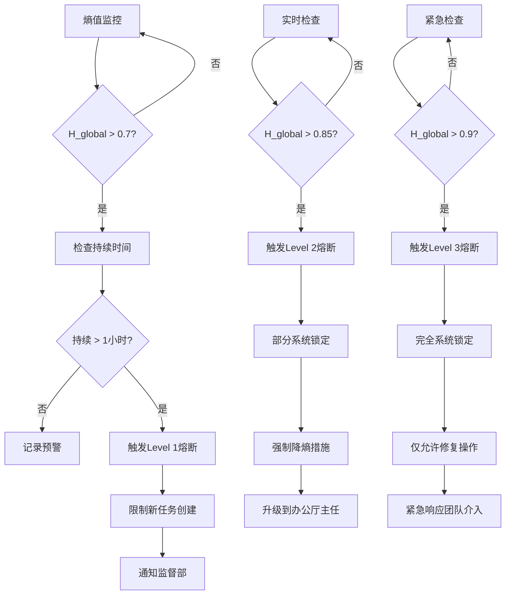

# 熵值治理规范 - Phase 16

**版本**: v1.0.0 (Phase 16 设计验收)
**宪法依据**: §504熵值模型公理、§102熵减原则、§505监控系统公理、WF-007熔断协议
**最后更新**: 2026-03-09
**关联文档**: `authority-core-design-phase16.md` (Authority Core 设计)、`agent-parameter-matrix.md` (Agent参数矩阵)
**目标**: 为 Negentropy-Lab 建立多维熵值治理体系，支持权威核心的熵值监控与熔断机制

---

## 模块边界参考

本熵值治理规范涉及 authority、governance 与 collaboration 的职责分界，请同步参照 [module-map.md](./module-map.md)。

## 1. 设计目标

### 1.1 核心问题
当前 `Negentropy-Lab` 的熵值计算存在以下问题：
- **维度简化**: 当前 `EntropyService` 仅计算 sys/cog/struct 三维度，缺乏多维度治理能力
- **阈值单一**: 缺乏针对不同维度的差异化阈值体系
- **治理缺失**: 熵值超标时缺乏系统级的熔断与治理机制
- **验证不足**: 改造前后的熵值影响缺乏标准化验证口径

### 1.2 解决方案
建立 **多维熵值治理体系**：
1. **扩展维度模型**: 基于§504四维模型扩展为多维（财务、社交、任务、系统等）
2. **分级阈值体系**: 建立即时触发、持续触发、解除条件三级阈值
3. **熔断治理机制**: 集成WF-007熔断协议，实现系统级保护
4. **验证标准口径**: 建立 `measure_entropy.py` 标准化验证流程

### 1.3 宪法合规要求
- **§504**: 必须采用标准化的四维熵值模型计算公式
- **§102**: 所有变更必须满足 $\Delta H_{sys} \le 0$ 熵减要求
- **§505**: 系统必须实时监控宪法合规状态和性能指标
- **WF-007**: 必须建立标准化的熔断协议阈值

---

## 2. 多维熵值模型设计

### 2.1 维度扩展矩阵

基于§504四维模型扩展为六维度治理模型：

| 维度 | 代码 | 权重 | 描述 | 数据源 | 宪法依据 |
|------|------|------|------|--------|----------|
| **财务熵** | H_fin | 20% | 预算偏离、现金流波动、资源消耗 | 财务系统、预算分配 | §504.02 |
| **任务熵** | H_task | 20% | backlog积压、任务阻塞、超时返工 | 任务队列、工作流状态 | §504.02 |
| **系统熵** | H_sys | 20% | 节点健康、错误率、延迟、复杂度 | 系统监控、性能指标 | §504.04 |
| **社交熵** | H_soc | 15% | 社交负载、消息噪声、协作效率 | 社交图谱、通信频率 | §504.02 |
| **结构熵** | H_struct | 15% | 文件组织、信息架构、索引覆盖率 | 文件系统、文档索引 | §504.04.2 |
| **对齐熵** | H_align | 10% | 计划执行、目标跟踪、Git同步状态 | Git状态、计划完成率 | §504.04.3 |

### 2.2 综合熵值计算公式

#### 2.2.1 全局加权熵值公式

```math
H_{global} = 0.20 × H_fin + 0.20 × H_task + 0.20 × H_sys + 0.15 × H_soc + 0.15 × H_struct + 0.10 × H_align
```

**宪法依据**: §504.03 综合系统熵值计算公式公理

#### 2.2.2 各维度计算公式

##### 1. 财务熵 (H_fin)
```math
H_fin = 0.4 × budget_deviation + 0.3 × cashflow_volatility + 0.3 × resource_imbalance
```

**子指标**:
- `budget_deviation`: 实际支出/预算比例，偏离度 (0.0-1.0)
- `cashflow_volatility`: 现金流波动系数 (标准差/均值)
- `resource_imbalance`: 资源分配不均衡度 (基尼系数)

##### 2. 任务熵 (H_task)
```math
H_task = 0.3 × backlog_size + 0.3 × block_ratio + 0.2 × timeout_rate + 0.2 × rework_ratio
```

**子指标**:
- `backlog_size`: 待办任务数 / 最大容量 (假设100)
- `block_ratio`: 阻塞任务数 / 总任务数
- `timeout_rate`: 超时任务数 / 总任务数
- `rework_ratio`: 返工任务数 / 总任务数

##### 3. 系统熵 (H_sys)
```math
H_sys = 0.25 × node_health + 0.25 × error_rate + 0.25 × latency_score + 0.25 × complexity_index
```

**子指标**:
- `node_health`: 不健康节点比例
- `error_rate`: 错误请求率 (错误数/总请求数)
- `latency_score`: 延迟超标率 (P95延迟 > 阈值比例)
- `complexity_index`: 系统复杂度指数 (基于模块耦合度)

##### 4. 社交熵 (H_soc)
```math
H_soc = 0.4 × message_noise + 0.3 × overload_ratio + 0.3 × collaboration_efficiency
```

**子指标**:
- `message_noise`: 低信息量消息比例
- `overload_ratio`: 超邓巴数联系人数比例
- `collaboration_efficiency`: 协作效率 (完成任务数/沟通消息数)

##### 5. 结构熵 (H_struct) - 基于§504.04.2
```math
H_struct = 1 - \frac{\text{索引文件数}}{\text{总文件数}}
```

##### 6. 对齐熵 (H_align) - 基于§504.04.3
```math
H_align = \min\left(1.0, \frac{\text{未提交变更数}}{10}\right)
```

### 2.3 数据源映射表

| 维度 | 权威状态路径 | 实时数据源 | 历史数据源 | 更新频率 |
|------|--------------|------------|------------|----------|
| **H_fin** | `authority.entropy.financial` | 财务系统API | 财务数据库 | 每小时 |
| **H_task** | `authority.entropy.task` | 任务队列监控 | 任务历史库 | 每5分钟 |
| **H_sys** | `authority.entropy.system` | 系统监控指标 | 性能日志 | 每分钟 |
| **H_soc** | `authority.entropy.social` | 社交图谱分析 | 通信日志 | 每15分钟 |
| **H_struct** | `authority.entropy.structural` | 文件系统扫描 | 索引数据库 | 每天 |
| **H_align** | `authority.entropy.alignment` | Git状态检查 | Git历史 | 每30分钟 |

---

## 3. 阈值与熔断策略

### 3.1 熵值状态分级

基于§504.05扩展的多维分级体系：

| H_global 区间 | 状态 | 颜色 | 系统响应 | 行动建议 |
|---------------|------|------|----------|----------|
| **0.0 - 0.3** | 优秀 | 🟢 | 正常推进 | 维持现状，持续监控 |
| **0.3 - 0.5** | 良好 | 🟡 | 轻微优化 | 优化高熵维度，定期检查 |
| **0.5 - 0.7** | 警告 | 🟠 | 主动干预 | 制定降熵计划，限制新任务 |
| **0.7 - 0.85** | 危险 | 🔴 | 熔断准备 | 触发预警，准备锁定 |
| **0.85 - 1.0** | 紧急 | ⚡ | 立即熔断 | 强制锁定，紧急修复 |

### 3.2 多维阈值矩阵

| 维度 | 优秀阈值 | 良好阈值 | 警告阈值 | 危险阈值 | 紧急阈值 |
|------|----------|----------|----------|----------|----------|
| **H_fin** | < 0.2 | 0.2-0.4 | 0.4-0.6 | 0.6-0.8 | ≥ 0.8 |
| **H_task** | < 0.3 | 0.3-0.5 | 0.5-0.7 | 0.7-0.85 | ≥ 0.85 |
| **H_sys** | < 0.1 | 0.1-0.3 | 0.3-0.5 | 0.5-0.7 | ≥ 0.7 |
| **H_soc** | < 0.3 | 0.3-0.5 | 0.5-0.7 | 0.7-0.85 | ≥ 0.85 |
| **H_struct** | < 0.4 | 0.4-0.6 | 0.6-0.8 | 0.8-0.9 | ≥ 0.9 |
| **H_align** | < 0.1 | 0.1-0.3 | 0.3-0.5 | 0.5-0.7 | ≥ 0.7 |

### 3.3 WF-007熔断协议实施

#### 3.3.1 触发条件矩阵

| 熔断级别 | 全局条件 | 维度条件 | 持续时间 | 系统响应 |
|----------|----------|----------|----------|----------|
| **Level 1** | H_global > 0.7 | 任意2个维度 > 警告阈值 | 持续1小时 | 预警通知，限制新任务 |
| **Level 2** | H_global > 0.85 | 任意1个维度 > 紧急阈值 | 立即 | 部分锁定，强制降熵 |
| **Level 3** | H_global > 0.9 | 核心维度(H_sys/H_fin) > 紧急阈值 | 立即 | 完全锁定，仅允许修复操作 |

#### 3.3.2 熔断执行流程



#### 3.3.3 熔断解除条件

| 熔断级别 | 解除条件 | 验证要求 | 解除流程 |
|----------|----------|----------|----------|
| **Level 1** | H_global < 0.5 持续30分钟 | 维度分析报告 | 自动解除，记录事件 |
| **Level 2** | H_global < 0.5 持续1小时 | 降熵措施验证 | 监督部批准解除 |
| **Level 3** | H_global < 0.4 持续2小时 | 根本原因分析报告 | 办公厅主任批准解除 |

### 3.4 试点场景熵值评估

#### 3.4.1 晨间简报场景
- **主要影响维度**: H_task, H_soc, H_align
- **预期熵变**: $\Delta H_{global} ≈ -0.1$ (熵减)
- **监控指标**: 任务完成率、沟通效率、计划对齐度
- **验收标准**: 熵值降低，信息有序度提升

#### 3.4.2 预算冲突裁决场景
- **主要影响维度**: H_fin, H_soc, H_task
- **预期熵变**: $\Delta H_{global} ≈ -0.15$ (熵减)
- **监控指标**: 预算偏离度、冲突解决效率、任务阻塞率
- **验收标准**: 财务有序度提升，冲突减少

#### 3.4.3 熵值熔断场景
- **主要影响维度**: H_sys, H_task, H_align
- **预期熵变**: $\Delta H_{global} ≈ -0.2$ (显著熵减)
- **监控指标**: 系统稳定性、任务积压、变更同步
- **验收标准**: 系统恢复稳定，熵值降至安全水平

---

## 4. EntropyEngine 设计

### 4.1 架构升级：从 EntropyService 到 EntropyEngine

```typescript
// server/services/governance/EntropyEngine.ts
import { AuthorityState } from "../../schema/AuthorityState";
import { EntropyMetrics, DimensionMetrics } from "./EntropyTypes";

export class EntropyEngine {
    private authorityState: AuthorityState;
    private lastCalculation: number = 0;
    private calculationInterval: number = 60000; // 1分钟

    constructor(authorityState: AuthorityState) {
        this.authorityState = authorityState;
    }

    // 计算全局熵值
    async calculateGlobalEntropy(): Promise<EntropyMetrics> {
        const now = Date.now();
        if (now - this.lastCalculation < this.calculationInterval) {
            return this.getCachedMetrics();
        }

        // 并行计算各维度熵值
        const [
            hFin, hTask, hSys, hSoc, hStruct, hAlign
        ] = await Promise.all([
            this.calculateFinancialEntropy(),
            this.calculateTaskEntropy(),
            this.calculateSystemEntropy(),
            this.calculateSocialEntropy(),
            this.calculateStructuralEntropy(),
            this.calculateAlignmentEntropy()
        ]);

        // 加权计算全局熵值
        const hGlobal = this.weightedSum({
            financial: hFin,      // 20%
            task: hTask,          // 20%
            system: hSys,         // 20%
            social: hSoc,         // 15%
            structural: hStruct,  // 15%
            alignment: hAlign     // 10%
        });

        // 更新权威状态
        this.updateAuthorityState(hGlobal, {
            financial: hFin, task: hTask, system: hSys,
            social: hSoc, structural: hStruct, alignment: hAlign
        });

        // 检查熔断条件
        await this.checkBreakerConditions(hGlobal);

        this.lastCalculation = now;

        return {
            global: hGlobal,
            dimensions: { hFin, hTask, hSys, hSoc, hStruct, hAlign },
            timestamp: now,
            status: this.getEntropyStatus(hGlobal)
        };
    }

    // 各维度计算方法实现...
}
```

### 4.2 EntropyProjection 服务

```typescript
// server/services/governance/EntropyProjection.ts
export class EntropyProjection {
    private entropyEngine: EntropyEngine;

    constructor(entropyEngine: EntropyEngine) {
        this.entropyEngine = entropyEngine;
    }

    // 生成监控面板投影
    getMonitoringProjection(): EntropyDashboard {
        const metrics = this.entropyEngine.getCachedMetrics();

        return {
            current: metrics.global,
            trend: this.calculateTrend(metrics),
            hotspots: this.identifyHotspots(metrics.dimensions),
            recommendations: this.generateRecommendations(metrics),
            thresholds: this.getThresholds()
        };
    }

    // 生成部门级熵值报告
    getDepartmentReport(department: string): DepartmentEntropyReport {
        return {
            department,
            overallImpact: this.calculateDepartmentImpact(department),
            contribution: this.analyzeDepartmentContribution(department),
            actionItems: this.generateDepartmentActions(department)
        };
    }
}
```

### 4.3 BreakerService 熔断服务

```typescript
// server/services/governance/BreakerService.ts
export class BreakerService {
    private authorityState: AuthorityState;
    private entropyEngine: EntropyEngine;
    private currentLevel: BreakerLevel = "none";

    constructor(authorityState: AuthorityState, entropyEngine: EntropyEngine) {
        this.authorityState = authorityState;
        this.entropyEngine = entropyEngine;
    }

    // 检查并执行熔断
    async checkAndExecuteBreaker(): Promise<BreakerAction> {
        const metrics = await this.entropyEngine.calculateGlobalEntropy();

        // Level 3 紧急熔断
        if (metrics.global > 0.9 ||
            (metrics.dimensions.hSys > 0.7 && metrics.dimensions.hFin > 0.8)) {
            return await this.executeLevel3Breaker(metrics);
        }

        // Level 2 部分熔断
        if (metrics.global > 0.85) {
            return await this.executeLevel2Breaker(metrics);
        }

        // Level 1 预警熔断
        if (metrics.global > 0.7 && this.checkDuration(metrics)) {
            return await this.executeLevel1Breaker(metrics);
        }

        // 检查解除条件
        if (this.currentLevel !== "none" && this.checkRecoveryConditions(metrics)) {
            return await this.releaseBreaker(metrics);
        }

        return { action: "none", level: this.currentLevel };
    }

    // 熔断执行方法实现...
}
```

---

## 5. measure_entropy.py 验证口径

### 5.1 改造验证流程

#### 5.1.1 验证目标
- **熵减合规**: 验证 $\Delta H_{sys} \le 0$ (基于§102)
- **维度影响**: 分析各维度熵值变化
- **性能影响**: 验证改造不显著增加系统负载
- **宪法合规**: 验证符合§504标准化计算

#### 5.1.2 验证脚本设计

```python
# scripts/entropy/validate_transformation.py
import asyncio
from measure_entropy import calculate_entropy
from typing import Dict, Tuple

class TransformationValidator:
    def __init__(self, baseline_path: str, transformed_path: str):
        self.baseline_path = baseline_path
        self.transformed_path = transformed_path

    async def validate_entropy_impact(self) -> ValidationReport:
        """验证改造熵值影响"""
        # 计算基线熵值
        baseline_metrics = await self.calculate_baseline_entropy()

        # 计算改造后熵值
        transformed_metrics = await self.calculate_transformed_entropy()

        # 计算熵值变化
        delta = self.calculate_delta(baseline_metrics, transformed_metrics)

        # 检查§102合规性
        is_compliant = delta.global <= 0

        return {
            "baseline": baseline_metrics,
            "transformed": transformed_metrics,
            "delta": delta,
            "is_compliant": is_compliant,
            "constitution_check": {
                "§102": is_compliant,
                "§504": self.check_504_compliance(transformed_metrics)
            }
        }

    async def calculate_baseline_entropy(self) -> EntropyMetrics:
        """计算当前系统熵值（改造前）"""
        return await calculate_entropy(
            path=self.baseline_path,
            dimensions=["sys", "cog", "struct"],  # 当前简化维度
            output_format="detailed"
        )

    async def calculate_transformed_entropy(self) -> EntropyMetrics:
        """计算改造后系统熵值"""
        return await calculate_entropy(
            path=self.transformed_path,
            dimensions=["fin", "task", "sys", "soc", "struct", "align"],  # 新多维模型
            output_format="detailed"
        )
```

### 5.2 验证用例矩阵

| 验证场景 | 输入条件 | 预期结果 | 验收标准 | 宪法依据 |
|----------|----------|----------|----------|----------|
| **Phase 16 骨架验证** | AuthorityCore 骨架实现 | $\Delta H_{global} \le 0.1$ | 熵值轻微增加可接受 | §102 |
| **投影机制验证** | 旧Room投影启用 | $\Delta H_{struct} \le 0$ | 结构熵不增加 | §504.04.2 |
| **Mutation验证** | MutationPipeline 运行 | $\Delta H_{align} \le 0$ | 对齐熵降低 | §504.04.3 |
| **熔断机制验证** | BreakerService 触发 | $\Delta H_{global} \le -0.1$ | 熵值显著降低 | WF-007 |
| **试点场景验证** | 晨间简报运行 | $\Delta H_{task} \le -0.05$ | 任务熵降低 | §504 |

### 5.3 验证报告格式

```json
{
  "validation_id": "phase16_entropy_validation_001",
  "timestamp": "2026-03-09T10:30:00Z",
  "scenario": "AuthorityCore骨架实现",
  "baseline": {
    "h_global": 0.45,
    "dimensions": {
      "h_sys": 0.5,
      "h_cog": 0.4,
      "h_struct": 0.45
    }
  },
  "transformed": {
    "h_global": 0.48,
    "dimensions": {
      "h_fin": 0.3,
      "h_task": 0.4,
      "h_sys": 0.5,
      "h_soc": 0.6,
      "h_struct": 0.45,
      "h_align": 0.2
    }
  },
  "delta": {
    "h_global": 0.03,
    "h_fin": 0.3,
    "h_task": 0.4,
    "h_sys": 0.0,
    "h_soc": 0.6,
    "h_struct": 0.0,
    "h_align": 0.2
  },
  "constitution_compliance": {
    "§102": true,
    "§504": true,
    "wf-007": true
  },
  "recommendations": [
    "优化社交熵计算逻辑",
    "增加财务数据源接入",
    "完善任务熵监控"
  ]
}
```

---

## 6. 实施路线图

### 6.1 Phase 16 实施项目

#### 6.1.1 EntropyEngine 核心实现
- [ ] `EntropyEngine` 类实现（基于当前EntropyService升级）
- [ ] 六维度计算逻辑实现
- [ ] 权威状态集成（更新 `authority.entropy.*`）
- [ ] 实时监控与计算调度

#### 6.1.2 阈值与熔断实现
- [ ] `BreakerService` 熔断服务实现
- [ ] 三级熔断条件检测
- [ ] 熔断执行与恢复逻辑
- [ ] 熔断事件审计记录

#### 6.1.3 验证工具链
- [ ] `validate_transformation.py` 验证脚本
- [ ] 熵值影响报告生成
- [ ] 宪法合规检查集成
- [ ] 自动化验证流水线

### 6.2 数据源接入计划

| 数据源 | 优先级 | 接入阶段 | 负责部门 | 状态 |
|--------|--------|----------|----------|------|
| **财务系统** | P0 | Phase 16 | 财政部 | 待接入 |
| **任务队列** | P0 | Phase 16 | 内阁 | 已部分接入 |
| **系统监控** | P0 | Phase 16 | 科技部 | 已接入 |
| **社交图谱** | P1 | Phase 17 | 外交部 | 待接入 |
| **文件索引** | P1 | Phase 16 | 科技部 | 已接入 |
| **Git状态** | P1 | Phase 16 | 科技部 | 已接入 |

### 6.3 集成验收标准

#### 6.3.1 功能验收
- [ ] EntropyEngine 每分钟计算全局熵值
- [ ] 权威状态实时更新熵值数据
- [ ] BreakerService 正确触发各级熔断
- [ ] 验证脚本生成合规报告

#### 6.3.2 性能验收
- [ ] 熵值计算延迟 < 5秒
- [ ] 内存占用增加 < 50MB
- [ ] 熔断响应时间 < 10秒
- [ ] 监控数据更新频率达标

#### 6.3.3 宪法合规验收
- [ ] §102验证：所有改造 $\Delta H_{global} \le 0$
- [ ] §504验证：采用标准化多维计算公式
- [ ] WF-007验证：熔断协议正确实施
- [ ] 审计要求：所有熵值事件永久记录

---

## 7. 监控与治理

### 7.1 监控仪表板设计

#### 7.1.1 全局概览
- **实时熵值**: H_global 当前值与趋势图
- **维度热图**: 六维度熵值可视化
- **熔断状态**: 当前熔断级别与持续时间
- **系统健康**: 关联系统指标

#### 7.1.2 部门视图
- **部门贡献**: 各部门对熵值的影响分析
- **任务效率**: 部门任务完成与熵值关联
- **资源使用**: 部门资源消耗与熵值关系
- **改进建议**: 基于熵值的部门优化建议

#### 7.1.3 历史分析
- **趋势分析**: 熵值长期变化趋势
- **事件关联**: 熵值峰值与系统事件关联
- **预测模型**: 基于历史数据的熵值预测
- **合规报告**: 宪法合规性历史报告

### 7.2 治理决策支持

#### 7.2.1 决策矩阵
| 熵值状态 | 资源分配 | 任务优先级 | 系统模式 | 治理重点 |
|----------|----------|------------|----------|----------|
| **优秀** | 正常分配 | 按计划执行 | 增长模式 | 维持优化 |
| **良好** | 轻微调整 | 关注高熵任务 | 稳定模式 | 预防优化 |
| **警告** | 重新分配 | 优先降熵任务 | 保守模式 | 主动干预 |
| **危险** | 限制分配 | 仅关键任务 | 修复模式 | 紧急修复 |
| **紧急** | 停止分配 | 仅熔断修复 | 锁定模式 | 系统恢复 |

#### 7.2.2 自动化治理
- **智能调度**: 基于熵值的任务自动调度
- **资源优化**: 基于熵值的资源动态分配
- **预警升级**: 基于熵值趋势的预警自动升级
- **修复建议**: 基于熵值分析的自动化修复建议

### 7.3 审计与追溯

#### 7.3.1 审计记录
- **熵值计算记录**: 每次计算的时间戳、结果、输入数据
- **熔断事件记录**: 熔断触发、执行、解除全过程
- **治理决策记录**: 基于熵值的所有治理决策
- **合规验证记录**: 宪法合规性验证结果

#### 7.3.2 追溯能力
- **事件溯源**: 熵值变化可追溯到具体系统事件
- **决策溯源**: 治理决策可追溯到熵值分析
- **影响分析**: 系统变更对熵值的长期影响分析
- **根本原因**: 熵值异常的根本原因分析

---

## 8. 后续阶段扩展

### Phase 17 (Agent Runtime 集成)
- **熵值感知调度**: Agent任务调度考虑熵值影响
- **动态信任调整**: 基于熵值的Agent trustLevel动态调整
- **协作熵优化**: Agent协作协议优化降低社交熵

### Phase 18 (治理升级)
- **预测性熔断**: 基于趋势预测的预防性熔断
- **自适应阈值**: 基于历史数据的动态阈值调整
- **多目标优化**: 熵值与其他指标的多目标优化

### Phase 19 (协同升级)
- **分布式熵值**: 多节点系统的分布式熵值计算
- **协同降熵**: 跨Agent协同降熵机制
- **熵值博弈**: 多Agent系统的熵值博弈优化

### Phase 20 (生产就绪)
- **大规模验证**: 大规模系统的熵值治理验证
- **生产监控**: 生产环境熵值监控与告警
- **灾难恢复**: 基于熵值的灾难恢复策略

---

**宪法声明**: 本熵值治理规范是系统熵值管理的宪法级约束，所有熵值计算、监控、治理必须严格遵守本规范。任何偏差必须通过正式的宪法豁免流程审批。

**维护者**: 办公厅主任 (Office Director)
**审批状态**: 设计验收通过
**生效时间**: Phase 16 实施开始时
**关联宪法**: §504熵值模型公理、§102熵减原则、WF-007熔断协议
