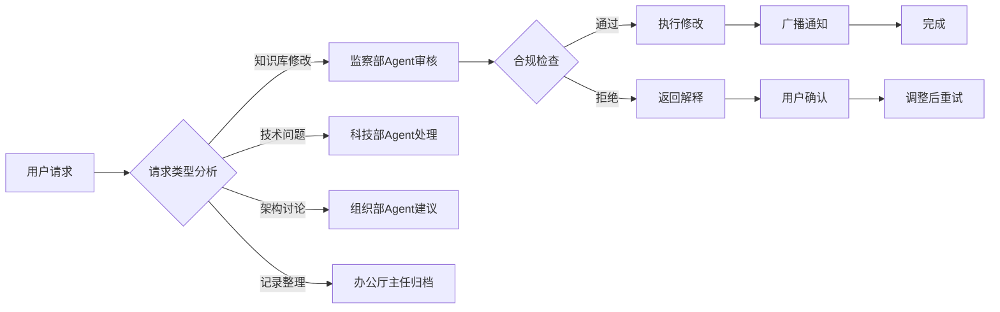

# 基本法索引 - Negentropy-Lab v7.6.0-dev

**版本**: v7.6.0-dev (Phase 13 批次验收完成)
**状态**: ✅ 活跃
**最后更新**: 2026-03-03
**说明**: 本文档是Negentropy-Lab系统的最高宪法内核，定义了多Agent协作聊天系统的核心公理与架构约束，包含LLM集成与模型选择器支持，支持三服务微服务架构移植。

---

## 第一章：核心公理集 (Constitutional Axioms)

| 条款 | 公理名称 | 核心定义 | 协作系统适配 |
|------|----------|----------|--------------|
| **§101** | 用户主权公理 | 人类用户拥有最终决策权与否决权，Agent仅为执行器 | 所有Agent动作需用户确认 |
| **§102** | 单一真理源公理 | 知识库文件是可执行规范的唯一真理源，`memory_bank/t0_core/`为宪法内核真理源 | `.clinerules`为入口索引，所有修改必须同步到`memory_bank/t0_core/`目录 |
| **§103** | 协作同步公理 | 版本变更必须触发全体系同步与通知 | 知识库修改后广播更新通知 |
| **§104** | 功能分层拓扑公理 | 系统严格遵循Agent-用户-知识库三层架构 | Agent不能直接修改知识库 |
| **§105** | 数据完整性公理 | 所有状态变更必须是原子的，且经过完整性校验 | 聊天消息、知识修改需审计记录 |
| **§106** | Agent身份公理 | 每个Agent必须拥有唯一身份标识和明确职责 | 监察部Agent、科技部Agent、组织部Agent、办公厅主任Agent（含书记员职责） |
| **§107** | 通信安全公理 | 私聊消息必须加密，公开消息需身份验证 | WebSocket通信需令牌认证（生产目标为JWT；当前Gateway WS实现为测试凭据路径） |
| **§108** | 消息历史公理 | 所有聊天记录必须持久化存储，支持CRUD操作 | JSON文件存储，支持修改删除 |
| **§109** | 知识图谱公理 | 系统必须维护知识实体间的关系图谱 | 基于`knowledge_graph.md`可视化 |
| **§110** | 协作效率公理 | Agent响应时间必须控制在合理范围内 | 目标：平均响应<3秒 |
| **§192** | 模型选择器公理 | 必须根据任务复杂度动态选择最优LLM模型以平衡成本与性能 | Agent请求必须通过模型选择器路由 |
| **§193** | 模型选择器更新公理 | 模型选择器必须持续学习并适应性能变化和成本波动 | 定期更新Provider健康状态和性能指标 |

---

## 第二章：Agent协作协议 (Agent Collaboration Protocol)

### 2.1 Agent职责矩阵 (已细化三层架构)

| Agent类型 | 层级 | 主要职责 | 可操作知识库 | 调用条件 | 宪法依据 |
|-----------|------|----------|--------------|----------|----------|
| **办公厅主任Agent** | L1入口层 | 统一用户对话入口、复杂度评估、日常任务路由、对话记录 | 所有聊天消息 | 所有用户消息入口，复杂度≤7直接路由 | §101, §110 |
| **内阁总理Agent** | L2协调层 | 战略协调、跨部门资源调配、宪法监督、冲突仲裁 | 跨部门协作任务 | 复杂度>7的跨部门复杂任务 | §102.3, §152 |
| **监察部Agent** | L3专业层 | 宪法合规检查、公理解释、格式验证、法律风险分析 | 基本法、程序法 | 涉及宪法合规检查、公理修改 | §105, §107 |
| **科技部Agent** | L3专业层 | 技术实现、代码编写、LLM集成、技术可行性评估 | 技术法、实现代码 | 技术问题、代码生成、技术评估 | §108, §110 |
| **组织部Agent** | L3专业层 | 系统架构设计、技术选型、图谱维护、架构治理 | 知识图谱、架构文档 | 架构调整、图谱优化、系统扩展 | §109, §152 |

### 2.2 协作流程状态机



### 2.3 Agent通信协议

1. **消息格式**:
```json
{
  "type": "agent_request",
  "sender": "user:alice",
  "recipient": "agent:supervision_ministry",
  "content": "请问如何添加关于协作的新公理?",
  "context": {
    "knowledge_area": "basic_law",
    "priority": "normal",
    "timeout": 30000
  }
}
```

2. **响应格式**:
```json
{
  "type": "agent_response",
  "sender": "agent:supervision_ministry",
  "recipient": "user:alice",
  "content": "添加新公理需要遵循以下格式...",
  "actions": [
    {
      "type": "suggest_edit",
      "target": "basic_law_index.md",
      "section": "§111",
      "content": "建议添加的条文内容"
    }
  ]
}
```

> 兼容说明：历史术语 `agent:legal_expert` / `agent:programmer` / `agent:architect` / `agent:secretary` 通过 `server/utils/OfficialAgentTerminology.ts` 中的 `LegacyTerminologyMapping` 映射到当前官方身份。

---

## 第三章：知识库管理公理 (§200-§299)

### 3.1 文件结构约束
- **§201** 法典内核文件必须位于`memory_bank/t0_core/`目录，`.clinerules`仅作为入口索引文件
- **§202** 记忆库文件必须位于`memory_bank/`目录
- **§203** 所有Markdown文件必须使用UTF-8编码
- **§204** 文件命名遵循`前缀_描述.md`格式

### 3.2 修改操作规范
- **§211** 任何知识库修改必须创建备份副本
- **§212** 修改记录必须包含：修改者、时间、原因、内容差异
- **§213** 重要修改需至少一个Agent审核通过
- **§214** 冲突修改启动三位一体收敛协议

### 3.3 版本控制要求
- **§221** 每次发布必须生成版本号`vX.Y.Z`
- **§222** 版本变更更新所有文件头部版本标记
- **§223** 保留最近10个版本的历史记录
- **§224** 回滚操作需记录原因和影响分析

---

## 第四章：聊天系统公理 (§300-§399)

### 4.1 消息管理
- **§301** 公开消息存储在房间状态中，全员可见
- **§302** 私聊消息加密存储，仅参与方可访问
- **§303** 消息编辑需保留修改历史
- **§304** 消息删除执行软删除，保留审计记录

### 4.2 用户管理
- **§311** 用户身份通过JWT令牌验证
- **§312** 用户权限分为：普通用户、管理员、访客
- **§313** 用户活动记录存储30天
- **§314** 异常登录行为触发安全警报

### 4.3 实时通信
- **§321** WebSocket连接需心跳保持
- **§322** 断线重连机制最多尝试3次
- **§323** 消息投递需确认机制
- **§324** 大文件传输使用分片机制

---

## 第五章：系统验证协议 (§400-§499)

| Tier | 验证类型 | 数学公理 | 验证方法 |
|------|----------|----------|----------|
| **Tier 1** | 结构验证 | $S_{fs} \cong S_{doc}$ | 检查文件系统与文档结构一致性 |
| **Tier 2** | 协作验证 | $C_{agent} \supseteq C_{required}$ | 验证Agent能力覆盖需求 |
| **Tier 3** | 行为验证 | $B_{system} \equiv B_{spec}$ | 测试系统行为符合规范 |

### 5.1 验证执行流程
1. **启动验证**: 系统启动时执行Tier 1验证
2. **协作验证**: Agent加入时执行Tier 2验证
3. **操作验证**: 关键操作执行Tier 3验证
4. **定期审计**: 每周执行全量验证

---

## 第六章：全局引用映射

* **0x00 核心法典**: 本文件及兄弟索引文件
* **0x10 Agent系统**: Agent配置文件、能力定义
* **0x20 聊天记录**: 消息历史存储、会话管理
* **0x30 知识实体**: 知识图谱节点、关系定义
* **0x40 用户数据**: 用户配置、权限设置
* **0x50 系统状态**: 运行监控、性能指标

---

## 第七章：插件系统与监控系统公理 (§500-§599)

### 7.1 插件系统公理 (§500-§509)

| 条款 | 公理名称 | 核心定义 | 协作系统适配 |
|------|----------|----------|--------------|
| **§501** | 插件系统公理 | 所有扩展功能必须通过插件系统实现，支持热重载和宪法合规验证 | PluginManager统一管理插件，运行时PluginType(9)与接口PluginKind(6)分层建模 |
| **§502** | 插件宪法合规公理 | 插件必须通过宪法合规验证才能加载，确保符合所有相关宪法约束 | PluginValidator在插件加载前自动验证 |
| **§503** | 零停机热重载公理 | 插件更新必须支持零停机热重载，保持服务连续性 | PluginManager支持状态保存和恢复，符合§306零停机协议 |
| **§504** | 监控系统公理 | 系统必须实时监控宪法合规状态和性能指标，实现全景监控 | Operation Panopticon监控系统实时监控所有关键指标 |
| **§505** | 熵值计算公理 | 系统必须实时计算和监控认知熵值，量化系统有序度 | EntropyService实现四维熵值模型，每30秒计算一次 |
| **§506** | 成本透视公理 | 所有LLM调用必须实时追踪成本和性能，实现成本感知路由 | CostTracker实时统计令牌成本，支持多模型差异化定价 |
| **§507** | Gateway架构公理 | Gateway必须支持HTTP+WebSocket双协议，统一认证和插件系统 | Gateway模块化架构，支持WebSocket RPC和REST API |
| **§508** | 模型选择器更新公理 | 模型选择器必须实时更新性能指标，动态优化路由策略 | ModelSelectorService持续学习Provider性能，自动优化选择策略 |

### 7.2 监控系统实施规范

| 指标 | 定义 | 目标值 | 监控频率 | 宪法依据 |
|------|------|--------|----------|----------|
| **宪法合规率** | 代码文件宪法引用完整性 | > 90% | 每10分钟 | §501, §504 |
| **系统熵值** | 四维熵值综合指标 | ΔH < 0 | 每30秒 | §505 |
| **Token成本** | LLM API调用成本统计 | 优化30%+ | 实时 | §506 |
| **响应延迟** | API平均响应时间 | < 3秒 | 实时 | §110 |
| **服务可用性** | 系统正常运行时间 | > 99.9% | 24/7 | §306 |

### 7.3 插件系统实施规范

| 插件类型 | 主要用途 | 宪法合规要求 | 性能指标 |
|----------|----------|--------------|----------|
| **HTTP_MIDDLEWARE** | Express中间件，请求处理、认证、日志 | §107, §152, §501 | 响应时间<100ms |
| **WEBSOCKET_MIDDLEWARE** | WebSocket消息拦截、校验与治理 | §107, §321-§324 | 消息处理延迟<50ms |
| **EVENT_HANDLER** | 事件处理器，系统事件处理 | §103, §110 | 事件处理延迟<50ms |
| **SCHEDULED_TASK** | 定时任务与计划调度 | §306, §110 | 触发抖动<1秒 |
| **DATA_TRANSFORMER** | 数据转换插件，数据清洗、格式转换 | §102, §105 | 数据处理延迟<500ms |
| **EXTERNAL_INTEGRATION** | 外部系统集成与适配 | §190, §381 | 集成调用成功率>99% |
| **MONITORING** | 监控插件，性能监控、指标收集 | §504, §505 | 数据收集延迟<1秒 |
| **LOGGING** | 日志插件，结构化日志、审计 | §105, §313 | 日志写入延迟<10ms |
| **SECURITY** | 安全插件，鉴权与策略防护 | §107, §381 | 安全规则命中实时生效 |

### 7.4 Agent三层架构细化

**宪法依据**: §101同步公理、§102熵减原则、§110协作效率公理

| 层级 | Agent类型 | 主要职责 | 调用时机 | 复杂度阈值 |
|------|-----------|----------|----------|------------|
| **L1入口层** | 办公厅主任Agent | 统一用户对话入口、复杂度评估、日常任务路由、对话记录 | 所有用户消息入口 | 复杂度≤7直接路由 |
| **L2协调层** | 内阁总理Agent | 战略协调、跨部门资源调配、宪法监督、冲突仲裁、优先级管理 | 复杂度>7的跨部门复杂任务 | 复杂度>7转交协调 |
| **L3专业层** | 监察部Agent | 宪法合规检查、公理解释、格式验证、法律风险分析 | 涉及宪法合规检查、公理修改 | 专业领域问题 |
| **L3专业层** | 科技部Agent | 技术实现、代码编写、LLM集成、技术可行性评估 | 技术问题、代码生成、技术评估 | 技术领域问题 |
| **L3专业层** | 组织部Agent | 系统架构设计、技术选型、图谱维护、架构治理 | 架构调整、图谱优化、系统扩展 | 架构领域问题 |

---

## 附录：术语定义

| 术语 | 定义 |
|------|------|
| **Agent** | 具有特定职责的AI助手，参与知识协作 |
| **公理** | 系统必须遵守的基本规则和约束 |
| **法典** | 包含公理、规范的文件集合 |
| **知识图谱** | 实体间关系的可视化表示 |
| **熵减** | 系统有序度提升的过程 |
| **协作流** | 用户与Agent交互的工作流程 |
| **插件系统** | 通过PluginManager管理的扩展功能模块系统 |
| **监控系统** | Operation Panopticon全景监控系统，实时监控宪法合规状态 |
| **Gateway架构** | 支持HTTP+WebSocket双协议的微服务网关架构 |

---

*遵循宪法约束: Agent即执行者，协作即熵减，架构即真理，插件即扩展，监控即真理可视化。*
