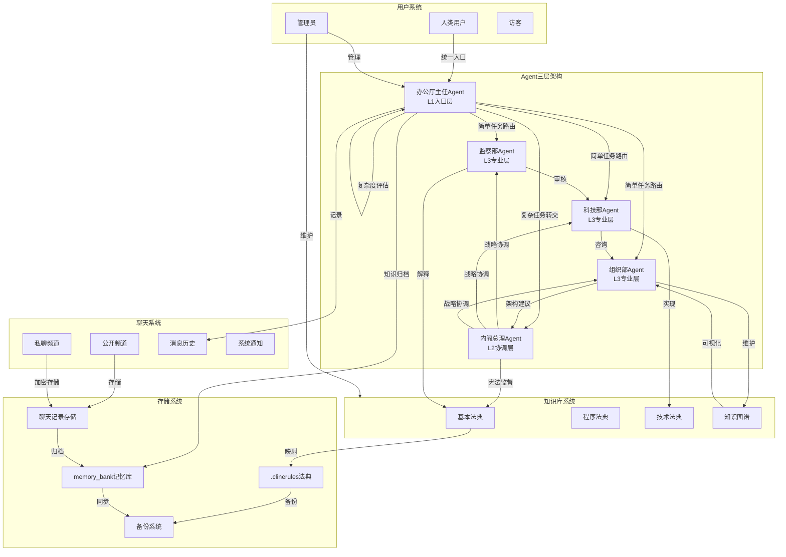
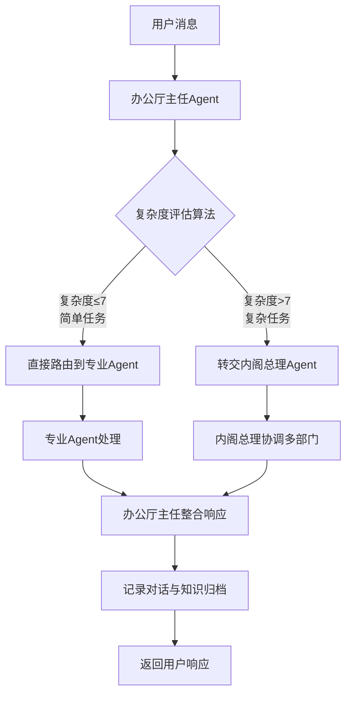

# Negentropy-Lab - 全局知识图谱 (Global Knowledge Graph) v7.6.0-dev

**状态**: ✅ Phase 13 批次验收完成
**节点数**: ~90+ (多Agent协作系统 + LLM集成 + 插件系统 + 监控系统)
**用途**: 提供Negentropy-Lab系统实体间的高维关联导航，支持Agent协作决策与LLM集成导航，插件系统与监控系统集成
**维护机制**: 每次Agent协作后更新，每日自动同步，LLM请求实时更新，监控系统实时更新
**最后更新**: 2026-03-03

---

## 1. 核心拓扑 (Core Topology)



## 2. 领域知识簇 (Domain Clusters)

### 🤖 Agent协作簇 (Agent Collaboration Cluster)

* **中心节点**: [监察部Agent], [科技部Agent], [组织部Agent], [办公厅主任Agent]
* **核心关系**: 审核 → 实现 → 维护 → 记录 → 通知
* **协作流程**: 
  1. 用户请求 → 2. Agent分析 → 3. 专业处理 → 4. 知识更新 → 5. 记录通知
* **导航示例**:
  > 技术问题: 用户提问 → 科技部Agent响应 → 咨询组织部Agent → 生成解决方案 → 办公厅主任Agent记录
  > 合规审查: 知识库修改请求 → 监察部Agent审核 → 通过/拒绝 → 用户确认 → 执行修改

### 📚 知识库管理簇 (Knowledge Base Management Cluster)

* **中心节点**: [基本法典 §101-§110], [程序法典], [技术法典], [知识图谱]
* **核心文件**: `memory_bank/t0_core/active_context.md`, `memory_bank/t0_core/basic_law_index.md`
* **管理流程**: 版本控制 → 备份机制 → 同步通知 → 冲突解决
* **修改保护**: 用户确认 → Agent审核 → 原子操作 → 历史记录
* **导航示例**:
  > 添加公理: 用户建议 → 监察部Agent格式检查 → 组织部Agent位置规划 → 科技部Agent技术实现 → 执行添加 → 广播通知
  > 冲突解决: 检测冲突 → 激活收敛协议 → 各Agent提供意见 → 用户仲裁 → 执行解决方案

### 💬 聊天系统簇 (Chat System Cluster)

* **中心节点**: [公开频道], [私聊频道], [消息历史], [系统通知]
* **消息类型**: 文本消息、文件传输、Agent动作、知识更新
* **存储机制**: JSON文件存储、加密传输、审计记录、CRUD操作
* **用户管理**: JWT认证、权限分级、活动监控、安全警报
* **导航示例**:
  > 历史查询: 用户请求 → 办公厅主任Agent检索（含书记员职责） → 过滤条件 → 返回结果 → 权限验证
  > 私聊建立: 用户A请求 → 加密通道建立 → 消息交换 → 端到端加密 → 存储记录

### 🔧 技术实现簇 (Technical Implementation Cluster)

* **中心节点**: [Gateway服务(HTTP+WS)], [Colyseus房间服务], [TypeScript后端], [文件系统存储]
* **技术栈**: Node.js + TypeScript + Express + ws + Colyseus（并存）
* **通信协议**: Gateway WebSocket RPC、基础WebSocket(`/ws`)、HTTP REST API、JWT认证
* **数据持久化**: 文件系统操作、JSON序列化、备份机制
* **仓库边界**: 当前仓库为后端/API-only；前端位于`/home/wsman/OpenDoge/opendoge-ui`（Linux环境）或`D:\Users\WSMAN\Desktop\OpenDoge\opendoge-ui`（Windows环境）
* **导航示例**:
  > 实时聊天: WebSocket连接 → 消息路由 → 房间广播 → 状态同步 → 历史保存
  > 知识操作: HTTP请求 → 权限验证 → 文件读写 → 原子操作 → 响应返回

### 🧠 LLM集成簇 (LLM Integration Cluster)

* **中心节点**: [LLMService], [模型选择器], [PythonWorkerBridge], [多Agent协作引擎]
* **宪法依据**: §192模型选择器公理、§193模型选择器更新公理、§110协作效率公理
* **技术栈**: LLM API集成、模型选择算法、成本优化、性能监控
* **核心组件**:
  - **LLMService**: 统一LLM API接口，支持同步流式响应
  - **模型选择器**: 动态路由到最佳Provider，基于成本、性能、任务复杂度
  - **PythonWorkerBridge**: Python与Node.js桥接，支持复杂计算和外部服务
  - **多Agent协作引擎**: 协调多个Agent的LLM请求，聚合结果
* **导航示例**:
  > **Agent LLM请求**: 用户提问 → Agent分析需求 → 模型选择器路由 → LLM API调用 → 返回增强响应
  > **成本优化**: 复杂任务 → 选择GPT-4 → 高质量响应；简单任务 → 选择低成本模型 → 节约费用
  > **故障转移**: 主Provider失败 → 自动切换备用Provider → 保证服务连续性
  > **多Agent协作**: 用户复杂问题 → 办公厅主任协调 → 多个Agent并行处理 → 结果聚合 → 综合响应
* **性能监控**:
  - **响应时间**: 目标 < 3秒 (LLM API + 本地处理)
  - **成本效率**: 令牌成本优化，性价比最大化
  - **成功率**: API调用成功率 > 99%
  - **协作效率**: 多Agent协作时间线性增长

## 3. 图谱导航协议 (Navigation Protocol)

当用户或Agent查询复杂问题（如"如何优化协作效率"）时，请遵循以下路径:

1. **定位锚点**: 在上述领域簇中找到最接近的入口
   - 技术问题 → [技术实现簇]
   - 协作流程 → [Agent协作簇]
   - 知识管理 → [知识库管理簇]
   - 聊天功能 → [聊天系统簇]

2. **遍历邻居**: 检查该簇下的相关节点和关系
   - 对于"协作效率": [Agent协作簇] → 检查Agent响应时间 → 查看协作流程 → 分析瓶颈

3. **多跳推理**: 如果当前节点无法解决，沿着关系边探索
   - 示例: 协作效率低 → [Agent协作簇] → 发现响应延迟 → [技术实现簇] → 检查WebSocket性能 → 优化方案

4. **跨簇关联**: 复杂问题可能需要跨簇分析
   - 示例: 知识库修改慢 → [知识库管理簇] → 发现文件操作延迟 → [技术实现簇] → 优化文件系统 → 返回解决方案

> **导航示例**:
> "如何添加新的Agent类型"? 
> 1. 定位到[Agent协作簇]
> 2. 检查现有Agent定义和接口
> 3. 参考[技术实现簇]中的Agent实现规范
> 4. 查看[知识库管理簇]中的修改流程
> 5. 输出完整实现方案：定义职责 → 实现接口 → 集成系统 → 测试验证

## 4. 文档分级体系 (Document Tiering System)

* **中心节点**: [基本法§104], [活跃上下文], [Bootloader模式]
* **核心概念**: T0-T3分级体系、注意力分配、认知负载优化、上下文管理
* **分级定义**:
  - **T0 (Kernel)**: 核心意识层 - 常驻内存 (`active_context.md`, `basic_law_index.md`, `procedural_law_index.md`, `technical_law_index.md`, `knowledge_graph.md`)
  - **T1 (Index)**: 索引与状态层 - 高频检索 (`behavior_context.md`, `tech_context.md`, `CONCEPTS.md`, `GLOSSARY.md`)
  - **T2 (Executable)**: 执行规范层 - 按需加载 (`t2_protocols/`工作流 + `t2_standards/`技术标准)
  - **T3 (Archive)**: 分析与归档层 - 离线存储 (聊天历史、审计日志、备份数据)
* **数学约束**: 
  - $\sum_{file \in Context} \text{Token}(file) \leq T_{limit}$ (默认: 8000 tokens)
  - $\text{Attention}(T0) \gg \text{Attention}(T1) > \text{Attention}(T2)$
* **导航示例**:
  > 开发新功能: Bootloader模式 → T0层定位核心约束 → T1层检索相关法典 → T2层查看实现规则 → T3层参考历史案例
  > 问题诊断: 用户报告 → T0层快速响应 → T1层检索类似问题 → T2层查看技术细节 → T3层分析历史数据

## 5. Agent决策支持 (Agent Decision Support)

### 5.1 决策路径模板

**场景**: Agent需要处理用户请求时
1. **请求解析**: 分析用户意图和上下文
2. **图谱定位**: 在知识图谱中找到相关节点
3. **职责匹配**: 确定应由哪个/哪些Agent处理
4. **知识检索**: 查阅相关法典和规则
5. **方案生成**: 基于图谱关系生成解决方案
6. **协作协调**: 如果需要其他Agent协助，发起协作请求
7. **响应交付**: 向用户返回处理结果

### 5.2 跨Agent协作模式

| 协作模式 | 触发条件 | 参与Agent | 产出 |
|----------|----------|-----------|------|
| **技术审查** | 代码生成或技术实现 | 科技部Agent + 组织部Agent | 技术方案 + 架构建议 |
| **合规检查** | 知识库修改或公理添加 | 监察部Agent + 相关Agent | 合规意见 + 修改建议 |
| **知识整理** | 大量对话或复杂讨论 | 办公厅主任（含书记员职责） + 相关Agent | 摘要报告 + 知识要点 |
| **冲突解决** | 版本冲突或意见分歧 | 所有相关Agent + 用户 | 解决方案 + 仲裁记录 |

### 5.3 图谱查询接口

Agent可以通过以下方式查询知识图谱:
- **按实体查询**: "获取监察部Agent的能力定义"
- **按关系查询**: "查找与知识库修改相关的工作流程"
- **按路径查询**: "从用户请求到知识更新的完整路径"
- **按模式查询**: "所有需要多Agent协作的场景"

---

## 6. 熵值监测与优化 (Entropy Monitoring & Optimization)

### 6.1 协作熵指标

| 指标 | 定义 | 目标值 |
|------|------|--------|
| **响应时间熵** | Agent平均响应时间分布 | < 3秒 |
| **知识完整性熵** | 法典覆盖率与更新频率 | > 90% |
| **协作效率熵** | 多Agent协作任务完成时间 | 线性增长 |
| **系统稳定性熵** | 异常事件与正常运行时间比 | < 1% |

### 6.2 熵减策略

1. **知识图谱优化**: 定期重构图谱关系，减少冗余连接
2. **Agent能力扩展**: 根据协作需求动态调整Agent职责
3. **缓存机制**: 高频查询结果缓存，减少重复计算
4. **预加载策略**: 预测用户需求，提前加载相关资源

### 6.3 监测仪表板

- **实时协作视图**: 显示当前活跃的Agent协作状态
- **知识库健康度**: 法典完整性、更新频率、冲突数量
- **系统性能指标**: 响应时间、并发连接、资源使用
- **用户参与度**: 活跃用户、消息数量、协作深度

---

## 7. Agent协作三层架构 (Three-Tier Agent Collaboration Architecture)

### 7.1 架构总览

**中心节点**: [办公厅主任Agent], [内阁总理Agent], [专业Agent集群]
**核心概念**: 入口统一、分层协调、复杂度驱动路由、宪法监督
**架构层级**:
  - **L1 入口层**: 办公厅主任Agent (统一用户对话入口 + 书记员职责合并)
  - **L2 协调层**: 内阁总理Agent (复杂任务战略协调 + 跨部门资源调配)
  - **L3 专业层**: 监察部、科技部、组织部Agent (专业技术服务)

### 7.2 消息流转流程



### 7.3 复杂度评估算法 (办公厅主任)

**评估因素**:
1. **意图类型**: technical/legal/architectural/mixed
2. **涉及部门**: 1-5个专业Agent需求
3. **宪法影响**: 是否涉及宪法修改或解释
4. **知识库影响**: none/read/write/structural
5. **预估处理时间**: 毫秒级估计

**评分公式**: $C = f(I, D, L, K, T)$
- **简单任务** (C ≤ 7): 直接路由到对应专业Agent
- **复杂任务** (C > 7): 转交内阁总理Agent协调

### 7.4 内阁总理协调协议

**核心职责**:
1. **战略协调**: 跨部门复杂任务分解与分配
2. **资源调配**: 专业Agent任务队列管理与优先级
3. **冲突仲裁**: 部门间意见分歧宪法仲裁
4. **宪法监督**: 确保所有操作符合宪法约束
5. **优先级管理**: 基于宪法重要性和用户需求排序

**宪法依据**: §102.3宪法同步公理、§141熵减验证公理、§152单一真理源公理、§190网络韧性公理

### 7.5 导航示例

> **复杂任务处理**: 
> 用户请求"重构法典索引系统" → 办公厅主任评估复杂度=9 → 转交内阁总理 →
> 内阁总理协调(监察部合规检查 + 科技部技术实现 + 组织部架构设计) →
> 整合专业意见 → 办公厅主任记录审计日志 → 返回综合方案

> **宪法监督流程**:
> 知识库修改请求 → 内阁总理宪法合规检查 → 监察部条款解释 →
> 科技部技术可行性评估 → 组织部架构影响分析 → 用户最终确认 → 原子操作执行

---

## 8. 插件系统与监控系统知识簇 (Plugin System & Monitoring System Clusters)

### 8.1 插件系统簇 (Plugin System Cluster)

**中心节点**: [PluginManager], [PluginRegistry], [PluginValidator]
**宪法依据**: §501插件系统公理、§502插件宪法合规公理、§503零停机热重载公理
**核心组件**:
  - **PluginManager**: 插件生命周期管理、热重载支持、状态保存恢复
  - **PluginRegistry**: 插件注册表、依赖关系管理、实时状态监控
  - **PluginValidator**: 插件宪法合规验证器，确保插件符合宪法约束

**支持的插件类型**:
1. **HTTP_MIDDLEWARE** - Express中间件插件，用于请求处理、认证、日志
2. **WEBSOCKET_MIDDLEWARE** - WebSocket中间件插件，用于消息拦截、协议治理
3. **EVENT_HANDLER** - 事件处理器插件，用于系统事件处理
4. **SCHEDULED_TASK** - 定时任务插件，用于计划任务编排
5. **DATA_TRANSFORMER** - 数据转换插件，用于数据清洗、格式转换
6. **EXTERNAL_INTEGRATION** - 外部集成插件，用于第三方系统接入
7. **MONITORING** - 监控插件，用于性能监控、指标收集
8. **LOGGING** - 日志插件，用于结构化日志、审计
9. **SECURITY** - 安全插件，用于访问控制与威胁防护

**导航示例**:
> 插件开发流程: 开发者创建插件 → PluginValidator宪法合规验证 → PluginRegistry注册插件 → PluginManager加载运行 → 实时性能监控 → 零停机热重载更新

### 8.2 监控系统簇 (Monitoring System Cluster)

**中心节点**: [ConstitutionMonitor], [EntropyService], [CostTracker]
**宪法依据**: §504监控系统公理、§505熵值计算公理、§506成本透视公理
**核心组件**:
  - **ConstitutionMonitor**: 宪法合规引擎，基于AST/Regex扫描TypeScript文件，10分钟扫描周期
  - **EntropyService**: 熵值计算服务，四维熵值模型（H_sys系统熵/H_cog认知熵/H_struct结构熵/H_perf性能熵），30秒计算周期
  - **CostTracker**: 成本透视系统，实时令牌成本统计，多模型差异化定价分析

**监控指标**:
| 指标 | 定义 | 目标值 | 监控频率 |
|------|------|--------|----------|
| **宪法合规率** | 代码文件宪法引用完整性 | > 90% | 每10分钟 |
| **系统熵值** | 四维熵值综合指标 | ΔH < 0 | 每30秒 |
| **Token成本** | LLM API调用成本统计 | 优化30%+ | 实时 |
| **响应延迟** | API平均响应时间 | < 3秒 | 实时 |
| **服务可用性** | 系统正常运行时间 | > 99.9% | 24/7 |

**可视化仪表板**:
- **实时宪法合规视图**: 显示代码文件合规状态和问题点
- **熵值趋势分析**: 展示系统有序度变化趋势
- **成本透视雷达图**: 多模型使用分布和成本对比
- **性能监控仪表板**: 响应延迟、成功率、并发连接数

### 8.3 Gateway架构簇 (Gateway Architecture Cluster)

**中心节点**: [WebSocket RPC], [HTTP REST API], [双协议同步]
**宪法依据**: §507 Gateway架构公理、§107通信安全公理、§306零停机协议
**核心组件**:
  - **WebSocket RPC（JSON-RPC风格）**: 完整RPC消息帧支持，请求/响应/事件三种消息类型
  - **HTTP REST API**: OpenAI兼容端点，支持流式响应
  - **双协议同步**: HTTP状态与WebSocket会话状态同步
  - **认证系统**: Token/Password认证（当前Gateway WS实现），JWT为生产目标路径

**导航示例**:
> 客户端接入流程: 客户端建立WebSocket连接 → 令牌认证（生产目标JWT） → RPC消息帧通信 → 实时状态同步 → 断线重连支持 → 会话状态恢复

### 8.4 四层架构体系集成 (Four-Layer Architecture Integration)

```
四层架构体系:
1. Gateway生态系统层: WebSocket + HTTP + 认证 + 插件 + 监控
2. Agent三层架构层: L1入口层(办公厅主任) + L2协调层(内阁总理) + L3专业层(监察/科技/组织)
3. LLM集成层: LLMService + ModelSelectorService + 成本优化
4. 知识库管理层: 法典内核 + 记忆库 + 工作流系统
```

**集成关系**:
- Gateway层提供统一的通信接口和插件管理
- Agent层处理业务逻辑和LLM集成
- 监控系统实时监控所有层级的宪法合规和性能指标
- 插件系统提供扩展能力，支持九种PluginType（并与PluginKind(6)分层建模）

---

## 9. 领域知识簇导航扩展 (Domain Cluster Navigation Extensions)

### 9.1 跨簇协作导航

**宪法依据**: §110协作效率公理、§152单一真理源公理

**复杂问题导航路径**:
1. **插件开发问题**: [插件系统簇] → [技术实现簇] → [Agent协作簇] → [知识库管理簇]
2. **性能优化问题**: [监控系统簇] → [Gateway架构簇] → [技术实现簇] → [Agent协作簇]
3. **宪法合规问题**: [监控系统簇] → [知识库管理簇] → [Agent协作簇] → [插件系统簇]
4. **成本优化问题**: [监控系统簇] → [LLM集成簇] → [Agent协作簇] → [Gateway架构簇]

### 9.2 实时监控导航

**监控系统集成导航**:
- **实时宪法合规**: ConstitutionMonitor扫描 → 问题定位 → 修复建议 → 合规率更新
- **熵值趋势分析**: EntropyService计算 → 趋势预测 → 优化建议 → 熵值可视化
- **成本透视优化**: CostTracker统计 → 模型选择优化 → 预算控制 → 成本报告
- **性能监控告警**: 性能阈值检测 → 告警触发 → 故障诊断 → 恢复建议

### 9.3 插件系统导航

**插件生命周期导航**:
1. **开发阶段**: 插件设计 → 宪法合规检查 → 测试验证 → 文档编写
2. **部署阶段**: PluginManager加载 → PluginValidator验证 → PluginRegistry注册 → 热重载准备
3. **运行阶段**: 实时监控 → 性能优化 → 状态管理 → 错误处理
4. **更新阶段**: 零停机热重载 → 状态迁移 → 版本管理 → 回滚支持

---

**宪法依据**: §109知识图谱公理、§110协作效率公理、§501插件系统公理、§504监控系统公理
**更新时间**: 2026-03-03  
**状态**: **Negentropy-Lab知识图谱 v7.6.0-dev就绪，Phase 13 批次验收完成，支持多Agent协作、LLM集成、插件系统与监控系统集成导航**
