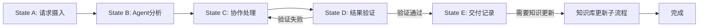
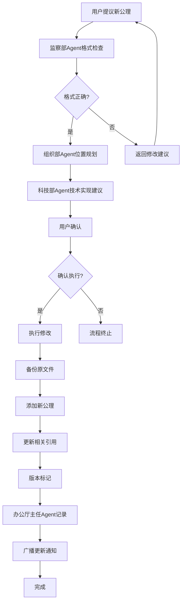

# 程序法索引 - Negentropy-Lab v7.6.0-dev

/**
 * 宪法依据：
 * - §152 单一真理源公理：程序法索引作为工作流程的唯一真理源
 * - §201 CDD工作流规范：定义宪法驱动开发的核心流程
 * - §104 功能分层拓扑公理：T0核心层程序法索引
 * - §109 协作流程公理：Agent协作流程标准化
 * - §141 熵减验证公理：流程执行必须降低系统熵值
 */


**版本**: v7.6.0-dev (Phase 13 批次验收完成)
**状态**: ✅ 活跃
**说明**: 程序法工作流索引，整合了所有协作、聊天、知识管理的操作流程，包含LLM集成、插件系统、监控系统流程，支持Gateway生态系统架构。

---

## 第一章：核心协作工作流 (§200-§209)

| 条款 | 工作流名称 | 核心用途 | 触发条件 | 文件路径 (Pointer) |
|------|------------|----------|----------|-------------------|
| **§201** | **Agent协作流程** | **多Agent协同处理用户请求 (默认流程)** | 用户提问需要多领域专业知识 | `memory_bank/t2_protocols/WF-30_simple_routing.md` |
| **§202** | 知识库修改流程 | 知识库内容的增删改查操作 | 用户或Agent提出知识库修改 | `memory_bank/t2_protocols/WF-02_amend.md` |
| **§203** | 聊天消息管理流程 | 消息的发送、编辑、删除、查询 | 用户发送消息或管理历史 | `memory_bank/t2_protocols/WF-62_room_binding_info.md` |
| **§204** | 用户权限管理流程 | 用户注册、登录、权限分配 | 新用户加入或权限变更 | `memory_bank/t2_protocols/WF-63_security_operations.md` |
| **§205** | 系统监控与维护流程 | 系统健康检查、日志管理、备份 | 定期执行或异常发现 | `memory_bank/t2_protocols/WF-60_crisis_handling.md` |
| **§206** | **三位一体收敛协议简化版** | **解决文档-逻辑-物理三重脱节的高熵状态修复(简化架构适配)** | 架构文档与实际代码脱节，宪法合规度<85% | `memory_bank/t2_protocols/WF-04_review.md` |
| **§207** | Agent能力扩展流程 | 新增或修改Agent类型与职责 | 系统需要新的Agent能力 | `memory_bank/t2_protocols/agent_standards/README.md` |
| **§208** | 真实LLM接入工作流程 | Week 1: LLM服务封装 | Phase 7智能接入 | `memory_bank/t2_protocols/llm_standards/README.md` |
| **§209** | 数据持久化工作流程 | Week 2: 数据库集成 | Phase 7数据持久化 | `memory_bank/t2_protocols/WF-61_version_release.md` |

---

## 第一章（续）：系统运维工作流 (§205, §220)

| 条款 | 工作流名称 | 核心用途 | 触发条件 | 文件路径 (Pointer) |
|------|------------|----------|----------|-------------------|
| **§205** | 版本发布流程 | 新版本系统的安全发布 | 版本发布计划启动 | `memory_bank/t2_protocols/WF-61_version_release.md` |
| **§220** | MCP运维流程 | MCP服务的启动、停止和维护 | MCP服务变更或故障 | `memory_bank/t2_protocols/WF-64_mcp_operations.md` |

---

## 第二章：专项操作流程 (§210-§229)

### 2.1 聊天系统操作 (§210-§219)

| 条款 | 工作流名称 | 核心用途 |
|------|------------|----------|
| **§210** | 公开消息发送流程 | 用户向公开频道发送消息 |
| **§211** | 私聊建立与通信流程 | 用户间点对点私聊通信 |
| **§212** | 消息编辑与删除流程 | 消息内容的修改与移除 |
| **§213** | 聊天历史查询流程 | 按条件检索历史消息 |
| **§214** | 文件传输流程 | 聊天中文件的上传与下载 |

### 2.2 Agent协作操作 (§220-§229)

| 条款 | 工作流名称 | 核心用途 |
|------|------------|----------|
| **§220** | Agent请求路由流程 | 用户请求分配到合适Agent |
| **§221** | 跨Agent协作流程 | 多个Agent协同处理复杂问题 |
| **§222** | Agent能力查询流程 | 查询Agent当前状态与能力 |
| **§223** | Agent响应优化流程 | 优化Agent响应时间与质量 |

---

## 第三章：知识库操作流程 (§230-§249)

### 3.1 法典管理 (§230-§239)

| 条款 | 工作流名称 | 核心用途 |
|------|------------|----------|
| **§230** | 公理添加流程 | 向基本法添加新公理 |
| **§231** | 法典修改流程 | 修改现有法典条款 |
| **§232** | 法典版本发布流程 | 发布新版本的知识库 |
| **§233** | 法典冲突检测流程 | 检测并报告法典冲突 |

### 3.2 知识图谱操作 (§240-§249)

| 条款 | 工作流名称 | 核心用途 |
|------|------------|----------|
| **§240** | 知识实体添加流程 | 向图谱添加新实体 |
| **§241** | 关系建立与修改流程 | 建立或修改实体间关系 |
| **§242** | 图谱可视化更新流程 | 更新知识图谱可视化 |
| **§243** | 图谱一致性验证流程 | 验证图谱与法典一致性 |

---

## 第四章：Agent协作五状态工作流引擎



### 4.1 State A (请求摄入)
**输入**: 用户消息、上下文信息、历史记录  
**处理**: 
1. 解析用户意图和需求
2. 提取关键信息和约束条件
3. 确定请求类型和优先级
4. 建立请求跟踪ID

### 4.2 State B (Agent分析)
**输入**: 解析后的请求、可用Agent状态  
**处理**:
1. 根据请求类型路由到合适Agent
2. 查询相关法典和知识图谱
3. 评估处理复杂度和所需资源
4. 确定是否需要跨Agent协作

### 4.3 State C (协作处理)
**输入**: Agent分析结果、协作需求  
**处理**:
1. 主Agent处理核心问题
2. 如需协作，发起协作请求
3. 协调各Agent贡献
4. 整合处理结果

### 4.4 State D (结果验证)
**输入**: 处理结果、原始请求、约束条件  
**处理**:
1. 验证结果符合用户需求
2. 检查合规性（监察部Agent参与）
3. 验证技术可行性（科技部Agent参与）
4. 评估架构合理性（组织部Agent参与）

### 4.5 State E (交付记录)
**输入**: 验证通过的结果  
**处理**:
1. 格式化响应交付给用户
2. 办公厅主任Agent记录完整过程（含书记员职责）
3. 更新相关统计数据
4. 如需知识库更新，启动子流程

---

## 第五章：知识库修改工作流示例

### 5.1 添加新公理流程 (§201.1)



### 5.2 消息编辑流程 (§212.1)

1. **请求阶段**: 用户请求编辑消息
2. **权限验证**: 检查用户是否有编辑权限
3. **历史保存**: 创建消息编辑历史记录
4. **内容更新**: 更新消息内容
5. **通知相关方**: 通知对话参与者消息已编辑
6. **审计记录**: 办公厅主任Agent记录编辑操作（含书记员职责）

---

## 第六章：紧急与异常处理流程

### 6.1 系统故障处理 (§290)
1. **故障检测**: 监控系统发现异常
2. **降级策略**: 启动降级服务模式
3. **Agent通知**: 通知相关Agent故障状态
4. **用户通知**: 向用户显示维护信息
5. **恢复流程**: 按优先级恢复服务

### 6.2 安全事件响应 (§291)
1. **异常检测**: 安全监控发现可疑活动
2. **隔离措施**: 隔离受影响组件
3. **权限冻结**: 临时冻结相关用户权限
4. **审计分析**: 分析安全事件原因
5. **修复实施**: 实施安全修复措施
6. **恢复验证**: 验证系统安全性后恢复

---

## 第七章：流程检索协议

### 7.1 按编号检索
输入流程编号（如"§201"）可快速定位到对应工作流。

### 7.2 按场景检索
- **"我要向知识库添加内容"** → §202 (知识库修改流程)
- **"需要多个Agent帮助"** → §201 (Agent协作流程)
- **"消息发错了想修改"** → §212 (消息编辑流程)
- **"系统运行不正常"** → §290 (系统故障处理)
- **"新用户想加入系统"** → §204 (用户权限管理流程)

### 7.3 按Agent职责检索
- **监察部Agent相关**: §230, §231, §206
- **科技部Agent相关**: §222, §240, §241
- **组织部Agent相关**: §242, §243, §207
- **办公厅主任Agent相关**: §213, §233, §205

---

## 第八章：流程执行质量指标

| 指标 | 计算公式 | 目标值 |
|------|----------|--------|
| **流程完成率** | $\frac{N_{completed}}{N_{initiated}}$ | > 95% |
| **平均处理时间** | $\frac{\sum T_{process}}{N_{process}}$ | < 30秒 |
| **用户满意度** | $\frac{N_{satisfied}}{N_{surveyed}}$ | > 90% |
| **异常发生率** | $\frac{N_{exceptions}}{N_{process}}$ | < 2% |
| **协作效率** | $\frac{N_{collaboration}}{N_{total}}$ | 根据场景动态调整 |

---

## 附录：流程模板库

### 模板A：标准Agent响应流程
```json
{
  "process_id": "agent_response_v1",
  "steps": [
    "request_parsing",
    "knowledge_retrieval",
    "solution_generation",
    "compliance_check",
    "response_formatting",
    "delivery"
  ],
  "quality_gates": [
    "response_time < 3000ms",
    "knowledge_coverage > 80%",
    "user_intent_match > 90%"
  ]
}
```

### 模板B：知识库原子修改流程
```json
{
  "process_id": "knowledge_atomic_update_v1",
  "steps": [
    "backup_original",
    "validate_change",
    "execute_update",
    "verify_integrity",
    "update_references",
    "notify_stakeholders"
  ],
  "rollback_strategy": "restore_backup",
  "timeout": 10000
}
```

---

*遵循宪法约束: 流程即协作，执行即熵减，质量即信任。*
