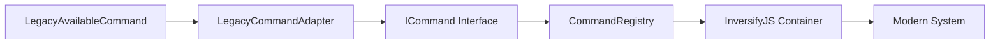

# 技术法索引 - Negentropy-Lab v7.6.0-dev

**版本**: v7.6.0-dev (Phase 13 Final Acceptance 已完成)
**状态**: ✅ 引导模式 (Bootloader Mode) | 📋 Phase 14-15 规划中（计划窗口: 2026-03-05~2026-03-20）
**说明**: 技术法标准索引，定义了多Agent协作聊天系统的技术实现规范，包含LLM集成、插件系统、监控系统标准，支持Gateway生态系统架构。严禁凭空生成代码，必须查阅本索引。
**运行态基线**: 入口、边界与实现状态以 `runtime_architecture_baseline.md` + `active_context.md` 为准。

---

## 第零章：微内核七层自治架构 (§100-§109)

**来源**: MY-DOGE-DEMO v6.8.0 七层架构适配整合
**宪法依据**: §102.3宪法同步公理、§141熵减验证公理、§152单一真理源公理、§110协作效率公理
**说明**: Negentropy-Lab采用微内核七层自治架构，与T0-T3四层架构形成互补映射关系。七层架构提供更细粒度的物理分层，四层架构提供逻辑分层。

### 0.1 架构公理 (§100 微内核七层自治架构公理)

**定义**: 系统严格遵循七层自治架构，每层具有独立的职责边界和明确的依赖关系。

**数学映射**: $S_{7-layer} \cong S_{4-layer}$

```
L5 [接口表现层] → API/CLI/UI
L4 [应用逻辑层] → Business Logic
L3 [MCP微内核层] → Deterministic Toolchain
L2.5 [内部事务局] → IAB Supervision
L2 [执行代理层] → Cline Agent
L1 [记忆银行层] → Single Source of Truth
L0.5 [Legacy兼容层] → Adapter & DI Container
L0 [遗留隔离层] → Quarantine Zone
```

**与T0-T3四层架构的映射关系**:
- **L5-L4** → **Gateway生态系统层**
- **L3-L2.5-L2** → **Agent三层架构层**
- **L3** → **LLM集成层**
- **L1** → **知识库管理层**

### 0.2 L5接口表现层 (§101)

**职责**: 用户界面和交互层，提供API、CLI、UI等多种访问方式。

**核心组件**:
- WebSocket RPC协议接口
- HTTP REST API接口
- 前端UI组件
- 命令行工具

**技术标准**: TS-101 WebSocket连接管理、TS-102 消息序列化格式

### 0.3 L4应用逻辑层 (§102)

**职责**: 业务逻辑和状态管理层，处理请求路由、状态管理、业务规则。

**核心组件**:
- TypeScript Node.js服务
- REST API端点
- 认证和授权中间件
- 状态管理器

**技术标准**: TS-201 消息历史存储、TS-301 JWT认证流程

### 0.4 L3 MCP微内核层 (§103)

**职责**: AI助手接口和协议桥接层，提供确定性工具链和自然语言到系统操作的转换。

**核心组件**:
- Python MCP微内核服务
- 自然语言处理模块
- 质量门控控制
- 逆熵审计协议

**宪法依据**: §130 MCP微内核神圣公理、§131 MCP绝对冷启动原则、§132 MCP架构原则

**工具治理**: Tier 1-3三级治理体系
- **Tier 1**: 法定核心工具（CDD流程强制调用）
- **Tier 2**: 法定辅助工具（按需调用）
- **Tier 3**: 管理工具（基础设施运维）

### 0.5 L2.5内部事务局 (§104)

**职责**: 运行时审计和元监督层，确保系统运行时的熵减趋势。

**核心组件**:
- Internal Affairs Bureau (IAB)
- 实时熵值计算引擎
- 系统健康监控
- 熵减趋势验证

**数学基础**: $\Delta H = H_{t} - H_{t-1} \leq 0$

**技术标准**: ME-101 系统熵值计算标准、ME-102 认知熵值计算标准

### 0.6 L2执行代理层 (§105)

**职责**: Agent执行和管理层，负责Agent的生命周期管理、任务调度和协作协调。

**核心组件**:
- Agent管理器
- 任务调度器
- 协作协调器
- 状态同步服务

**三层架构**: L1入口层(办公厅主任) + L2协调层(内阁总理) + L3专业层(监察/科技/组织)

**技术标准**: DS-AS-101 Agent接口规范、AS-103 协作协议

### 0.7 L1记忆银行层 (§106)

**职责**: 系统单一真理源，包含宪法、公理、活跃状态和知识库。

**核心组件**:
- 入口索引 (`.clinerules`) + 法典内核 (`memory_bank/t0_core/`)
- 记忆库 (`memory_bank/`)
- T0核心意识层
- T1索引与状态层

**宪法依据**: §152单一真理源公理

**技术标准**: KB-101 Markdown处理、KB-102 原子文件写入

### 0.8 L0.5 Legacy兼容层 (§107)

**实现状态**: 📋 架构规划（架构设计完成，代码待开发）

**职责**: Legacy Quarantine Zone与现代系统之间的双向适配器层。

**架构定位**:


**数学映射函数**:
- **正向映射**: $f_{forward}: L_{legacy} \rightarrow I_{modern}$
- **逆向映射**: $f_{backward}: I_{modern} \rightarrow L_{legacy}$
- **行为等价**: $\forall c \in C_{legacy}, B(f_{forward}(c)) \equiv B(c)$

**核心组件** (待开发):
- LegacyCommandAdapter (适配器)
- LegacyCommandFactory (工厂模式)
- LegacyCommandInitializer (自动初始化)
- InversifyJS依赖注入容器

**宪法依据**: §141自动化重构安全、§151行为锁定原则、§336依赖注入标准

> **注意**: 本节描述的组件为架构设计，尚未有对应的代码实现。LegacyCommandAdapter等类名仅为设计命名，实际代码待开发。

### 0.9 L0遗留隔离层 (§108)

**职责**: 遗留代码隔离区，防止遗留系统污染现代系统。

**核心组件**:
- 遗留代码存储区
- 纯度分析工具
- 遗留代码迁移队列
- 考古学家层 (L1.7)

**宪法依据**: §151行为锁定原则

### 0.10 ToolCallBridge标准化架构 (§109)

**职责**: 智能体工具调用标准化接口。

**架构定位**: L0.8层，作为工具调用事件广播的标准化接口

**数学基础**:
- **事件广播函数**: $B: E \times C \rightarrow M$
- **工具类型推断**: $F_{infer}: \text{ToolName} \rightarrow S_{category}$
- **并发控制**: $|A_{active}| \leq max_{concurrent}$ (默认$max_{concurrent} = 10$)

**分类算法**:
$$
P(s) = 
\begin{cases}
\text{APPLICATION} & \text{if } s \text{ starts with 'mcp_' or 'http_'} \\
\text{CONTEXT} & \text{if } s \text{ starts with 'memory_' or 'context_'} \\
\text{BUILTIN} & \text{otherwise}
\end{cases}
$$

**标准事件集合**: $E = \{\text{TOOL\_CALL}, \text{TOOL\_RESULT}, \text{TOOL\_ERROR}, \text{TOOL\_PROGRESS}\}$

**核心接口**: IToolCallBridge
- `broadcastToolStart(payload)` - 工具开始广播
- `broadcastToolResult(payload)` - 工具结果广播
- `broadcastToolError(payload)` - 工具错误广播
- `broadcastToolProgress(payload)` - 工具进度广播

**宪法依据**: §181.1工具调用类型定义强制原则、§438工具调用事件广播公理、§439工具类型推断标准、§440工具调用桥接器接口契约

**技术标准**: DS-039 工具调用桥接器标准实现（实现文件：`memory_bank/t2_standards/DS-23_tool_call_bridge.md`）

---

## 第一章：数学公理与总纲 (§300)

### 1.1 复杂度约束公理 (§301)
- **操作复杂度**: 核心操作必须收敛于 $O(1)$ 或 $O(\log N)$
- **查询复杂度**: 知识库查询最坏情况 $O(\log N)$，平均 $O(1)$
- **协作复杂度**: 多Agent协作任务复杂度线性增长 $O(k)$（$k$为Agent数量）

### 1.2 原子性公理 (§302)
- **文件写入**: 知识库修改必须是原子的（全有或全无）
- **状态更新**: Colyseus房间状态更新必须是原子的
- **事务处理**: 涉及多个文件的操作必须支持回滚

### 1.3 引用完整性公理 (§303)
- **法典引用**: 所有代码必须引用有效的法典条款
- **知识关联**: 知识实体间引用必须保持一致
- **版本同步**: 代码实现与法典版本必须同步

---

## 第二章：聊天系统技术标准 (Chat System Standards)

### 2.1 实时通信标准 (§310-§319)

| ID | 标准名称 | 核心要求 | 适用场景 |
|----|----------|----------|----------|
| **TS-101** | WebSocket连接管理 | 心跳保持(30s)、断线重试(3次)、会话恢复 | 所有实时通信 |
| **TS-102** | 消息序列化格式 | JSON Schema验证、UTF-8编码、大小限制(1MB) | 消息发送与接收 |
| **TS-103** | 房间状态同步 | 增量更新、冲突解决、最终一致性 | Colyseus房间管理 |
| **TS-104** | 消息路由策略 | 基于类型路由、优先级队列、超时处理 | 消息分发 |

### 2.2 消息存储标准 (§320-§329)

| ID | 标准名称 | 核心要求 | 适用场景 |
|----|----------|----------|----------|
| **TS-201** | 消息历史存储 | JSON文件分片、按日期组织、压缩存储 | 聊天历史持久化 |
| **TS-202** | CRUD操作规范 | 原子操作、版本控制、审计日志 | 消息编辑删除 |
| **TS-203** | 查询接口设计 | 索引查询、全文搜索、时间范围过滤 | 历史消息检索 |
| **TS-204** | 备份与恢复 | 每日自动备份、增量备份、快速恢复 | 数据保护 |

### 2.3 用户管理标准 (§330-§339)

| ID | 标准名称 | 核心要求 | 适用场景 |
|----|----------|----------|----------|
| **TS-301** | JWT认证流程 | 令牌签发(24h)、刷新机制、黑名单管理 | 用户身份验证 |
| **TS-302** | 权限分级模型 | 角色定义(用户/管理员/访客)、权限粒度 | 访问控制 |
| **TS-303** | 会话管理 | 并发会话控制、活动监控、异常检测 | 用户状态管理 |
| **TS-304** | 安全审计 | 登录日志、操作记录、异常报告 | 安全监控 |

---

## 第三章：Agent集成技术标准 (Agent Integration Standards)

### 3.1 Agent通信标准 (§340-§349)

| ID | 标准名称 | 核心要求 | 适用场景 |
|----|----------|----------|----------|
| **DS-AS-101** | Agent接口规范 | 统一请求/响应格式、错误处理、超时控制 | Agent间通信 |
| **AS-102** | 能力描述语言 | JSON Schema定义能力、输入输出规范 | Agent能力注册 |
| **AS-103** | 协作协议 | 请求转发、结果聚合、冲突解决 | 多Agent协作 |
| **DS-AS-104** | 状态管理 | 心跳检测、负载均衡、故障转移 | Agent健康监控 |

### 3.2 Agent类型标准 (§350-§359)

| ID | 标准名称 | 核心要求 | 适用Agent |
|----|----------|----------|-----------|
| **AS-201** | 监察部Agent | 公理解释、合规检查、格式验证 | 监察部Agent |
| **AS-202** | 科技部Agent | 代码生成、技术建议、实现指导 | 科技部Agent |
| **AS-203** | 组织部Agent | 架构设计、图谱维护、优化建议 | 组织部Agent |
| **AS-204** | 办公厅主任Agent | 记录管理、摘要生成、知识整合 | 办公厅主任Agent |

### 3.3 LLM集成标准 (§360-§369)

| ID | 标准名称 | 核心要求 | 适用场景 |
|----|----------|----------|----------|
| **AS-301** | API调用规范 | 统一接口、错误重试、速率限制 | 外部LLM调用 |
| **AS-302** | 上下文管理 | 对话历史、知识库引用、状态保持 | Agent思考上下文 |
| **AS-303** | 提示工程 | 系统提示、角色定义、输出格式 | Agent提示设计 |
| **AS-304** | 成本与性能 | 令牌计数、响应时间、质量评估 | 资源优化 |

---

## 第四章：知识库操作技术标准 (Knowledge Base Standards)

### 4.1 文件操作标准 (§370-§379)

| ID | 标准名称 | 核心要求 | 适用场景 |
|----|----------|----------|----------|
| **KB-101** | Markdown处理 | UTF-8编码、标准化格式、语法验证 | 法典文件读写 |
| **KB-102** | 原子文件写入 | 临时文件创建、原子替换、备份保护 | 知识库修改 |
| **KB-103** | 版本控制 | 语义版本号、变更日志、历史回滚 | 版本管理 |
| **KB-104** | 引用更新 | 自动引用修复、死链检测、引用计数 | 内容维护 |
| **DS-12** | 知识漂移检测 | 文件系统与向量库一致性检测，漂移报告生成 | 知识库同步 |
| **DS-16** | 自动化重构安全 | 语义保持性验证，行为锁定，迁移协议 | 代码重构 |
| **DS-17** | 三阶段逆熵审计 | 信噪比分析、结构熵计算、目标对齐评估 | 质量门控 |
| **DS-19** | 双存储双射映射（逻辑ID: DS-023） | φ: F ↔ V 数学映射，4096维向量，动态重建 | 双存储架构 |
| **DS-20** | 自动化架构同步（逻辑ID: DS-024） | 代码与文档自动同步，宪法约束验证，冲突解决 | 架构维护 |
| **DS-21** | 双存储同构验证（逻辑ID: DS-027） | S_fs ≅ S_doc 同构性验证，完整性检查，一致性保证 | 架构合规 |

> 说明：DS-023/DS-024/DS-027 在仓库中的实现文件分别为 `DS-19_dual_store_bijection.md`、`DS-20_automated_architecture_sync.md`、`DS-21_dual_store_isomorphism.md`（文件名与标准编号并存）。

### 4.2 知识图谱标准 (§380-§389)

| ID | 标准名称 | 核心要求 | 适用场景 |
|----|----------|----------|----------|
| **KB-201** | 图谱数据结构 | 节点/边定义、属性存储、关系类型 | 图谱建模 |
| **KB-202** | 图谱操作API | CRUD接口、查询语言、遍历算法 | 图谱编程 |
| **KB-203** | 可视化规范 | 布局算法、交互设计、性能优化 | 前端展示 |
| **KB-204** | 一致性验证 | 图谱-法典一致性、引用完整性、结构验证 | 质量保证 |

### 4.3 备份与同步标准 (§390-§399)

| ID | 标准名称 | 核心要求 | 适用场景 |
|----|----------|----------|----------|
| **KB-301** | 自动备份策略 | 定时备份(每日)、增量备份、版本保留(10个) | 数据保护 |
| **KB-302** | 同步机制 | 文件系统监控、变更检测、实时同步 | 多实例部署 |
| **KB-303** | 冲突解决 | 自动合并、人工仲裁、版本选择 | 并发修改 |
| **KB-304** | 灾难恢复 | 备份验证、恢复测试、RTO/RPO定义 | 应急响应 |

---

## 第五章：系统部署与运维标准 (Deployment & Operations Standards)

### 5.1 服务器部署标准 (§400-§409)

| ID | 标准名称 | 核心要求 | 适用场景 |
|----|----------|----------|----------|
| **DO-101** | Colyseus服务器配置 | 端口配置(2567)、房间限制、资源限制 | 生产部署 |
| **DO-102** | 反向代理设置 | Nginx配置、SSL证书、负载均衡 | Web服务器 |
| **DO-103** | 环境配置 | 环境变量管理、配置文件、密钥存储 | 部署管理 |
| **DO-104** | 监控与日志 | 性能指标、错误日志、访问日志 | 运维监控 |

## 第六章：前端与性能优化标准 (Frontend & Performance Standards)

### 6.1 前端架构标准 (§450-§459)

| ID | 标准名称 | 核心要求 | 适用场景 |
|----|----------|----------|----------|
| **DS-01** | 前端架构重构标准 | React 19 + Vite 7 + Tailwind 4，Feature-Based架构 | 前端重构基础架构 |
| **DS-02** | Colyseus集成标准 | WebSocket实时通信，状态同步，连接管理 | 实时通信层集成 |
| **DS-03** | 高性能渲染优化标准 | Web Worker计算分离，Transferable Objects优化 | 高频数据渲染优化 |
| **DS-04** | WebSocket通信优化标准 | 高频更新节流，优先级队列，自适应节流 | 高频通信性能优化 |
| **DS-05** | 工作流JSON架构设计标准 | JSON Schema定义，步骤编排，检查点设计 | 自定义工作流数据结构 |
| **DS-08** | 依赖注入配置标准 | InversifyJS容器管理，类型标识符定义，生命周期管理 | 依赖注入架构 |
| **DS-09** | UTF-8输出配置标准 | 输出消毒、UTF-8编码一致性、stdout安全 | 输出与编码治理 |
| **DS-14** | 可视化熵减标准 | Visual Entropy Reduction，信息密度优化，分层显示 | 数据可视化 |
| **DS-15** | 渐进式增强标准 | Progressive Enhancement，核心功能优先，功能分层 | 前端性能优化 |

### 6.2 工作流程标准 (§460-§469)

| ID | 标准名称 | 核心要求 | 适用场景 |
|----|----------|----------|----------|
| **WF-01** | 真实LLM接入工作流程 | LLM服务封装，模型选择器集成，成本优化 | Phase 7 Week 1实施 |
| **WF-02** | 数据持久化工作流程 | SQLite集成，Repository实现，状态恢复 | Phase 7 Week 2实施 |
| **WF-04** | UDAW核心引擎开发流程 | 工作流Schema定义，调度引擎实现，消息处理器集成 | 自定义工作流开发 |

### 5.2 开发与测试标准 (§410-§419)

| ID | 标准名称 | 核心要求 | 适用场景 |
|----|----------|----------|----------|
| **DO-201** | TypeScript配置 | 严格模式、ES模块、类型检查 | 代码开发 |
| **DO-202** | 代码质量 | ESLint规则、Prettier格式化、代码审查 | 质量保证 |
| **DO-203** | 测试策略 | 单元测试、集成测试、端到端测试 | 测试覆盖 |
| **DO-204** | 构建与打包 | 构建脚本、依赖管理、发布流程 | 版本发布 |

### 5.3 安全与合规标准 (§420-§429)

| ID | 标准名称 | 核心要求 | 适用场景 |
|----|----------|----------|----------|
| **DO-301** | 输入验证 | SQL注入防护、XSS防护、路径遍历防护 | 安全防御 |
| **DO-302** | 数据加密 | TLS传输加密、静态数据加密、密钥管理 | 数据保护 |
| **DO-303** | 访问控制 | 最小权限原则、角色分离、审计追踪 | 权限管理 |
| **DO-304** | 合规审计 | 日志记录、监控告警、合规报告 | 合规要求 |

---

## 第六章：LLM集成与外部服务技术标准 (LLM Integration & External Services)

**宪法依据**: §192模型选择器公理、§193模型选择器更新公理、§110协作效率公理

### 6.1 模型选择器标准 (§470-§474)

| ID | 标准名称 | 核心要求 | AI友好说明 |
|----|----------|----------|------------|
| **DS-LS-101** | 模型选择器接口 | 统一选择器接口、多Provider支持、动态路由 | **AI注意**: 实现`IModelSelector`接口，根据任务类型、复杂度、成本自动选择最佳模型 |
| **LS-102** | Provider健康监控 | 实时健康检查、性能指标收集、自动降级 | **AI注意**: 每个Provider实现健康探针，异常时自动切换到备用Provider |
| **LS-103** | 成本优化算法 | 令牌成本计算、预算控制、性价比分析 | **AI注意**: 优先选择成本效益最高的模型，复杂任务用高质量模型，简单任务用低成本模型 |
| **LS-104** | 性能基准测试 | 响应时间测量、质量评估、A/B测试框架 | **AI注意**: 定期测试不同模型表现，更新选择策略 |
| **LS-105** | 故障转移机制 | 主备切换、请求重试、降级服务 | **AI注意**: 主Provider失败时自动重试备用Provider，保证服务连续性 |

### 6.2 LLM API集成标准 (§475-§479)

| ID | 标准名称 | 核心要求 | AI友好说明 |
|----|----------|----------|------------|
| **LS-201** | 统一API接口 | 标准化请求/响应格式、错误处理、超时控制 | **AI注意**: 所有LLM调用通过`LLMService`统一接口，隐藏Provider差异 |
| **LS-202** | 上下文管理 | 对话历史维护、Token计数、截断策略 | **AI注意**: 自动管理上下文窗口，优先保留重要消息，截断次要内容 |
| **LS-203** | 流式响应处理 | 实时Token流、进度指示、错误恢复 | **AI注意**: 支持流式响应，实时显示生成进度，中断时能恢复 |
| **LS-204** | 提示工程规范 | 系统提示模板、角色定义、输出格式约束 | **AI注意**: 为每个Agent类型设计专用提示词，确保输出格式一致性 |
| **LS-205** | 速率限制与配额 | 并发控制、配额管理、优先级队列 | **AI注意**: 防止API滥用，高优先级请求优先处理，公平分配资源 |

### 6.3 多Agent协作增强标准 (§480-§484)

| ID | 标准名称 | 核心要求 | AI友好说明 |
|----|----------|----------|------------|
| **LS-301** | Agent能力增强 | LLM-powered分析、代码生成、架构设计 | **AI注意**: 各Agent集成LLM能力：监察部Agent分析法律条款，科技部Agent生成代码，组织部Agent设计架构 |
| **LS-302** | 协作流程优化 | 并行处理、结果聚合、冲突解决 | **AI注意**: 多个Agent可并行处理子任务，办公厅主任协调汇总结结果 |
| **LS-303** | 知识库集成 | 法典引用、上下文检索、知识更新 | **AI注意**: LLM响应应引用相关法典条款，可建议知识库更新 |
| **LS-304** | 实时协作支持 | 流式对话、状态同步、进度共享 | **AI注意**: 支持用户与多个Agent实时对话，各Agent能看到完整上下文 |
| **LS-305** | 审计与改进 | 请求日志、质量评估、持续优化 | **AI注意**: 记录所有LLM请求，定期评估效果，优化提示词和选择策略 |

### 6.4 MCP工具标准 (§485-§489)

| ID | 标准名称 | 核心要求 | AI友好说明 |
|----|----------|----------|------------|
| **DS-10** | MCP工具策略标准实现 | 三阶段决策流程（语义门控→质量审计→存储决策），策略拒绝率监控 | **AI注意**: 所有MCP工具在存储知识前必须调用`mcp_tool_usage_strategy`，执行完整的决策流程 |
| **DS-11** | MCP服务标准实现 | 输出消毒装饰器，工具注册装饰器，UTF-8编码配置 | **AI注意**: 使用`@negetropy_sanitizer`装饰器防止向量截断，使用`@registry.register()`注册工具 |

---

## 第七章：标准实现路径

### 6.1 标准文件组织
```
standards/
├── chat_system/          # 聊天系统标准实现
│   ├── TS-101_WebSocket连接管理.md
│   ├── TS-102_消息序列化格式.md
│   └── ...
├── agent_integration/    # Agent集成标准实现
│   ├── AS-101_Agent接口规范.md
│   ├── AS-102_能力描述语言.md
│   └── ...
├── knowledge_base/       # 知识库标准实现
│   ├── KB-101_Markdown处理.md
│   ├── KB-102_原子文件写入.md
│   └── ...
└── deployment_ops/       # 部署运维标准实现
    ├── DO-101_Colyseus服务器配置.md
    ├── DO-102_反向代理设置.md
    └── ...
```

### 6.2 标准引用格式
在代码中引用技术标准时，必须使用以下格式：
```typescript
// @ts-standard: TS-101 (WebSocket连接管理)
// 宪法依据: §310 实时通信标准
// 要求: 心跳保持30秒，断线重试3次
```

### 6.3 标准验证流程
1. **代码审查**: 检查是否遵循相关技术标准
2. **自动化测试**: 验证标准要求的实现正确性
3. **性能测试**: 确保满足复杂度约束
4. **安全审计**: 验证安全标准的合规性

---

## 第七章：使用指南

### 7.1 开发流程
1. **需求分析**: 确定功能需求和技术约束
2. **标准查找**: 在本索引中找到相关技术标准
3. **设计实现**: 按照标准要求进行设计和编码
4. **测试验证**: 验证实现符合标准要求
5. **文档更新**: 更新相关技术文档

### 7.2 标准优先级
- **P0 (必须遵循)**: 安全标准、数据完整性标准、核心通信标准
- **P1 (强烈推荐)**: 性能标准、可维护性标准、用户体验标准
- **P2 (建议遵循)**: 代码风格标准、文档标准、测试标准

### 7.3 例外处理
如确有特殊原因无法遵循某项标准，必须：
1. 书面说明原因和替代方案
2. 获得技术负责人批准
3. 记录在项目文档中
4. 定期评估是否可回归标准

---

## 第八章：插件系统技术标准 (§490-§509)

**宪法依据**: §501插件系统公理、§502插件宪法合规公理、§503零停机热重载公理

### 8.1 插件生命周期管理标准 (§490-§494)

| ID | 标准名称 | 核心要求 | 适用场景 |
|----|----------|----------|----------|
| **PS-101** | 插件注册表规范 | 统一的插件manifest.json格式，支持依赖声明和版本约束 | 插件开发与注册 |
| **PS-102** | 插件加载与初始化标准 | 异步加载支持，初始化顺序管理，依赖注入机制 | 插件运行时管理 |
| **PS-103** | 热重载标准 | 零停机更新支持，状态迁移机制，版本兼容性检查 | 插件维护更新 |
| **PS-104** | 插件状态管理标准 | 持久化状态存储，状态迁移兼容性，故障恢复机制 | 插件状态管理 |
| **PS-105** | 插件生命周期事件标准 | 统一的生命周期事件（load、init、ready、unload），事件处理优先级 | 插件事件处理 |

### 8.2 插件宪法合规验证标准 (§495-§499)

| ID | 标准名称 | 核心要求 | 宪法依据 |
|----|----------|----------|----------|
| **PV-101** | 宪法引用完整性验证 | 插件必须引用有效的宪法条款，不允许使用无效或废弃的宪法引用 | §102单一真理源公理 |
| **PV-102** | 插件权限验证标准 | 插件声明的权限必须与实际操作匹配，禁止越权操作 | §105数据完整性公理 |
| **PV-103** | 依赖关系验证标准 | 插件依赖必须存在且版本兼容，防止循环依赖 | §110协作效率公理 |
| **PV-104** | 安全约束验证标准 | 插件必须符合安全约束，包括输入验证、输出过滤、访问控制 | §107通信安全公理 |
| **PV-105** | 性能约束验证标准 | 插件启动时间<100ms，响应时间<50ms，内存使用<50MB | §110协作效率公理 |

### 8.3 插件类型技术标准 (§500-§504)

| ID | 标准名称 | 核心要求 | 适用插件类型 |
|----|----------|----------|--------------|
| **PT-101** | HTTP_MIDDLEWARE插件标准 | Express中间件兼容，请求/响应拦截，错误处理 | HTTP_MIDDLEWARE |
| **PT-102** | WEBSOCKET_MIDDLEWARE插件标准 | WebSocket消息拦截、序列化校验、连接级策略治理 | WEBSOCKET_MIDDLEWARE |
| **PT-103** | EVENT_HANDLER插件标准 | 事件订阅/发布机制，事件序列化，优先级处理 | EVENT_HANDLER |
| **PT-104** | SCHEDULED_TASK插件标准 | Cron表达式调度、幂等执行与失败重试机制 | SCHEDULED_TASK |
| **PT-105** | DATA_TRANSFORMER插件标准 | 数据格式转换，数据验证，数据清洗流水线 | DATA_TRANSFORMER |
| **PT-106** | EXTERNAL_INTEGRATION插件标准 | 第三方系统接入、凭据治理、重试与熔断策略 | EXTERNAL_INTEGRATION |
| **PT-107** | MONITORING插件标准 | 指标收集接口，监控数据格式，告警触发机制 | MONITORING |
| **PT-108** | LOGGING插件标准 | 结构化日志格式，日志级别控制，日志旋转策略 | LOGGING |
| **PT-109** | SECURITY插件标准 | 访问控制、威胁检测、策略审计与动态封禁 | SECURITY |

---

## 第九章：监控系统技术标准 (§510-§529)

**宪法依据**: §504监控系统公理、§505熵值计算公理、§506成本透视公理

### 9.1 宪法合规监控标准 (§510-§514)

| ID | 标准名称 | 核心要求 | 监控频率 |
|----|----------|----------|----------|
| **MC-101** | 代码宪法引用监控标准 | 实时扫描TypeScript文件，检测宪法引用完整性 | 每10分钟 |
| **MC-102** | 宪法合规率计算标准 | 基于AST/Regex的合规率算法，可视化报告生成 | 实时计算 |
| **MC-103** | 宪法违规自动修复建议 | 检测宪法违规，生成修复建议，优先级排序 | 每次扫描 |
| **MC-104** | 宪法更新同步监控 | 法典更新时自动验证代码引用，确保同步一致性 | 文件变更时 |

### 9.2 熵值计算与监控标准 (§515-§519)

| ID | 标准名称 | 核心要求 | 数学定义 |
|----|----------|----------|----------|
| **ME-101** | 系统熵值计算标准 | 四维熵值模型（H_sys/H_cog/H_struct/H_perf），实时计算算法 | $H_{sys} = -\sum p_i \log p_i$ |
| **ME-102** | 认知熵值计算标准 | 文档复杂度、理解难度、维护成本综合指标 | $H_{cog} = f(complexity, readability, maintainability)$ |
| **ME-103** | 结构熵值计算标准 | 架构一致性、耦合度、模块化程度评估 | $H_{struct} = g(cohesion, coupling, modularity)$ |
| **ME-104** | 性能熵值计算标准 | 响应延迟、资源使用、吞吐量稳定性指标 | $H_{perf} = h(latency, throughput, resource\_usage)$ |
| **ME-105** | 熵值趋势分析标准 | 时间序列分析，趋势预测，异常检测算法 | $\Delta H = H_{t} - H_{t-1}$ |

### 9.3 成本透视监控标准 (§520-§524)

| ID | 标准名称 | 核心要求 | 监控粒度 |
|----|----------|----------|----------|
| **MC-101** | 令牌成本统计标准 | 实时统计各模型令牌使用量，成本计算算法 | 每次LLM调用 |
| **MC-102** | 模型使用分布分析 | 各模型使用频率、成本占比、性能对比分析 | 每小时 |
| **MC-103** | 成本优化建议标准 | 基于使用模式的优化建议，模型选择策略优化 | 每日 |
| **MC-104** | 预算控制与告警 | 预算阈值设置，超支告警，自动降级机制 | 实时 |

### 9.4 性能监控标准 (§525-§529)

| ID | 标准名称 | 核心要求 | 目标值 |
|----|----------|----------|--------|
| **MP-101** | API响应时间监控 | 平均响应时间，P95/P99延迟，错误率统计 | < 3秒 |
| **MP-102** | WebSocket连接监控 | 连接成功率，断线率，重连时间 | > 99.9% |
| **MP-103** | 服务可用性监控 | 正常运行时间，故障恢复时间，健康检查机制 | > 99.9% |
| **MP-104** | 资源使用监控 | CPU/内存/磁盘使用率，连接数，队列长度 | < 80% |

### 9.5 Gateway监控标准 (§530-§534)

| ID | 标准名称 | 核心要求 | Gateway组件 |
|----|----------|----------|-------------|
| **MG-101** | WebSocket RPC监控 | 请求/响应/事件消息统计，协议合规验证 | WebSocket处理器 |
| **MG-102** | HTTP REST API监控 | 端点调用统计，响应时间，错误率分析 | HTTP路由器 |
| **MG-103** | 认证系统监控 | 认证成功率，令牌验证时间，权限检查性能 | 认证中间件 |
| **MG-104** | 插件系统监控 | 插件加载时间，性能指标，错误统计 | PluginManager |

---

## 第十章：Gateway架构技术标准 (§540-§559)

**宪法依据**: §507 Gateway架构公理、§107通信安全公理、§306零停机协议

### 10.1 WebSocket协议标准 (§540-§544)

| ID | 标准名称 | 核心要求 | 协议版本 |
|----|----------|----------|----------|
| **GW-101** | WebSocket RPC消息帧标准 | 支持`request/response/event`三类消息，字段`type/id/method/ok/result/error` | project-rpc-v1 |
| **GW-102** | 消息序列化标准 | JSON序列化，UTF-8编码，大小限制，压缩支持 | 标准 |
| **GW-103** | 连接生命周期管理 | 心跳机制(30s)，断线检测，会话恢复，连接池 | 标准 |
| **GW-104** | 协议兼容性标准 | 向后兼容支持，版本协商，协议升级机制 | 兼容性 |

### 10.2 HTTP REST API标准 (§545-§549)

| ID | 标准名称 | 核心要求 | OpenAI兼容 |
|----|----------|----------|-------------|
| **GH-101** | OpenAI兼容API标准 | `/v1/chat/completions` 端点兼容，流式响应支持 | 完全兼容 |
| **GH-102** | 认证与授权标准 | Bearer Token认证，权限Scope，JWT验证 | 标准 |
| **GH-103** | 错误处理标准 | 标准化错误响应格式，HTTP状态码映射 | RFC标准 |
| **GH-104** | 速率限制标准 | 令牌桶算法，配额管理，优先级队列 | 标准 |

### 10.3 认证与安全标准 (§550-§554)

| ID | 标准名称 | 核心要求 | 安全级别 |
|----|----------|----------|----------|
| **GS-101** | 令牌认证标准（生产目标JWT） | 令牌签发/验证，黑名单管理，刷新机制；当前Gateway WS为测试凭据路径 | 高 |
| **GS-102** | 权限Scope标准 | 细粒度权限控制，角色定义，权限继承 | 细粒度 |
| **GS-103** | 本地直连安全优化 | 127.0.0.1连接跳过认证，开发环境安全 | 开发模式 |
| **GS-104** | 审计日志标准 | 完整操作审计，安全事件记录，合规报告 | 合规性 |

### 10.4 零停机部署标准 (§555-§559)

| ID | 标准名称 | 核心要求 | 部署模式 |
|----|----------|----------|----------|
| **GD-101** | 优雅关闭标准 | 连接排水，请求完成等待，资源清理 | 生产部署 |
| **GD-102** | 热重载标准 | 配置热重载，插件热重载，零停机更新 | 零停机 |
| **GD-103** | 状态迁移标准 | 会话状态保持，连接迁移，状态同步 | 高可用 |
| **GD-104** | 健康检查标准 | 就绪检查，存活检查，依赖性检查 | 容器化 |

---

## 附录：技术术语表

| 术语 | 定义 |
|------|------|
| **原子操作** | 要么完全成功，要么完全失败，没有中间状态的操作 |
| **最终一致性** | 系统在一段时间后达到一致状态，而非实时一致 |
| **JWT** | JSON Web Token，用于身份验证的令牌标准 |
| **Colyseus Schema** | Colyseus框架中用于定义房间状态的数据结构 |
| **LLM** | 大语言模型，如GPT、DeepSeek等 |
| **RTO/RPO** | 恢复时间目标/恢复点目标，灾难恢复指标 |
| **PluginManager** | 插件管理器，负责插件的生命周期管理和热重载 |
| **PluginValidator** | 宪法合规验证器，确保插件符合宪法约束 |
| **EntropyService** | 熵值计算服务，实时计算系统有序度指标 |
| **CostTracker** | 成本透视系统，实时统计LLM调用成本 |
| **WebSocket RPC** | WebSocket远程过程调用消息帧协议，支持请求/响应/事件通信 |
| **零停机热重载** | 服务更新时无需重启，保持连接和服务连续性 |

---

*遵循宪法约束: 技术即标准，代码即证明，质量即信任，插件即扩展，监控即真理可视化。*
