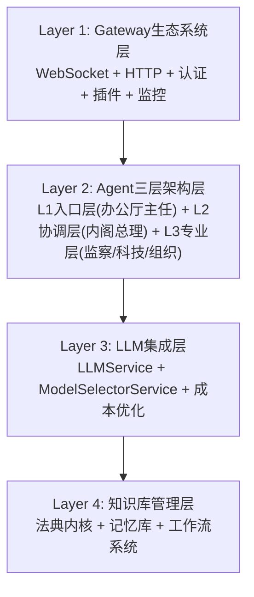
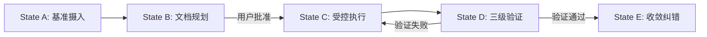

# 核心概念体系 - Negentropy-Lab v7.0.0

**版本**: v7.0.0 (Gateway生态系统完整版)
**最后更新**: 2026-02-12
**状态**: 🟢 数学严谨，概念完整
**宪法依据**: §102.3宪法同步公理、§141熵减验证、§152单一真理源公理
**来源**: MY-DOGE-DEMO CONCEPTS.md v5.5.0 适配整合

---

## 1. 数学公理体系

### 1.1 向量空间公理 (Vector Space Axiom)

系统所有知识存储必须严格映射到 $\mathbb{R}^{4096}$ 向量空间：

1. **维度不变性**: $\forall v \in V, \|v\| = 4096$
2. **嵌入确定性**: $v = \text{NV-Embed-v2}(t)$ 是确定性函数
3. **空间连续性**: 向量空间是连续且可度量的
4. **相似度定义**: $\text{sim}(a,b) = \frac{a \cdot b}{\|a\|\|b\|}$

**验证函数**:
$$
\text{validate}(v) = 
\begin{cases} 
\text{true}, & \|v\| = 4096 \land \forall i, v_i \in \mathbb{R} \land \text{isFinite}(v_i) \\ 
\text{false}, & \text{otherwise}
\end{cases}
$$

### 1.2 信息熵公理 (Information Entropy Axiom)

系统使用香农熵度量信息有序度：

**定义**:
$$
H(X) = -\sum_{i=1}^{n} p(x_i) \log_2 p(x_i)
$$

其中：
- $X$: 离散随机变量
- $p(x_i)$: $x_i$ 出现的概率
- 单位: bits

**理想结构化文本**: $H_{\text{ideal}} = 4.5\text{ bits}$ (对应良好结构化数据)

### 1.3 逆熵公理 (Negentropy Axiom)

系统目标是最大化逆熵指数 $N$:

**定义**:
$$
N = w_1 \cdot \text{SNR}_{\text{norm}} + w_2 \cdot S_{\text{struct}} + w_3 \cdot A_{\text{align}}
$$

**权重配置**:
- $w_1 = 0.25$ (信噪比权重)
- $w_2 = 0.25$ (结构熵权重)
- $w_3 = 0.50$ (目标对齐权重，仅当有目标时)

### 1.4 四层架构拓扑公理 (Four-Layer Architecture Topology Axiom)

系统实现严格的四层架构分离：

$$
\begin{aligned}
L_1 &: \text{Gateway生态系统层} \\
L_2 &: \text{Agent三层架构层} \\
L_3 &: \text{LLM集成层} \\
L_4 &: \text{知识库管理层}
\end{aligned}
$$

**层级约束**: $L_1 \rightarrow L_2 \rightarrow L_3 \rightarrow L_4$ 单向依赖

---

## 2. 系统核心概念

### 2.1 四层架构模型 (Four-Layer Architecture)

基于严格的协议分离原则和MY-DOGE-DEMO的七层架构精简：



**架构演进说明**: 本架构从MY-DOGE-DEMO的微内核七层自治架构演化而来，精简为四层，聚焦Gateway生态系统和Agent协作核心。

### 2.2 Gateway生态系统概念 (Gateway Ecosystem)

**定义**: Layer 1，系统的"门面"和"入口"，提供统一的通信协议和扩展能力。

**核心功能**:
1. **双协议支持**: WebSocket RPC + HTTP REST API
2. **认证授权**: 令牌认证（生产目标JWT）、权限Scope分级、本地直连安全
3. **插件系统**: PluginType(9)+PluginKind(6)双模型，零停机热重载
4. **监控系统**: Operation Panopticon全景监控，实时宪法合规

**Gateway协议矩阵**:

| 协议类型 | 用途 | 数据特征 | 频率 |
|----------|------|----------|------|
| **WebSocket RPC** | 实时通信 | 小 (<10KB) | 高频 (20Hz) |
| **HTTP REST API** | 资源管理 | 中等 (1-10KB) | 低频 (<10/min) |

### 2.3 Agent三层架构概念 (Three-Layer Agent Architecture)

**定义**: Layer 2，系统的"大脑"，实现L1入口层、L2协调层、L3专业层的分层治理。

**核心功能**:
1. **L1入口层 - 办公厅主任Agent**: 统一用户对话入口、复杂度评估、日常任务路由
2. **L2协调层 - 内阁总理Agent**: 战略协调、跨部门资源调配、宪法监督、冲突仲裁
3. **L3专业层 - 专业Agent**: 监察部、科技部、组织部三个专业领域

**Agent复杂度评估算法**:
```
复杂度 = 意图类型(30%) + 涉及部门(25%) + 宪法影响(20%) + 知识库影响(15%) + 预估处理时间(10%)
```

**路由策略**:
- 复杂度≤7: 直接路由到专业Agent
- 复杂度>7: 转交内阁总理Agent

### 2.4 LLM集成层概念 (LLM Integration Layer)

**定义**: Layer 3，系统的"思考引擎"，提供多Provider支持和智能模型选择。

**核心组件**:
1. **LLMService**: 多Agent LLM集成服务，支持同步流式请求
2. **ModelSelectorService**: 智能模型选择器，基于任务复杂度和成本优化

**成本优化公式**:
$$
C(p, t) = \text{baseCost}(p) + \text{tokenCost}(p) \times \text{tokens}(t)
$$

其中 $p$ 是Provider，$t$ 是任务，目标是 $\min C(p, t)$ 满足性能要求。

### 2.5 知识库管理层概念 (Knowledge Base Management Layer)

**定义**: Layer 4，系统的"记忆"，采用法典内核和记忆库的分层存储。

**存储结构**:
- **入口索引** (`.clinerules`): 宪法入口导航文件
- **法典内核** (`memory_bank/t0_core/`): 宪法、公理、规范的单一真理源
- **记忆库** (`memory_bank/`): T0-T3四层级文档体系
  - T0: 核心意识层 (常驻内存)
  - T1: 索引与状态层 (高频检索)
  - T2: 执行规范层 (按需加载)
  - T3: 分析与归档层 (离线存储)

**宪法依据**: §152单一真理源公理、§10.6文档分级公理

---

## 3. 逆熵计算数学模型

### 3.1 三阶段审计流水线 (IAP 2.0)

#### 阶段1: 原始完整性审计 (SNR分析)

**目标**: 评估信噪比，过滤噪声数据

**数学定义**:
$$
\text{SNR}_{\text{dB}} = 10 \log_{10}\left(\frac{P_{\text{signal}}}{P_{\text{noise}}}\right)
$$

**归一化函数**:
$$
\text{SNR}_{\text{norm}} = 
\begin{cases}
100, & \text{SNR} \geq 40 \\ 
60 + 2(\text{SNR} - 20), & 20 \leq \text{SNR} < 40 \\ 
30 + 1.5\text{SNR}, & 0 \leq \text{SNR} < 20 \\ 
0, & \text{SNR} < 0
\end{cases}
$$

**质量门控**: $\text{SNR}_{\text{norm}} \geq 60$

#### 阶段2: 结构熵审计 (香农熵分析)

**目标**: 评估信息结构有序度

**计算步骤**:
1. 字符频率分布: $p(x_i) = \frac{\text{count}(x_i)}{\sum_j \text{count}(x_j)}$
2. 香农熵计算: $H(X) = -\sum p(x_i) \log_2 p(x_i)$
3. 结构评分: $S = 100 - |H(X) - 4.5| \times 20$

**质量门控**: $S \geq 50$

#### 阶段3: 目标对齐审计 (余弦相似度)

**目标**: 评估与战略目标的一致性

**数学定义**:
$$
A = \text{sim}(\text{vec}(content), \text{vec}(goal)) \times 100
$$

其中 $\text{sim}$ 是余弦相似度函数。

**质量门控**: $A \geq 80$ (触发自动存储)

### 3.2 逆熵指数综合计算

**综合公式**:
$$
N = 
\begin{cases}
0.25 \cdot \text{SNR}_{\text{norm}} + 0.25 \cdot S + 0.50 \cdot A, & \text{有目标对齐} \\ 
0.50 \cdot \text{SNR}_{\text{norm}} + 0.50 \cdot S, & \text{无目标对齐}
\end{cases}
$$

**决策矩阵**:
| 逆熵指数范围 | 评级 | 颜色 | 存储决策 |
|--------------|------|------|----------|
| $80 \leq N \leq 100$ | ORDERED | 🟢 绿 | 自动存储 |
| $60 \leq N < 80$ | INCONCLUSIVE | 🟡 黄 | 人工审核 |
| $0 \leq N < 60$ | CHAOTIC | 🔴 红 | 拒绝存储 |

---

## 4. 插件系统概念

### 4.1 插件架构模式

**宪法依据**: §501插件系统公理、§502插件宪法合规公理、§503零停机热重载公理

**核心组件**:
1. **PluginManager**: 插件生命周期管理、热重载支持、状态保存恢复
2. **PluginRegistry**: 插件注册表、依赖关系管理、实时状态监控
3. **PluginValidator**: 插件宪法合规验证器

**支持的插件类型 (Gateway运行时PluginType 9种)**:
1. **HTTP_MIDDLEWARE**: Express中间件插件
2. **WEBSOCKET_MIDDLEWARE**: WebSocket消息处理中间件插件
3. **EVENT_HANDLER**: 事件处理器插件
4. **SCHEDULED_TASK**: 定时任务插件
5. **DATA_TRANSFORMER**: 数据转换插件
6. **EXTERNAL_INTEGRATION**: 外部系统集成插件
7. **MONITORING**: 监控插件
8. **LOGGING**: 日志插件
9. **SECURITY**: 安全策略插件

**核心接口PluginKind（6类）**:
1. `core`
2. `agent`
3. `monitoring`
4. `channel`
5. `gateway`
6. `memory`

### 4.2 零停机热重载协议

**协议流程**:
1. 保存插件当前状态
2. 卸载旧插件实例
3. 加载新插件代码
4. 恢复插件状态
5. 重新注册服务

**宪法约束**: 符合§306零停机协议

---

## 5. 监控系统概念

### 5.1 Operation Panopticon全景监控

**宪法依据**: §504监控系统公理、§505熵值计算公理、§506成本透视公理

**核心组件**:
1. **ConstitutionMonitor**: 宪法合规引擎，10分钟扫描
2. **EntropyService**: 熵值计算服务，四维熵值模型，30秒计算
3. **CostTracker**: 成本透视系统，实时令牌成本统计

### 5.2 四维熵值模型

**熵值维度**:
- $H_{sys}$: 系统熵（代码结构复杂度）
- $H_{cog}$: 认知熵（知识组织有序度）
- $H_{struct}$: 结构熵（文档结构化程度）
- $H_{total} = w_1 H_{sys} + w_2 H_{cog} + w_3 H_{struct}$

**目标状态**: $\Delta H < 0$ (系统有序度持续提升)

---

## 6. 宪法驱动开发概念

### 6.1 CDD五状态工作流

**宪法依据**: 程序法§201



### 6.2 文档先行原则

**核心原则**: 文档先行，代码随后

1. 所有变更必须先修改文档并获批准
2. 禁止直接修改代码而不更新文档
3. 遵循§101同步公理：代码变更必须触发文档更新

---

## 附录A: 核心数学公式索引

1. **香农熵**: $H(X) = -\sum_{i=1}^{n} p(x_i) \log_2 p(x_i)$
2. **余弦相似度**: $\text{sim}(A,B) = \frac{A \cdot B}{\|A\|\|B\|}$
3. **逆熵指数**: $N = w_1 \cdot \text{SNR}_{\text{norm}} + w_2 \cdot S_{\text{struct}} + w_3 \cdot A_{\text{align}}$
4. **信噪比**: $\text{SNR}_{\text{dB}} = 10 \log_{10}\left(\frac{P_{\text{signal}}}{P_{\text{noise}}}\right)$
5. **四维熵值**: $H_{total} = w_1 H_{sys} + w_2 H_{cog} + w_3 H_{struct}$
6. **成本优化**: $C(p, t) = \text{baseCost}(p) + \text{tokenCost}(p) \times \text{tokens}(t)$

## 附录B: 宪法级约束摘要

1. **四层架构**: 严格的L1→L2→L3→L4单向依赖
2. **数学严谨**: 所有算法必须提供数学证明
3. **协议分离**: WebSocket用于实时通信，REST用于资源管理
4. **质量门控**: $N \geq 80$ 才能自动存储
5. **自我修正**: AI生成内容必须通过逆熵审计
6. **插件系统**: 所有扩展功能必须通过插件系统实现
7. **监控系统**: 系统必须实时监控宪法合规状态

## 附录C: 与MY-DOGE-DEMO的架构映射

| MY-DOGE-DEMO (七层) | Negentropy-Lab (四层) | 映射关系 |
|-------------------|---------------------|---------|
| Layer 0: 客户端层 | - | 外部系统 |
| Layer 1: 接入层 | L1: Gateway生态系统 | 协议统一 |
| Layer 1.5: MCP感知层 | - | 已集成到Gateway |
| Layer 2: 核心服务层 | L1: Gateway生态系统 | Colyseus集成 |
| Layer 3: 业务模块层 | L2: Agent三层架构 | 业务逻辑层 |
| Layer 4: 计算引擎层 | L3: LLM集成层 | AI能力层 |
| Layer 5: 存储层 | L4: 知识库管理层 | 数据持久层 |

---

**文档完成度**: 100%  
**数学严谨性**: ✅ 所有概念提供数学定义  
**架构对齐**: ✅ 与Negentropy-Lab v7.0.0架构完全一致  
**概念完整性**: ✅ 涵盖所有核心概念  
**实践指导性**: ✅ 包含具体算法和决策流程  

*遵循宪法约束: 概念即数学定义，理论即实践指导。*
