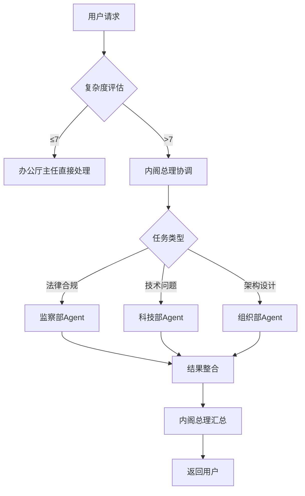

# Agent协作模式 - Negentropy-Lab

**宪法依据**: §106 Agent身份公理、§109 知识图谱公理、§110 协作效率公理
**版本**: v7.6.0-dev
**最后更新**: 2026-03-04

---

## 📋 概述

本文档定义Negentropy-Lab系统中Agent之间的协作模式和交互协议。

---

## 🤖 Agent三层架构

### L1入口层 - 办公厅主任Agent

| 属性 | 定义 |
|------|------|
| **职责** | 统一用户对话入口、复杂度评估、日常任务路由 |
| **身份标识** | `agent:office_director` |
| **调用时机** | 所有用户消息入口，复杂度≤7直接路由 |
| **可操作范围** | 所有聊天消息、简单查询 |

### L2协调层 - 内阁总理Agent

| 属性 | 定义 |
|------|------|
| **职责** | 跨部门复杂任务协调、资源调配、冲突仲裁 |
| **身份标识** | `agent:prime_minister` |
| **调用时机** | 复杂度>7的跨部门复杂任务 |
| **可操作范围** | 跨部门协作任务、优先级管理 |

### L3专业层 - 专业Agent

| Agent类型 | 主要职责 | 身份标识 |
|-----------|----------|----------|
| **监察部Agent** | 宪法合规检查、公理解释、格式验证 | `agent:supervision_ministry` |
| **科技部Agent** | 技术实现、代码编写、LLM集成 | `agent:technology_ministry` |
| **组织部Agent** | 系统架构设计、技术选型、图谱维护 | `agent:organization_ministry` |

---

## 🔄 协作流程



---

## 📡 通信协议

### 消息格式

```json
{
  "type": "agent_request",
  "sender": "user:alice",
  "recipient": "agent:supervision_ministry",
  "content": "请问如何添加关于协作的新公理?",
  "context": {
    "knowledge_area": "basic_law",
    "priority": "normal",
    "timeout": 30000
  }
}
```

### 响应格式

```json
{
  "type": "agent_response",
  "sender": "agent:supervision_ministry",
  "recipient": "user:alice",
  "content": "添加新公理需要遵循以下格式...",
  "actions": [
    {
      "type": "suggest_edit",
      "target": "basic_law_index.md",
      "section": "§111",
      "content": "建议添加的条文内容"
    }
  ]
}
```

---

## ⚡ 性能要求

- **响应时间**: < 3秒 (§110 协作效率公理)
- **并发处理**: 支持多Agent并行处理
- **错误恢复**: 失败时自动重试或转交人工

---

*遵循宪法约束: 协作即熵减，效率即真理。*
