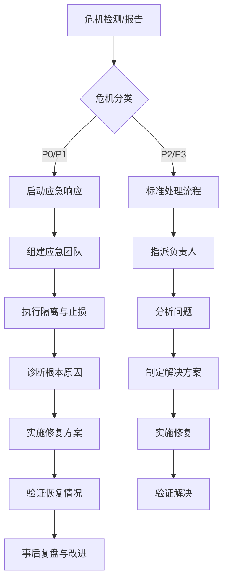

# WF-204: 危机处理流程工作流程实现

**版本**: v1.0.0
**状态**: 🟢 活跃
**宪法依据**: §204危机处理流程、§132失效隔离公理、§125数据完整性公理
**最后更新**: 2026-02-09

## 1. 范围

本工作流适用于MY-DOGE-MACRO项目中所有系统危机场景，包括但不限于：
- 系统崩溃或不可用
- 数据损坏或丢失
- 安全漏洞或攻击
- 性能严重下降
- 关键依赖故障

## 2. 危机分类与响应级别

### 2.1 危机级别定义

| 级别 | 名称 | 影响范围 | 响应时间 | 负责人 |
|------|------|----------|----------|--------|
| **P0** | 严重危机 | 系统完全不可用，核心功能失效 | <15分钟 | 系统负责人 |
| **P1** | 重大危机 | 主要功能不可用，业务严重影响 | <30分钟 | 技术负责人 |
| **P2** | 一般危机 | 次要功能不可用，部分影响 | <2小时 | 模块负责人 |
| **P3** | 轻微危机 | 非关键功能问题，有限影响 | <24小时 | 开发人员 |

### 2.2 危机场景矩阵

| 场景 | 可能级别 | 触发条件 | 初始响应 |
|------|----------|----------|----------|
| **数据库损坏** | P0/P1 | 数据完整性检查失败，无法读取关键数据 | 切换到备份，隔离损坏实例 |
| **API服务不可用** | P0/P1 | 关键外部API连续失败，断路器打开 | 启用降级模式，使用缓存数据 |
| **安全漏洞** | P0/P1 | 发现未授权访问或数据泄露 | 立即隔离受影响系统，审计日志 |
| **性能雪崩** | P1/P2 | 响应时间超过阈值，资源耗尽 | 限流降级，增加资源 |
| **配置错误** | P2/P3 | 错误配置导致功能异常 | 回滚配置，验证正确性 |

## 3. 危机处理流程

### 3.1 整体流程图



### 3.2 详细处理步骤

#### 阶段1：检测与报告 (0-5分钟)

**自动化检测**:
```python
# crisis_detection.py
import time
from typing import Dict, Optional
from dataclasses import dataclass
from enum import Enum


class CrisisSeverity(Enum):
    P0 = "p0"
    P1 = "p1"
    P2 = "p2"
    P3 = "p3"


class CrisisIndicator:
    """危机指标检测器"""
    
    @staticmethod
    def detect_system_unavailability() -> Optional[CrisisSeverity]:
        """检测系统不可用"""
        # 检查核心服务健康状态
        health_status = check_system_health()
        
        if not health_status["overall_healthy"]:
            # 核心服务不可用
            if health_status["critical_services_failed"] > 2:
                return CrisisSeverity.P0
            else:
                return CrisisSeverity.P1
        
        return None
    
    @staticmethod
    def detect_performance_degradation() -> Optional[CrisisSeverity]:
        """检测性能下降"""
        metrics = get_performance_metrics()
        
        # 检查响应时间
        if metrics["p95_response_time"] > 10000:  # 10秒
            return CrisisSeverity.P1
        elif metrics["p95_response_time"] > 5000:  # 5秒
            return CrisisSeverity.P2
        
        # 检查错误率
        if metrics["error_rate"] > 0.3:  # 30%
            return CrisisSeverity.P1
        elif metrics["error_rate"] > 0.1:  # 10%
            return CrisisSeverity.P2
        
        return None
    
    @staticmethod
    def detect_data_corruption() -> Optional[CrisisSeverity]:
        """检测数据损坏"""
        # 检查数据完整性
        integrity_checks = run_data_integrity_checks()
        
        for check in integrity_checks:
            if not check["passed"] and check["critical"]:
                return CrisisSeverity.P0
            elif not check["passed"]:
                return CrisisSeverity.P2
        
        return None


class CrisisReporter:
    """危机报告器"""
    
    def __init__(self):
        self.crisis_log = []
        self.notification_channels = ["slack", "email", "sms"]
    
    def report_crisis(
        self,
        severity: CrisisSeverity,
        description: str,
        location: str,
        indicators: Dict
    ):
        """报告危机"""
        crisis_id = f"crisis_{int(time.time())}"
        crisis_data = {
            "id": crisis_id,
            "severity": severity.value,
            "description": description,
            "location": location,
            "indicators": indicators,
            "timestamp": time.time(),
            "status": "reported"
        }
        
        # 记录危机
        self.crisis_log.append(crisis_data)
        
        # 发送通知
        self._send_notifications(crisis_data)
        
        # 创建危机处理任务
        self._create_crisis_task(crisis_data)
        
        return crisis_id
    
    def _send_notifications(self, crisis_data: Dict):
        """发送通知"""
        severity = crisis_data["severity"]
        
        # 根据严重程度确定通知范围
        if severity in ["p0", "p1"]:
            # 严重危机：通知所有相关人员
            recipients = ["system_owner", "tech_lead", "oncall_engineer"]
            urgency = "high"
        else:
            # 一般危机：通知负责人
            recipients = ["module_owner"]
            urgency = "medium"
        
        # 发送到各渠道
        for channel in self.notification_channels:
            send_notification(
                channel=channel,
                recipients=recipients,
                title=f"[{severity.upper()}] {crisis_data['description']}",
                message=self._format_notification_message(crisis_data),
                urgency=urgency
            )
```

#### 阶段2：应急响应启动 (5-15分钟)

**应急响应团队组建**:
```python
# emergency_response.py
from typing import List, Dict
from dataclasses import dataclass


@dataclass
class EmergencyTeamMember:
    """应急团队成员"""
    name: str
    role: str
    contact: str
    skills: List[str]


class EmergencyResponseTeam:
    """应急响应团队"""
    
    def __init__(self):
        self.members: List[EmergencyTeamMember] = []
        self.incident_commander: Optional[EmergencyTeamMember] = None
        self.communication_channels = {
            "war_room": "slack_war_room",
            "voice": "zoom_meeting",
            "documentation": "crisis_doc"
        }
    
    def assemble_team(self, crisis_severity: str) -> List[EmergencyTeamMember]:
        """组建应急团队"""
        # 根据危机严重程度确定团队规模
        if crisis_severity == "p0":
            team_size = 5
            required_roles = ["incident_commander", "technical_lead", "communication", "investigator", "recovery"]
        elif crisis_severity == "p1":
            team_size = 3
            required_roles = ["incident_commander", "technical_lead", "investigator"]
        else:
            team_size = 2
            required_roles = ["incident_commander", "investigator"]
        
        # 从待命名单中选取人员
        oncall_roster = get_oncall_roster()
        team = []
        
        for role in required_roles:
            candidate = self._select_candidate(role, oncall_roster)
            if candidate:
                team.append(candidate)
                oncall_roster.remove(candidate)
        
        self.members = team
        self.incident_commander = next(
            (m for m in team if m.role == "incident_commander"),
            team[0] if team else None
        )
        
        return team
    
    def establish_communication(self):
        """建立沟通渠道"""
        # 创建战时会议室
        war_room = create_slack_channel(
            name=f"crisis_war_room_{int(time.time())}",
            members=[m.contact for m in self.members]
        )
        
        # 创建危机文档
        crisis_doc = create_crisis_document(
            template="crisis_response_template",
            editors=[m.name for m in self.members]
        )
        
        # 安排定期同步会议
        sync_meeting = schedule_meeting(
            frequency="15min",  # 每15分钟同步一次
            participants=[m.contact for m in self.members],
            duration=30  # 30分钟
        )
        
        return {
            "war_room": war_room,
            "crisis_doc": crisis_doc,
            "sync_meeting": sync_meeting
        }
```

#### 阶段3：诊断与止损 (15-60分钟)

**系统隔离与诊断**:
```python
# crisis_diagnosis.py
import logging
from typing import Optional, Dict, List


class CrisisDiagnostician:
    """危机诊断器"""
    
    def __init__(self):
        self.logger = logging.getLogger(__name__)
        self.diagnosis_tools = {
            "logs": LogAnalyzer(),
            "metrics": MetricsAnalyzer(),
            "traces": TracingAnalyzer(),
            "configs": ConfigAnalyzer()
        }
    
    def perform_isolation(self, affected_components: List[str]):
        """执行隔离"""
        isolation_report = []
        
        for component in affected_components:
            try:
                # 隔离组件
                if self._is_network_service(component):
                    isolation_result = self._isolate_network_service(component)
                elif self._is_database(component):
                    isolation_result = self._isolate_database(component)
                elif self._is_storage(component):
                    isolation_result = self._isolate_storage(component)
                else:
                    isolation_result = {"status": "skipped", "reason": "unknown_type"}
                
                isolation_report.append({
                    "component": component,
                    "result": isolation_result,
                    "timestamp": time.time()
                })
                
            except Exception as e:
                self.logger.error(f"隔离组件 {component} 失败: {e}")
                isolation_report.append({
                    "component": component,
                    "result": {"status": "failed", "error": str(e)},
                    "timestamp": time.time()
                })
        
        return isolation_report
    
    def diagnose_root_cause(self, crisis_data: Dict) -> Dict:
        """诊断根本原因"""
        diagnosis = {
            "symptoms": [],
            "hypotheses": [],
            "evidence": {},
            "root_cause": None,
            "confidence": 0.0
        }
        
        # 收集症状
        diagnosis["symptoms"] = self._collect_symptoms(crisis_data)
        
        # 生成假设
        diagnosis["hypotheses"] = self._generate_hypotheses(diagnosis["symptoms"])
        
        # 收集证据
        for hypothesis in diagnosis["hypotheses"]:
            evidence = self._collect_evidence(hypothesis)
            diagnosis["evidence"][hypothesis["id"]] = evidence
        
        # 评估假设
        evaluated_hypotheses = self._evaluate_hypotheses(diagnosis["hypotheses"], diagnosis["evidence"])
        
        # 选择最可能的根本原因
        if evaluated_hypotheses:
            top_hypothesis = max(evaluated_hypotheses, key=lambda h: h["confidence"])
            diagnosis["root_cause"] = top_hypothesis["description"]
            diagnosis["confidence"] = top_hypothesis["confidence"]
        
        return diagnosis
    
    def _collect_symptoms(self, crisis_data: Dict) -> List[Dict]:
        """收集症状"""
        symptoms = []
        
        # 从指标中提取症状
        indicators = crisis_data.get("indicators", {})
        
        for tool_name, tool in self.diagnosis_tools.items():
            tool_symptoms = tool.analyze(indicators)
            symptoms.extend(tool_symptoms)
        
        return symptoms
    
    def _generate_hypotheses(self, symptoms: List[Dict]) -> List[Dict]:
        """生成假设"""
        hypotheses = []
        symptom_patterns = self._identify_patterns(symptoms)
        
        # 基于症状模式生成假设
        hypothesis_templates = self._load_hypothesis_templates()
        
        for pattern in symptom_patterns:
            matching_templates = [
                t for t in hypothesis_templates
                if self._pattern_matches_template(pattern, t)
            ]
            
            for template in matching_templates:
                hypothesis = {
                    "id": f"hypothesis_{len(hypotheses) + 1}",
                    "description": template["description"],
                    "type": template["type"],
                    "probability": template.get("base_probability", 0.5),
                    "test_methods": template["test_methods"],
                    "remediation": template["remediation"]
                }
                hypotheses.append(hypothesis)
        
        return hypotheses
```

#### 阶段4：恢复与修复 (1-4小时)

**恢复策略执行**:
```python
# crisis_recovery.py
from typing import Dict, List, Optional
from enum import Enum


class RecoveryStrategy(Enum):
    """恢复策略"""
    ROLLBACK = "rollback"            # 回滚到之前版本
    FAILOVER = "failover"            # 故障切换到备用系统
    DEGRADE = "degrade"              # 降级功能
    ISOLATE_AND_CONTINUE = "isolate" # 隔离问题继续运行
    RECONSTRUCT = "reconstruct"      # 重建数据/系统


class CrisisRecoveryManager:
    """危机恢复管理器"""
    
    def __init__(self):
        self.recovery_plans = self._load_recovery_plans()
        self.backup_systems = self._discover_backup_systems()
    
    def execute_recovery(self, crisis_data: Dict, diagnosis: Dict) -> Dict:
        """执行恢复"""
        # 确定恢复策略
        strategy = self._determine_recovery_strategy(crisis_data, diagnosis)
        
        # 执行恢复
        recovery_result = None
        
        if strategy == RecoveryStrategy.ROLLBACK:
            recovery_result = self._execute_rollback(crisis_data, diagnosis)
        elif strategy == RecoveryStrategy.FAILOVER:
            recovery_result = self._execute_failover(crisis_data, diagnosis)
        elif strategy == RecoveryStrategy.DEGRADE:
            recovery_result = self._execute_degradation(crisis_data, diagnosis)
        elif strategy == RecoveryStrategy.ISOLATE_AND_CONTINUE:
            recovery_result = self._execute_isolation(crisis_data, diagnosis)
        elif strategy == RecoveryStrategy.RECONSTRUCT:
            recovery_result = self._execute_reconstruction(crisis_data, diagnosis)
        
        # 验证恢复
        verification = self._verify_recovery(recovery_result)
        
        return {
            "strategy": strategy.value,
            "execution_result": recovery_result,
            "verification": verification,
            "timestamp": time.time()
        }
    
    def _determine_recovery_strategy(self, crisis_data: Dict, diagnosis: Dict) -> RecoveryStrategy:
        """确定恢复策略"""
        severity = crisis_data["severity"]
        root_cause = diagnosis.get("root_cause", "")
        
        # 根据严重程度和根本原因选择策略
        if severity in ["p0", "p1"]:
            # 严重危机，优先快速恢复
            if "data_corruption" in root_cause.lower():
                return RecoveryStrategy.RECONSTRUCT
            elif "configuration" in root_cause.lower():
                return RecoveryStrategy.ROLLBACK
            elif "dependency" in root_cause.lower():
                return RecoveryStrategy.FAILOVER
            else:
                return RecoveryStrategy.DEGRADE
        else:
            # 一般危机，可以更谨慎
            return RecoveryStrategy.ISOLATE_AND_CONTINUE
    
    def _execute_rollback(self, crisis_data: Dict, diagnosis: Dict) -> Dict:
        """执行回滚"""
        # 识别要回滚的组件
        affected_components = crisis_data.get("affected_components", [])
        
        rollback_results = []
        for component in affected_components:
            # 查找最近的健康版本
            healthy_version = self._find_healthy_version(component)
            
            if healthy_version:
                # 执行回滚
                result = self._rollback_component(component, healthy_version)
                rollback_results.append({
                    "component": component,
                    "target_version": healthy_version,
                    "result": result
                })
        
        return {
            "type": "rollback",
            "results": rollback_results,
            "timestamp": time.time()
        }
    
    def _execute_failover(self, crisis_data: Dict, diagnosis: Dict) -> Dict:
        """执行故障切换"""
        # 识别主系统
        primary_systems = self._identify_primary_systems(crisis_data)
        
        failover_results = []
        for system in primary_systems:
            # 查找备用系统
            backup_system = self._find_backup_system(system)
            
            if backup_system:
                # 执行故障切换
                result = self._perform_failover(system, backup_system)
                failover_results.append({
                    "primary": system,
                    "backup": backup_system,
                    "result": result
                })
        
        return {
            "type": "failover",
            "results": failover_results,
            "timestamp": time.time()
        }
```

#### 阶段5：验证与监控 (1-2小时)

**恢复验证**:
```python
# recovery_verification.py
import time
from typing import Dict, List


class RecoveryVerifier:
    """恢复验证器"""
    
    def __init__(self):
        self.verification_tests = self._load_verification_tests()
        self.monitoring_thresholds = self._load_monitoring_thresholds()
    
    def verify_recovery(self, recovery_result: Dict) -> Dict:
        """验证恢复"""
        verification_report = {
            "overall_status": "pending",
            "component_tests": [],
            "integration_tests": [],
            "monitoring_data": {},
            "recommendations": []
        }
        
        # 执行组件级测试
        for component in recovery_result.get("affected_components", []):
            component_test = self._test_component(component)
            verification_report["component_tests"].append(component_test)
        
        # 执行集成测试
        integration_test = self._test_integration()
        verification_report["integration_tests"].append(integration_test)
        
        # 收集监控数据
        monitoring_data = self._collect_monitoring_data()
        verification_report["monitoring_data"] = monitoring_data
        
        # 评估恢复状态
        verification_report["overall_status"] = self._evaluate_recovery_status(
            verification_report["component_tests"],
            verification_report["integration_tests"],
            monitoring_data
        )
        
        # 生成建议
        verification_report["recommendations"] = self._generate_recommendations(
            verification_report
        )
        
        return verification_report
    
    def monitor_post_recovery(self, verification_report: Dict, duration_hours: int = 24):
        """监控恢复后状态"""
        monitoring_interval = 300  # 5分钟
        total_intervals = (duration_hours * 3600) // monitoring_interval
        
        monitoring_results = []
        
        for interval in range(total_intervals):
            # 收集指标
            metrics = self._collect_metrics()
            
            # 检查异常
            anomalies = self._detect_anomalies(metrics)
            
            # 记录状态
            status = {
                "interval": interval,
                "timestamp": time.time(),
                "metrics": metrics,
                "anomalies": anomalies,
                "overall_status": "healthy" if not anomalies else "unhealthy"
            }
            
            monitoring_results.append(status)
            
            # 如果发现严重异常，触发警报
            severe_anomalies = [a for a in anomalies if a["severity"] == "high"]
            if severe_anomalies:
                self._trigger_alert(severe_anomalies)
            
            # 等待下一个间隔
            time.sleep(monitoring_interval)
        
        return monitoring_results
```

#### 阶段6：复盘与改进 (1-3天)

**事后复盘**:
```python
# post_mortem.py
from typing import Dict, List
from dataclasses import dataclass
import datetime


@dataclass
class PostMortemFinding:
    """复盘发现"""
    category: str
    description: str
    impact: str
    root_cause: str
    recommendations: List[str]
    priority: str  # high, medium, low


class PostMortemAnalyzer:
    """事后复盘分析器"""
    
    def __init__(self):
        self.timeline_events = []
        self.findings = []
        self.action_items = []
    
    def conduct_post_mortem(self, crisis_data: Dict, recovery_data: Dict) -> Dict:
        """执行事后复盘"""
        # 重建时间线
        timeline = self._reconstruct_timeline(crisis_data, recovery_data)
        
        # 分析关键决策点
        decision_points = self._analyze_decision_points(timeline)
        
        # 识别改进机会
        findings = self._identify_findings(timeline, decision_points)
        
        # 生成行动项
        action_items = self._generate_action_items(findings)
        
        # 创建复盘文档
        post_mortem_doc = self._create_post_mortem_document(
            crisis_data, recovery_data, timeline, findings, action_items
        )
        
        return {
            "timeline": timeline,
            "decision_points": decision_points,
            "findings": findings,
            "action_items": action_items,
            "post_mortem_doc": post_mortem_doc
        }
    
    def _reconstruct_timeline(self, crisis_data: Dict, recovery_data: Dict) -> List[Dict]:
        """重建时间线"""
        timeline = []
        
        # 添加危机检测事件
        timeline.append({
            "timestamp": crisis_data["timestamp"],
            "event": "crisis_detected",
            "description": f"Crisis detected: {crisis_data['description']}",
            "severity": crisis_data["severity"]
        })
        
        # 添加响应事件
        response_events = crisis_data.get("response_events", [])
        timeline.extend(response_events)
        
        # 添加恢复事件
        recovery_events = recovery_data.get("recovery_events", [])
        timeline.extend(recovery_events)
        
        # 按时间排序
        timeline.sort(key=lambda x: x["timestamp"])
        
        # 计算时间间隔
        for i in range(1, len(timeline)):
            prev_time = timeline[i-1]["timestamp"]
            curr_time = timeline[i]["timestamp"]
            timeline[i]["time_since_previous"] = curr_time - prev_time
        
        return timeline
    
    def _identify_findings(self, timeline: List[Dict], decision_points: List[Dict]) -> List[PostMortemFinding]:
        """识别发现"""
        findings = []
        
        # 分析检测延迟
        detection_delay = self._analyze_detection_delay(timeline)
        if detection_delay["significant"]:
            findings.append(PostMortemFinding(
                category="detection",
                description=f"Detection delay of {detection_delay['delay_minutes']} minutes",
                impact="Extended crisis duration",
                root_cause=detection_delay["root_cause"],
                recommendations=[
                    "Improve monitoring alerts",
                    "Reduce alert thresholds",
                    "Implement anomaly detection"
                ],
                priority="high" if detection_delay["delay_minutes"] > 30 else "medium"
            ))
        
        # 分析响应效率
        response_efficiency = self._analyze_response_efficiency(timeline)
        if not response_efficiency["efficient"]:
            findings.append(PostMortemFinding(
                category="response",
                description="Inefficient response process",
                impact="Delayed recovery",
                root_cause=response_efficiency["root_cause"],
                recommendations=[
                    "Streamline communication channels",
                    "Predefine escalation paths",
                    "Conduct regular crisis drills"
                ],
                priority="medium"
            ))
        
        # 分析恢复有效性
        recovery_effectiveness = self._analyze_recovery_effectiveness(timeline)
        if not recovery_effectiveness["effective"]:
            findings.append(PostMortemFinding(
                category="recovery",
                description="Ineffective recovery strategy",
                impact="Extended downtime",
                root_cause=recovery_effectiveness["root_cause"],
                recommendations=[
                    "Improve backup and restore procedures",
                    "Implement automated failover",
                    "Test recovery plans regularly"
                ],
                priority="high"
            ))
        
        return findings
```

## 4. 工具与自动化

### 4.1 危机检测仪表板

```python
# crisis_dashboard.py
import streamlit as st
import pandas as pd
import plotly.graph_objects as go
from datetime import datetime, timedelta


class CrisisDashboard:
    """危机仪表板"""
    
    def __init__(self):
        self.crisis_data = self._load_crisis_data()
        self.system_metrics = self._load_system_metrics()
    
    def render_dashboard(self):
        """渲染仪表板"""
        st.title("MY-DOGE-MACRO 危机管理仪表板")
        
        # 当前状态概览
        col1, col2, col3, col4 = st.columns(4)
        
        with col1:
            self._render_system_health()
        
        with col2:
            self._render_active_crises()
        
        with col3:
            self._render_response_times()
        
        with col4:
            self._render_recovery_success()
        
        # 时间线视图
        st.subheader("危机时间线")
        self._render_timeline()
        
        # 指标趋势
        st.subheader("系统指标趋势")
        self._render_metrics_trends()
        
        # 行动项跟踪
        st.subheader("改进行动项")
        self._render_action_items()
    
    def _render_system_health(self):
        """渲染系统健康状态"""
        health_status = self._calculate_system_health()
        
        # 使用颜色编码
        if health_status["overall"] == "healthy":
            color = "green"
            emoji = "✅"
        elif health_status["overall"] == "degraded":
            color = "orange"
            emoji = "⚠️"
        else:
            color = "red"
            emoji = "🔴"
        
        st.metric(
            label="系统健康状态",
            value=f"{emoji} {health_status['overall'].upper()}",
            delta=f"{health_status['healthy_services']}/{health_status['total_services']} 服务正常"
        )
```

### 4.2 自动化恢复脚本

```bash
#!/bin/bash
# crisis_recovery_automation.sh
# 自动化危机恢复脚本

set -euo pipefail

# 配置
CRISIS_ID="${1:-}"
LOG_FILE="/var/log/crisis_recovery_${CRISIS_ID}.log"
BACKUP_DIR="/backup/crisis_${CRISIS_ID}"
RECOVERY_PLAN="default"

# 初始化日志
exec > >(tee -a "$LOG_FILE") 2>&1
echo "=== Crisis Recovery Automation Started ==="
echo "Crisis ID: $CRISIS_ID"
echo "Timestamp: $(date)"
echo ""

# 加载危机数据
load_crisis_data() {
    echo "Loading crisis data..."
    # 从数据库或API加载危机信息
    CRISIS_DATA=$(curl -s "http://localhost:8000/api/crisis/${CRISIS_ID}")
    
    SEVERITY=$(echo "$CRISIS_DATA" | jq -r '.severity')
    AFFECTED_COMPONENTS=$(echo "$CRISIS_DATA" | jq -r '.affected_components[]')
    
    echo "Severity: $SEVERITY"
    echo "Affected Components: $AFFECTED_COMPONENTS"
}

# 执行隔离
execute_isolation() {
    echo "Executing isolation..."
    
    for component in $AFFECTED_COMPONENTS; do
        case $component in
            "database")
                isolate_database
                ;;
            "api_server")
                isolate_api_server
                ;;
            "cache")
                isolate_cache
                ;;
            *)
                echo "Unknown component: $component"
                ;;
        esac
    done
}

# 执行恢复
execute_recovery() {
    echo "Executing recovery plan: $RECOVERY_PLAN..."
    
    case $RECOVERY_PLAN in
        "rollback")
            perform_rollback
            ;;
        "failover")
            perform_failover
            ;;
        "degrade")
            perform_degradation
            ;;
        "reconstruct")
            perform_reconstruction
            ;;
        *)
            echo "Unknown recovery plan: $RECOVERY_PLAN"
            exit 1
            ;;
    esac
}

# 验证恢复
verify_recovery() {
    echo "Verifying recovery..."
    
    # 检查服务健康
    check_services_health
    
    # 验证数据完整性
    verify_data_integrity
    
    # 检查性能指标
    check_performance_metrics
    
    echo "Recovery verification completed."
}

# 主流程
main() {
    if [[ -z "$CRISIS_ID" ]]; then
        echo "Error: Crisis ID is required"
        exit 1
    fi
    
    load_crisis_data
    execute_isolation
    execute_recovery
    verify_recovery
    
    echo "=== Crisis Recovery Automation Completed ==="
    echo "Recovery successful for crisis: $CRISIS_ID"
}

# 执行主流程
main "$@"
```

## 5. 培训与演练

### 5.1 危机处理培训计划

| 培训项目 | 目标受众 | 频率 | 内容 |
|----------|----------|------|------|
| **基础培训** | 所有开发人员 | 每季度 | 危机分类、报告流程、基本响应 |
| **专项培训** | 系统负责人 | 每两月 | 深度诊断、恢复策略、决策制定 |
| **实战演练** | 应急团队 | 每月 | 模拟危机场景、团队协作、工具使用 |
| **复盘培训** | 相关人员 | 每次危机后 | 经验总结、改进实施、流程优化 |

### 5.2 演练场景库

```yaml
# drill_scenarios.yaml
scenarios:
  - id: "scenario_001"
    name: "数据库主从切换失败"
    description: "主数据库故障，从库无法正常接管"
    severity: "P0"
    learning_objectives:
      - "掌握数据库故障诊断"
      - "练习手动故障切换"
      - "验证数据一致性"
    steps:
      - "模拟主库宕机"
      - "观察监控告警"
      - "执行故障切换"
      - "验证应用功能"
    expected_duration: "2小时"
  
  - id: "scenario_002"
    name: "第三方API大规模失败"
    description: "关键依赖API服务不可用"
    severity: "P1"
    learning_objectives:
      - "练习降级策略实施"
      - "验证断路器模式"
      - "测试备用数据源"
    steps:
      - "模拟API失败"
      - "观察断路器状态"
      - "启用降级模式"
      - "验证用户体验"
    expected_duration: "1.5小时"
  
  - id: "scenario_003"
    name: "配置错误导致系统崩溃"
    description: "错误配置部署导致服务不可用"
    severity: "P2"
    learning_objectives:
      - "练习配置回滚"
      - "验证回滚流程"
      - "测试配置验证"
    steps:
      - "部署错误配置"
      - "观察系统崩溃"
      - "执行配置回滚"
      - "验证恢复状态"
    expected_duration: "1小时"
```

## 6. 监控与告警

### 6.1 关键监控指标

| 指标类别 | 具体指标 | 阈值 | 告警级别 |
|----------|----------|------|----------|
| **可用性** | 服务健康检查 | <95% | P1 |
| | HTTP状态码成功率 | <99% | P2 |
| | 服务响应时间P95 | >5秒 | P2 |
| **数据** | 数据完整性检查 | 失败 | P0 |
| | 备份状态 | 失败 | P1 |
| | 存储空间使用率 | >90% | P1 |
| **性能** | CPU使用率 | >80% | P2 |
| | 内存使用率 | >85% | P2 |
| | 磁盘IO延迟 | >100ms | P2 |
| **安全** | 认证失败率 | >10% | P1 |
| | 异常访问模式 | 检测到 | P0 |
| | 配置变更 | 未授权 | P0 |

### 6.2 告警集成

```python
# alert_integration.py
from typing import Dict, List
import requests


class AlertIntegrator:
    """告警集成器"""
    
    def __init__(self):
        self.integrations = {
            "slack": SlackIntegration(),
            "pagerduty": PagerDutyIntegration(),
            "email": EmailIntegration(),
            "sms": SMSIntegration(),
            "webhook": WebhookIntegration()
        }
    
    def send_alert(self, alert_data: Dict, channels: List[str] = None):
        """发送告警"""
        if channels is None:
            channels = ["slack", "pagerduty"]
        
        results = {}
        for channel in channels:
            if channel in self.integrations:
                try:
                    result = self.integrations[channel].send(alert_data)
                    results[channel] = {"success": True, "result": result}
                except Exception as e:
                    results[channel] = {"success": False, "error": str(e)}
        
        return results
    
    def create_crisis_alert(self, crisis_data: Dict) -> Dict:
        """创建危机告警"""
        severity = crisis_data["severity"]
        
        alert_template = {
            "p0": {
                "title": "🚨 CRITICAL CRISIS DETECTED",
                "color": "#ff0000",
                "urgency": "critical",
                "notify_all": True
            },
            "p1": {
                "title": "⚠️ MAJOR CRISIS DETECTED",
                "color": "#ff9900",
                "urgency": "high",
                "notify_team": True
            },
            "p2": {
                "title": "📢 MINOR CRISIS DETECTED",
                "color": "#ffff00",
                "urgency": "medium",
                "notify_owner": True
            },
            "p3": {
                "title": "ℹ️ INCIDENT DETECTED",
                "color": "#0000ff",
                "urgency": "low",
                "log_only": True
            }
        }
        
        template = alert_template.get(severity, alert_template["p3"])
        
        alert_data = {
            "title": template["title"],
            "message": crisis_data["description"],
            "severity": severity,
            "crisis_id": crisis_data.get("id", "unknown"),
            "timestamp": crisis_data["timestamp"],
            "affected_components": crisis_data.get("affected_components", []),
            "urgency": template["urgency"],
            "metadata": {
                "color": template["color"],
                "notify_all": template.get("notify_all", False),
                "notify_team": template.get("notify_team", False),
                "notify_owner": template.get("notify_owner", False),
                "log_only": template.get("log_only", False)
            }
        }
        
        return alert_data
```

## 7. 实施指南

### 7.1 部署步骤

#### 阶段1：基础建设 (第1-2周)
1. 部署危机检测监控
2. 配置告警渠道
3. 建立应急联系人清单
4. 创建基础文档和模板

#### 阶段2：流程定义 (第3-4周)
1. 制定危机分类标准
2. 定义响应流程
3. 创建恢复策略库
4. 建立沟通协议

#### 阶段3：工具开发 (第5-8周)
1. 开发自动化检测脚本
2. 实现恢复自动化
3. 创建仪表板
4. 集成监控系统

#### 阶段4：培训演练 (第9-12周)
1. 开展全员培训
2. 执行首次演练
3. 优化流程和工具
4. 建立持续改进机制

### 7.2 验证检查表

| 检查项 | 状态 | 验证方法 | 负责人 |
|--------|------|----------|--------|
| 危机检测配置 | ✅/❌ | 模拟测试，验证告警触发 | 运维 |
| 应急联系人清单 | ✅/❌ | 定期验证联系方式 | 经理 |
| 恢复脚本测试 | ✅/❌ | 非生产环境执行 | 开发 |
| 文档完整性 | ✅/❌ | 同行评审，演练验证 | 技术作家 |
| 培训完成率 | ✅/❌ | 培训记录检查 | HR |
| 演练频率达标 | ✅/❌ | 演练日程检查 | 项目经理 |

## 8. 版本历史

| 版本 | 日期 | 变更说明 |
|------|------|----------|
| v1.0.0 | 2026-02-09 | 初始版本，基于MY-DOGE-MACRO项目需求 |

## 9. 宪法合规性

### 9.1 §204危机处理流程
- 本工作流实现§204定义的危机处理标准流程
- 提供从检测到复盘的完整处理框架

### 9.2 §132失效隔离公理
- 危机处理中强调隔离受影响组件
- 防止故障扩散，保护系统其他部分

### 9.3 §125数据完整性公理
- 恢复流程包含数据完整性验证
- 确保危机处理不影响数据一致性

### 9.4 §133弹性公理
- 危机处理策略支持系统弹性
- 恢复机制确保系统快速恢复服务

### 9.5 §152单一真理源公理
- 本标准为MY-DOGE-MACRO项目危机处理的权威规范
- 所有危机处理必须遵循本工作流

---

**遵循原则**: 预防胜于治疗，准备胜于应急。通过完善的危机处理流程，我们确保在不可避免的故障发生时，能够快速、有序、有效地恢复系统，最大限度地减少业务影响。