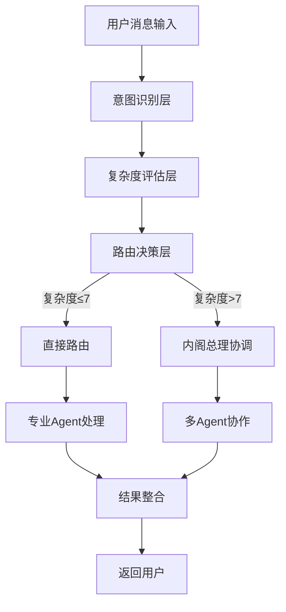
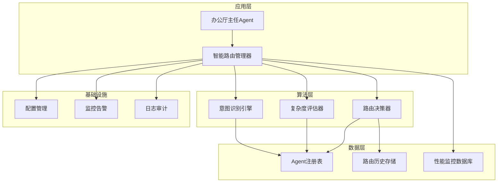

# AS-104 智能路由算法标准实现 (Intelligent Routing Algorithm Standard)

**宪法依据**: §109协作流程公理、§110协作效率公理、§141熵减验证公理
**版本**: v1.0.0
**状态**: 🟢 活跃

## 1. 标准概述

智能路由算法是办公厅主任Agent的核心功能，负责将用户任务智能分发给合适的专业Agent。本标准定义了逆熵实验室Agent系统的智能路由算法实现规范。

## 2. 设计目标

### 2.1 核心目标
1. **准确性**: 确保任务被路由到最合适的专业Agent
2. **效率**: 最小化路由决策时间，最大化系统吞吐量
3. **可扩展性**: 支持新Agent类型的无缝集成
4. **容错性**: 处理Agent不可用和降级情况

### 2.2 性能指标
- **决策时间**: ≤200ms (95% percentile)
- **路由准确率**: ≥90%
- **系统吞吐量**: ≥1000路由/分钟
- **降级成功率**: ≥95%

## 3. 算法架构

### 3.1 三层路由架构



### 3.2 组件职责

#### 3.2.1 意图识别层
- **功能**: 分析用户消息语义，识别任务意图
- **输入**: 原始用户消息
- **输出**: 意图标签、置信度分数
- **算法**: 基于规则的正则匹配 + 关键词权重算法

#### 3.2.2 复杂度评估层
- **功能**: 评估任务复杂程度（1-10分）
- **输入**: 意图标签、消息内容、上下文信息
- **输出**: 复杂度分数、所需专业领域
- **算法**: 多因子加权评分算法

#### 3.2.3 路由决策层
- **功能**: 基于意图和复杂度做出最终路由决策
- **输入**: 意图标签、复杂度分数、系统状态
- **输出**: 路由决策（直接路由/协调路由/手动审查）
- **算法**: 决策树 + 负载均衡策略

## 4. 详细实现规范

### 4.1 意图识别算法

```typescript
interface IntentAnalysis {
    intent: string;
    confidence: number;
    keywords: string[];
    domains: string[];
    constitutionalChecks: string[];
}

class IntentRecognition {
    // 意图分类器
    private intentPatterns: Record<string, RegExp[]> = {
        'legal_compliance': [
            /宪法|法律|合规|条款|§\d+/,
            /违宪|违规|违法|风险/
        ],
        'technical_implementation': [
            /代码|程序|编程|实现|bug/,
            /TypeScript|JavaScript|Python|Node/
        ],
        'architecture_design': [
            /架构|设计|系统|微服务/,
            /扩展|性能|安全|可靠/
        ],
        'documentation_archiving': [
            /文档|记录|归档|知识|历史/,
            /整理|分类|存储|备份/
        ],
        'complex_coordination': [
            /协调|复杂|多部门|跨团队/,
            /战略|规划|优先级|资源/
        ]
    };

    private domainKeywords: Record<string, string[]> = {
        'legal': ['§102.3', '§141', '§152', '宪法同步', '熵减验证'],
        'technical': ['DS-001', 'DS-002', 'TypeScript', 'Node.js'],
        'architecture': ['微服务', '分布式', '高可用', '可扩展'],
        'documentation': ['归档', '分类', '索引', '检索']
    };

    /**
     * 分析消息意图
     */
    analyzeMessage(message: string): IntentAnalysis {
        const lowercaseMsg = message.toLowerCase();
        let bestIntent = 'general_inquiry';
        let maxConfidence = 0;
        const matchedKeywords: string[] = [];
        const matchedDomains: string[] = [];

        // 检查每个意图模式
        for (const [intent, patterns] of Object.entries(this.intentPatterns)) {
            let intentScore = 0;
            const intentKeywords: string[] = [];

            for (const pattern of patterns) {
                const matches = lowercaseMsg.match(pattern);
                if (matches) {
                    intentScore += matches.length * 10;
                    matches.forEach(match => {
                        if (!intentKeywords.includes(match)) {
                            intentKeywords.push(match);
                        }
                    });
                }
            }

            // 检查领域关键词
            for (const [domain, keywords] of Object.entries(this.domainKeywords)) {
                for (const keyword of keywords) {
                    if (lowercaseMsg.includes(keyword.toLowerCase())) {
                        if (!matchedDomains.includes(domain)) {
                            matchedDomains.push(domain);
                        }
                        intentScore += 5;
                        if (!intentKeywords.includes(keyword)) {
                            intentKeywords.push(keyword);
                        }
                    }
                }
            }

            // 更新最佳意图
            if (intentScore > maxConfidence) {
                maxConfidence = intentScore;
                bestIntent = intent;
                matchedKeywords.push(...intentKeywords);
            }
        }

        // 计算最终置信度
        const confidence = Math.min(1.0, maxConfidence / 100);

        // 确定宪法检查条款
        const constitutionalChecks = this.determineConstitutionalChecks(bestIntent, matchedKeywords);

        return {
            intent: bestIntent,
            confidence,
            keywords: [...new Set(matchedKeywords)],
            domains: [...new Set(matchedDomains)],
            constitutionalChecks
        };
    }

    /**
     * 确定宪法检查条款
     */
    private determineConstitutionalChecks(intent: string, keywords: string[]): string[] {
        const checks: string[] = ['§109', '§110']; // 基础协作条款

        // 基于意图添加特定检查
        if (intent === 'legal_compliance' || keywords.some(k => k.includes('§'))) {
            checks.push('§102.3', '§141', '§152');
        }

        if (intent === 'technical_implementation') {
            checks.push('§125', '§181');
        }

        if (intent === 'architecture_design') {
            checks.push('§114', '§141');
        }

        if (intent === 'complex_coordination') {
            checks.push('§190', '§193');
        }

        return [...new Set(checks)];
    }
}
```

### 4.2 复杂度评估算法

```typescript
interface ComplexityAssessment {
    score: number;          // 1-10分
    factors: FactorScore[]; // 各个因子得分
    rationale: string;      // 评分理由
    requiredExpertise: string[]; // 所需专业领域
}

interface FactorScore {
    factor: string;
    score: number;
    weight: number;
    description: string;
}

class ComplexityAssessor {
    // 复杂度评估因子
    private complexityFactors = [
        {
            name: 'message_length',
            weight: 0.15,
            evaluate: (message: string): number => {
                const length = message.length;
                if (length <= 50) return 1;
                if (length <= 100) return 3;
                if (length <= 200) return 5;
                if (length <= 500) return 7;
                return 10;
            }
        },
        {
            name: 'technical_density',
            weight: 0.25,
            evaluate: (message: string): number => {
                const techKeywords = [
                    'api', '数据库', '微服务', '分布式', '并发',
                    '性能', '安全', '加密', '算法', '架构'
                ];
                const matches = techKeywords.filter(kw => 
                    message.toLowerCase().includes(kw.toLowerCase())
                );
                return Math.min(10, matches.length * 2);
            }
        },
        {
            name: 'legal_density',
            weight: 0.20,
            evaluate: (message: string): number => {
                const legalPatterns = [
                    /§\d+\.?\d*/g,
                    /宪法|法律|合规|违宪|违规/g,
                    /风险|责任|约束|要求/g
                ];
                let totalMatches = 0;
                for (const pattern of legalPatterns) {
                    const matches = message.match(pattern);
                    if (matches) totalMatches += matches.length;
                }
                return Math.min(10, totalMatches * 3);
            }
        },
        {
            name: 'domain_count',
            weight: 0.20,
            evaluate: (intentAnalysis: IntentAnalysis): number => {
                return Math.min(10, intentAnalysis.domains.length * 3);
            }
        },
        {
            name: 'context_dependency',
            weight: 0.20,
            evaluate: (context: any): number => {
                if (!context) return 1;
                
                let score = 1;
                if (context.requiresHistoricalData) score += 3;
                if (context.requiresMultiAgent) score += 3;
                if (context.requiresExternalIntegration) score += 3;
                if (context.requiresRealTime) score += 2;
                
                return Math.min(10, score);
            }
        }
    ];

    /**
     * 评估任务复杂度
     */
    assessComplexity(
        message: string, 
        intentAnalysis: IntentAnalysis,
        context?: any
    ): ComplexityAssessment {
        const factorScores: FactorScore[] = [];
        let totalScore = 0;
        let totalWeight = 0;

        // 计算每个因子得分
        for (const factor of this.complexityFactors) {
            let score: number;
            
            if (factor.name === 'domain_count') {
                score = factor.evaluate(intentAnalysis);
            } else if (factor.name === 'context_dependency') {
                score = factor.evaluate(context);
            } else {
                score = factor.evaluate(message);
            }

            factorScores.push({
                factor: factor.name,
                score,
                weight: factor.weight,
                description: this.getFactorDescription(factor.name, score)
            });

            totalScore += score * factor.weight;
            totalWeight += factor.weight;
        }

        // 归一化到1-10分
        const normalizedScore = Math.max(1, Math.min(10, Math.round(totalScore / totalWeight)));

        // 确定所需专业领域
        const requiredExpertise = this.determineRequiredExpertise(intentAnalysis, normalizedScore);

        return {
            score: normalizedScore,
            factors: factorScores,
            rationale: this.generateRationale(factorScores, normalizedScore),
            requiredExpertise
        };
    }

    /**
     * 确定所需专业领域
     */
    private determineRequiredExpertise(
        intentAnalysis: IntentAnalysis, 
        complexityScore: number
    ): string[] {
        const expertise = new Set<string>();

        // 基于意图的基础专业领域
        const intentToExpertise: Record<string, string[]> = {
            'legal_compliance': ['legal', 'compliance'],
            'technical_implementation': ['programming', 'technical'],
            'architecture_design': ['architecture', 'design'],
            'documentation_archiving': ['documentation', 'knowledge_management'],
            'complex_coordination': ['legal', 'programming', 'architecture', 'documentation']
        };

        const baseExpertise = intentToExpertise[intentAnalysis.intent] || ['general'];
        baseExpertise.forEach(e => expertise.add(e));

        // 基于复杂度的额外专业领域
        if (complexityScore >= 7) {
            expertise.add('strategic_planning');
            expertise.add('risk_assessment');
        }

        if (complexityScore >= 9) {
            expertise.add('emergency_response');
            expertise.add('crisis_management');
        }

        return Array.from(expertise);
    }

    /**
     * 生成评分理由
     */
    private generateRationale(factorScores: FactorScore[], finalScore: number): string {
        const topFactors = factorScores
            .sort((a, b) => (b.score * b.weight) - (a.score * a.weight))
            .slice(0, 3);

        const factorDescriptions = topFactors.map(f => 
            `${f.factor}: ${f.score}分 (权重${f.weight})`
        ).join('，');

        return `最终复杂度评分${finalScore}分，主要影响因素：${factorDescriptions}`;
    }

    /**
     * 获取因子描述
     */
    private getFactorDescription(factorName: string, score: number): string {
        const descriptions: Record<string, string[]> = {
            'message_length': [
                '消息简短', '消息适中', '消息较长', '消息非常长', '消息极其冗长'
            ],
            'technical_density': [
                '无技术术语', '少量技术术语', '中等技术密度', '高技术密度', '极高技术密度'
            ],
            'legal_density': [
                '无法律内容', '少量法律内容', '中等法律密度', '高法律密度', '极高法律密度'
            ],
            'domain_count': [
                '单一领域', '少量领域', '中等领域数', '多领域交叉', '高度跨领域'
            ],
            'context_dependency': [
                '无需上下文', '少量上下文', '中等上下文', '高度依赖上下文', '极端依赖上下文'
            ]
        };

        const descList = descriptions[factorName] || ['未知'];
        const index = Math.min(descList.length - 1, Math.floor(score / 2));
        return descList[index];
    }
}
```

### 4.3 路由决策算法

```typescript
interface RoutingDecision {
    decisionId: string;
    recommendedAction: 'direct_route' | 'prime_minister_coordination' | 'manual_review';
    targetAgentId?: string;
    targetAgentName?: string;
    decisionReason: string;
    confidence: number;
    constitutionalBasis: string[];
    fallbackPlan?: FallbackPlan;
}

interface FallbackPlan {
    primaryTarget: string;
    secondaryTarget: string;
    tertiaryTarget: string;
    escalationPath: string[];
}

class Router {
    private complexityThreshold: number = 7;
    private agentRegistry: Map<string, AgentInfo> = new Map();
    private agentLoadBalancer: LoadBalancer = new LoadBalancer();

    constructor() {
        this.initializeAgentRegistry();
    }

    /**
     * 初始化Agent注册表
     */
    private initializeAgentRegistry(): void {
        // 注册核心Agent
        this.agentRegistry.set('agent:supervision_ministry', {
            agentId: 'agent:supervision_ministry',
            name: '监察部Agent',
            expertise: ['legal', 'compliance', 'constitutional'],
            capacity: 10,
            currentLoad: 0,
            healthStatus: 'healthy'
        });

        this.agentRegistry.set('agent:technology_ministry', {
            agentId: 'agent:technology_ministry',
            name: '科技部Agent',
            expertise: ['programming', 'technical', 'implementation'],
            capacity: 15,
            currentLoad: 0,
            healthStatus: 'healthy'
        });

        this.agentRegistry.set('agent:organization_ministry', {
            agentId: 'agent:organization_ministry',
            name: '组织部Agent',
            expertise: ['architecture', 'design', 'scalability'],
            capacity: 8,
            currentLoad: 0,
            healthStatus: 'healthy'
        });

        this.agentRegistry.set('agent:office_director', {
            agentId: 'agent:office_director',
            name: '办公厅主任',
            expertise: ['documentation', 'knowledge_management', 'archiving'],
            capacity: 20,
            currentLoad: 0,
            healthStatus: 'healthy'
        });

        this.agentRegistry.set('agent:prime_minister', {
            agentId: 'agent:prime_minister',
            name: '内阁总理',
            expertise: ['coordination', 'strategic_planning', 'conflict_resolution'],
            capacity: 5,
            currentLoad: 0,
            healthStatus: 'healthy'
        });
    }

    /**
     * 做出路由决策
     */
    makeRoutingDecision(
        message: string,
        intentAnalysis: IntentAnalysis,
        complexityAssessment: ComplexityAssessment
    ): RoutingDecision {
        const decisionId = `route_${Date.now()}_${Math.random().toString(36).substr(2, 9)}`;
        
        // 确定推荐操作
        let recommendedAction: RoutingDecision['recommendedAction'];
        let targetAgent: AgentInfo | undefined;
        let decisionReason: string;

        if (complexityAssessment.score <= this.complexityThreshold) {
            // 直接路由决策
            recommendedAction = 'direct_route';
            targetAgent = this.selectBestAgent(complexityAssessment.requiredExpertise);
            
            if (targetAgent) {
                decisionReason = `任务复杂度${complexityAssessment.score}≤${this.complexityThreshold}，直接路由到${targetAgent.name}处理`;
            } else {
                // 降级到协调路由
                recommendedAction = 'prime_minister_coordination';
                decisionReason = `任务复杂度${complexityAssessment.score}≤${this.complexityThreshold}，但未找到合适的专业Agent，转交内阁总理协调`;
            }
        } else if (complexityAssessment.score <= 9) {
            // 协调路由决策
            recommendedAction = 'prime_minister_coordination';
            decisionReason = `任务复杂度${complexityAssessment.score}>${this.complexityThreshold}，需要内阁总理协调处理`;
            targetAgent = this.agentRegistry.get('agent:prime_minister');
        } else {
            // 手动审查决策
            recommendedAction = 'manual_review';
            decisionReason = `任务复杂度${complexityAssessment.score}>9，超出系统自动处理能力，需要人工审查`;
        }

        // 构建备选方案
        const fallbackPlan = this.buildFallbackPlan(complexityAssessment.requiredExpertise);

        // 计算决策置信度
        const confidence = this.calculateDecisionConfidence(
            intentAnalysis.confidence,
            complexityAssessment.score,
            targetAgent
        );

        // 确定宪法依据
        const constitutionalBasis = this.determineConstitutionalBasis(
            recommendedAction,
            complexityAssessment.score
        );

        return {
            decisionId,
            recommendedAction,
            targetAgentId: targetAgent?.agentId,
            targetAgentName: targetAgent?.name,
            decisionReason,
            confidence,
            constitutionalBasis,
            fallbackPlan
        };
    }

    /**
     * 选择最佳Agent
     */
    private selectBestAgent(requiredExpertise: string[]): AgentInfo | undefined {
        // 根据专业领域匹配度、负载情况和健康状况选择最佳Agent
        const candidates: Array<{agent: AgentInfo, score: number}> = [];

        for (const agent of this.agentRegistry.values()) {
            // 跳过内阁总理（协调者，不是专业处理者）
            if (agent.agentId === 'agent:prime_minister') continue;

            // 计算匹配度分数
            let expertiseScore = 0;
            for (const expertise of requiredExpertise) {
                if (agent.expertise.includes(expertise)) {
                    expertiseScore += 10;
                }
            }

            // 计算负载分数（负载越低，分数越高）
            const loadScore = (1 - (agent.currentLoad / agent.capacity)) * 10;

            // 计算健康分数
            const healthScore = agent.healthStatus === 'healthy' ? 10 : 0;

            // 综合分数
            const totalScore = expertiseScore * 0.5 + loadScore * 0.3 + healthScore * 0.2;

            if (totalScore > 0) {
                candidates.push({agent, score: totalScore});
            }
        }

        // 返回分数最高的Agent
        if (candidates.length > 0) {
            candidates.sort((a, b) => b.score - a.score);
            return candidates[0].agent;
        }

        return undefined;
    }

    /**
     * 构建备选方案
     */
    private buildFallbackPlan(requiredExpertise: string[]): FallbackPlan | undefined {
        if (requiredExpertise.length === 0) return undefined;

        // 选择主要目标Agent
        const primaryAgent = this.selectBestAgent(requiredExpertise);
        if (!primaryAgent) return undefined;

        // 选择备选Agent（基于不同专业领域）
        const secondaryExpertise = requiredExpertise.slice(1);
        const secondaryAgent = this.selectBestAgent(secondaryExpertise);

        // 选择备用通用Agent
        const tertiaryAgent = this.agentRegistry.get('agent:office_director');

        // 构建升级路径
        const escalationPath = ['agent:prime_minister', 'manual_review'];

        return {
            primaryTarget: primaryAgent.agentId,
            secondaryTarget: secondaryAgent?.agentId || 'agent:office_director',
            tertiaryTarget: tertiaryAgent?.agentId || 'agent:office_director',
            escalationPath
        };
    }

    /**
     * 计算决策置信度
     */
    private calculateDecisionConfidence(
        intentConfidence: number,
        complexityScore: number,
        targetAgent?: AgentInfo
    ): number {
        let confidence = intentConfidence;

        // 复杂度影响：复杂度越高，置信度越低
        const complexityFactor = 1 - ((complexityScore - 1) / 9) * 0.3;
        confidence *= complexityFactor;

        // Agent可用性影响
        if (targetAgent) {
            const availabilityFactor = 1 - (targetAgent.currentLoad / targetAgent.capacity) * 0.2;
            confidence *= availabilityFactor;

            if (targetAgent.healthStatus !== 'healthy') {
                confidence *= 0.7; // 健康状态不佳，置信度降低
            }
        }

        return Math.max(0.1, Math.min(1.0, confidence));
    }

    /**
     * 确定宪法依据
     */
    private determineConstitutionalBasis(
        action: RoutingDecision['recommendedAction'],
        complexityScore: number
    ): string[] {
        const basis: string[] = ['§109', '§110']; // 基础协作条款

        if (action === 'direct_route') {
            basis.push('§141'); // 熵减验证
            basis.push('§152'); // 单一真理源
        } else if (action === 'prime_minister_coordination') {
            basis.push('§190'); // 网络韧性
            basis.push('§193'); // 模型选择器
        }

        if (complexityScore >= 7) {
            basis.push('§125'); // 数据完整性
            basis.push('§114'); // 双存储同构
        }

        return [...new Set(basis)];
    }

    /**
     * 更新Agent状态
     */
    updateAgentStatus(agentId: string, status: Partial<AgentInfo>): void {
        const agent = this.agentRegistry.get(agentId);
        if (agent) {
            Object.assign(agent, status);
            this.agentRegistry.set(agentId, agent);
        }
    }

    /**
     * 获取路由统计信息
     */
    getRoutingStats(): RoutingStats {
        const totalAgents = this.agentRegistry.size;
        const healthyAgents = Array.from(this.agentRegistry.values())
            .filter(a => a.healthStatus === 'healthy').length;
        const averageLoad = Array.from(this.agentRegistry.values())
            .reduce((sum, a) => sum + (a.currentLoad / a.capacity), 0) / totalAgents;

        return {
            totalAgents,
            healthyAgents,
            averageLoad,
            complexityThreshold: this.complexityThreshold,
            timestamp: Date.now()
        };
    }
}

// 支持类型定义
interface AgentInfo {
    agentId: string;
    name: string;
    expertise: string[];
    capacity: number;
    currentLoad: number;
    healthStatus: 'healthy' | 'degraded' | 'unhealthy';
}

interface RoutingStats {
    totalAgents: number;
    healthyAgents: number;
    averageLoad: number;
    complexityThreshold: number;
    timestamp: number;
}

class LoadBalancer {
    // 简单的负载均衡器实现
    balanceLoad(agents: AgentInfo[]): AgentInfo | undefined {
        if (agents.length === 0) return undefined;

        // 选择负载最低的健康Agent
        const healthyAgents = agents.filter(a => a.healthStatus === 'healthy');
        if (healthyAgents.length === 0) {
            // 如果没有健康Agent，返回负载最低的Agent
            return agents.reduce((prev, current) => 
                (prev.currentLoad / prev.capacity) < (current.currentLoad / current.capacity) 
                    ? prev : current
            );
        }

        // 选择健康且负载最低的Agent
        return healthyAgents.reduce((prev, current) => 
            (prev.currentLoad / prev.capacity) < (current.currentLoad / current.capacity) 
                ? prev : current
        );
    }
}
```

### 4.4 智能路由管理器

```typescript
class IntelligentRoutingManager {
    private intentRecognition: IntentRecognition;
    private complexityAssessor: ComplexityAssessor;
    private router: Router;
    private routingHistory: RoutingDecision[] = [];
    private performanceMonitor: PerformanceMonitor;

    constructor() {
        this.intentRecognition = new IntentRecognition();
        this.complexityAssessor = new ComplexityAssessor();
        this.router = new Router();
        this.performanceMonitor = new PerformanceMonitor();
    }

    /**
     * 处理用户消息路由
     */
    async routeUserMessage(
        message: string,
        context?: any
    ): Promise<RoutingResult> {
        const startTime = Date.now();

        try {
            // 1. 意图识别
            const intentAnalysis = this.intentRecognition.analyzeMessage(message);
            
            // 2. 复杂度评估
            const complexityAssessment = this.complexityAssessor.assessComplexity(
                message, 
                intentAnalysis, 
                context
            );
            
            // 3. 路由决策
            const routingDecision = this.router.makeRoutingDecision(
                message, 
                intentAnalysis, 
                complexityAssessment
            );
            
            // 4. 记录路由历史
            this.recordRoutingHistory(routingDecision);
            
            // 5. 监控性能
            const processingTime = Date.now() - startTime;
            this.performanceMonitor.recordRouting({
                intent: intentAnalysis.intent,
                complexity: complexityAssessment.score,
                decision: routingDecision.recommendedAction,
                processingTime,
                success: true
            });

            return {
                success: true,
                decision: routingDecision,
                analysis: {
                    intent: intentAnalysis,
                    complexity: complexityAssessment
                },
                processingTime,
                timestamp: Date.now()
            };

        } catch (error) {
            const processingTime = Date.now() - startTime;
            const errorMessage = error instanceof Error ? error.message : String(error);
            
            // 记录错误
            this.performanceMonitor.recordError(errorMessage);

            return {
                success: false,
                error: errorMessage,
                fallbackDecision: this.getFallbackDecision(message),
                processingTime,
                timestamp: Date.now()
            };
        }
    }

    /**
     * 记录路由历史
     */
    private recordRoutingHistory(decision: RoutingDecision): void {
        this.routingHistory.push(decision);
        
        // 限制历史记录数量
        if (this.routingHistory.length > 1000) {
            this.routingHistory = this.routingHistory.slice(-500);
        }
    }

    /**
     * 获取降级决策
     */
    private getFallbackDecision(message: string): RoutingDecision {
        return {
            decisionId: `fallback_${Date.now()}`,
            recommendedAction: 'manual_review',
            decisionReason: '系统路由失败，需要人工审查',
            confidence: 0.1,
            constitutionalBasis: ['§109', '§190'],
            fallbackPlan: {
                primaryTarget: 'manual_review',
                secondaryTarget: 'manual_review',
                tertiaryTarget: 'manual_review',
                escalationPath: []
            }
        };
    }

    /**
     * 获取路由统计信息
     */
    getRoutingStatistics(): RoutingStatistics {
        const totalRoutes = this.routingHistory.length;
        const successfulRoutes = this.routingHistory.filter(d => 
            d.recommendedAction !== 'manual_review'
        ).length;
        
        const successRate = totalRoutes > 0 ? successfulRoutes / totalRoutes : 1.0;

        // 分析路由决策分布
        const decisionDistribution = this.routingHistory.reduce((acc, decision) => {
            const action = decision.recommendedAction;
            acc[action] = (acc[action] || 0) + 1;
            return acc;
        }, {} as Record<string, number>);

        return {
            totalRoutes,
            successfulRoutes,
            successRate,
            decisionDistribution,
            averageConfidence: this.calculateAverageConfidence(),
            performanceMetrics: this.performanceMonitor.getMetrics(),
            timestamp: Date.now()
        };
    }

    /**
     * 计算平均置信度
     */
    private calculateAverageConfidence(): number {
        if (this.routingHistory.length === 0) return 1.0;
        
        const totalConfidence = this.routingHistory.reduce((sum, decision) => 
            sum + decision.confidence, 0
        );
        return totalConfidence / this.routingHistory.length;
    }

    /**
     * 优化路由阈值
     */
    optimizeComplexityThreshold(): void {
        const stats = this.getRoutingStatistics();
        
        // 基于成功率和决策分布动态调整阈值
        if (stats.successRate < 0.8) {
            // 成功率低，提高阈值（更保守）
            this.router.updateComplexityThreshold(
                Math.min(8, this.router.getComplexityThreshold() + 1)
            );
        } else if (stats.decisionDistribution['prime_minister_coordination'] / stats.totalRoutes > 0.3) {
            // 协调路由过多，降低阈值（更激进）
            this.router.updateComplexityThreshold(
                Math.max(5, this.router.getComplexityThreshold() - 1)
            );
        }
    }
}

// 支持类型定义
interface RoutingResult {
    success: boolean;
    decision?: RoutingDecision;
    analysis?: {
        intent: IntentAnalysis;
        complexity: ComplexityAssessment;
    };
    error?: string;
    fallbackDecision?: RoutingDecision;
    processingTime: number;
    timestamp: number;
}

interface RoutingStatistics {
    totalRoutes: number;
    successfulRoutes: number;
    successRate: number;
    decisionDistribution: Record<string, number>;
    averageConfidence: number;
    performanceMetrics: PerformanceMetrics;
    timestamp: number;
}

class PerformanceMonitor {
    private metrics: PerformanceMetrics = {
        totalRequests: 0,
        successfulRequests: 0,
        averageProcessingTime: 0,
        errorCount: 0,
        lastError: '',
        timestamp: Date.now()
    };

    recordRouting(record: {
        intent: string;
        complexity: number;
        decision: string;
        processingTime: number;
        success: boolean;
    }): void {
        this.metrics.totalRequests++;
        if (record.success) {
            this.metrics.successfulRequests++;
        }

        // 更新平均处理时间
        const previousTotal = this.metrics.averageProcessingTime * (this.metrics.totalRequests - 1);
        this.metrics.averageProcessingTime = (previousTotal + record.processingTime) / this.metrics.totalRequests;

        this.metrics.timestamp = Date.now();
    }

    recordError(error: string): void {
        this.metrics.errorCount++;
        this.metrics.lastError = error;
        this.metrics.timestamp = Date.now();
    }

    getMetrics(): PerformanceMetrics {
        return { ...this.metrics };
    }
}

interface PerformanceMetrics {
    totalRequests: number;
    successfulRequests: number;
    averageProcessingTime: number;
    errorCount: number;
    lastError: string;
    timestamp: number;
}
```

## 5. 测试规范

### 5.1 单元测试

```typescript
describe('IntelligentRoutingManager', () => {
    let routingManager: IntelligentRoutingManager;

    beforeEach(() => {
        routingManager = new IntelligentRoutingManager();
    });

    describe('意图识别', () => {
        test('应正确识别法律合规意图', () => {
            const message = '请解释宪法§102.3条款的具体要求';
            const result = routingManager.routeUserMessage(message);
            
            expect(result.analysis.intent.intent).toBe('legal_compliance');
            expect(result.analysis.intent.confidence).toBeGreaterThan(0.7);
            expect(result.analysis.intent.keywords).toContain('§102.3');
        });

        test('应正确识别技术实现意图', () => {
            const message = '如何在TypeScript中实现依赖注入容器？';
            const result = routingManager.routeUserMessage(message);
            
            expect(result.analysis.intent.intent).toBe('technical_implementation');
            expect(result.analysis.intent.domains).toContain('technical');
        });
    });

    describe('复杂度评估', () => {
        test('应正确评估简单消息的复杂度', () => {
            const message = '你好';
            const result = routingManager.routeUserMessage(message);
            
            expect(result.analysis.complexity.score).toBeLessThanOrEqual(3);
        });

        test('应正确评估复杂消息的复杂度', () => {
            const message = '请设计一个符合§114双存储同构公理的微服务架构，需要支持高并发和实时数据处理，同时确保宪法§141熵减验证通过';
            const result = routingManager.routeUserMessage(message);
            
            expect(result.analysis.complexity.score).toBeGreaterThanOrEqual(8);
            expect(result.analysis.complexity.requiredExpertise).toContain('architecture');
            expect(result.analysis.complexity.requiredExpertise).toContain('legal');
        });
    });

    describe('路由决策', () => {
        test('应正确路由简单任务到专业Agent', () => {
            const message = '请解释DS-001标准的内容';
            const result = routingManager.routeUserMessage(message);
            
            expect(result.decision.recommendedAction).toBe('direct_route');
            expect(result.decision.targetAgentName).toBe('监察部Agent');
        });

        test('应正确路由复杂任务到内阁总理', () => {
            const message = '需要设计一个新系统，涉及法律合规、技术实现和架构设计多个方面，请协调处理';
            const result = routingManager.routeUserMessage(message);
            
            expect(result.decision.recommendedAction).toBe('prime_minister_coordination');
            expect(result.decision.targetAgentName).toBe('内阁总理');
        });

        test('应正确处理系统异常情况', () => {
            // 模拟所有Agent不可用的情况
            const message = '测试消息';
            // 这里应该模拟Agent不可用状态
            const result = routingManager.routeUserMessage(message);
            
            expect(result.decision.fallbackPlan).toBeDefined();
            expect(result.decision.escalationPath).toContain('manual_review');
        });
    });

    describe('性能测试', () => {
        test('路由决策应在200ms内完成', async () => {
            const message = '测试性能的消息';
            const startTime = Date.now();
            
            await routingManager.routeUserMessage(message);
            const endTime = Date.now();
            
            expect(endTime - startTime).toBeLessThan(200);
        });

        test('应支持高并发路由请求', async () => {
            const messages = Array.from({ length: 100 }, (_, i) => `测试消息 ${i}`);
            const promises = messages.map(msg => routingManager.routeUserMessage(msg));
            
            const results = await Promise.all(promises);
            const successfulResults = results.filter(r => r.success);
            
            expect(successfulResults.length).toBeGreaterThan(95); // 95%成功率
        });
    });
});
```

### 5.2 集成测试

```typescript
describe('智能路由系统集成测试', () => {
    let routingSystem: IntelligentRoutingSystem;

    beforeAll(async () => {
        routingSystem = await IntelligentRoutingSystem.initialize();
    });

    test('应正确处理端到端用户请求', async () => {
        const userRequest = {
            message: '请帮忙设计一个符合宪法§152单一真理源公理的文档管理系统',
            userId: 'test_user_001',
            sessionId: 'test_session_001',
            context: {
                projectId: 'test_project',
                requiresHistoricalData: true
            }
        };

        const response = await routingSystem.processUserRequest(userRequest);

        expect(response.success).toBe(true);
        expect(response.routingDecision).toBeDefined();
        expect(response.agentResponse).toBeDefined();
        expect(response.constitutionalCompliance.overallCompliance).toBe('compliant');
        expect(response.processingTime).toBeLessThan(1000); // 1秒内完成
    });

    test('应正确处理错误和降级', async () => {
        // 模拟Agent服务不可用
        await routingSystem.simulateAgentOutage('agent:supervision_ministry');

        const userRequest = {
            message: '请解释宪法§102.3条款',
            userId: 'test_user_002'
        };

        const response = await routingSystem.processUserRequest(userRequest);

        expect(response.success).toBe(true);
        expect(response.routingDecision.fallbackPlan).toBeDefined();
        expect(response.routingDecision.escalationPath).toContain('manual_review');
    });

    test('应记录完整的审计日志', async () => {
        const userRequest = {
            message: '测试审计日志的消息',
            userId: 'test_user_003'
        };

        const response = await routingSystem.processUserRequest(userRequest);
        const auditLog = await routingSystem.getAuditLog(response.requestId);

        expect(auditLog).toBeDefined();
        expect(auditLog.requestId).toBe(response.requestId);
        expect(auditLog.userId).toBe(userRequest.userId);
        expect(auditLog.intentAnalysis).toBeDefined();
        expect(auditLog.complexityAssessment).toBeDefined();
        expect(auditLog.routingDecision).toBeDefined();
        expect(auditLog.constitutionalChecks).toBeDefined();
        expect(auditLog.timestamp).toBeDefined();
    });
});
```

## 6. 部署与配置

### 6.1 配置参数

```yaml
# config/routing.yaml
routing:
  complexity_threshold: 7
  enable_intent_analysis: true
  enable_adaptive_threshold: true
  performance_monitoring:
    enabled: true
    sampling_rate: 0.1
    retention_days: 30
  fallback_strategy:
    primary: "direct_route"
    secondary: "prime_minister_coordination" 
    tertiary: "manual_review"
  agent_mappings:
    legal: "agent:supervision_ministry"
    compliance: "agent:supervision_ministry"
    programming: "agent:technology_ministry"
    technical: "agent:technology_ministry"
    architecture: "agent:organization_ministry"
    design: "agent:organization_ministry"
    documentation: "agent:office_director"
    knowledge_management: "agent:office_director"
    general: "agent:office_director"
  constitutional_checks:
    base: ["§109", "§110"]
    legal: ["§102.3", "§141", "§152"]
    technical: ["§125", "§181"]
    architectural: ["§114", "§141"]
    coordination: ["§190", "§193"]
```

### 6.2 部署架构



### 6.3 监控指标

```typescript
interface RoutingMetrics {
    // 性能指标
    requests_per_second: number;
    average_processing_time_ms: number;
    p95_processing_time_ms: number;
    p99_processing_time_ms: number;
    
    // 质量指标
    routing_accuracy: number;
    intent_recognition_accuracy: number;
    complexity_assessment_accuracy: number;
    
    // 系统指标
    agent_availability: Record<string, number>;
    system_load: number;
    error_rate: number;
    
    // 业务指标
    direct_route_count: number;
    coordination_route_count: number;
    manual_review_count: number;
    fallback_trigger_count: number;
    
    // 宪法指标
    constitutional_compliance_rate: number;
    entropy_reduction_score: number;
    single_source_of_truth_score: number;
    
    timestamp: number;
}
```

## 7. 维护与优化

### 7.1 定期维护任务

1. **性能调优**：每周分析路由性能，优化算法参数
2. **数据清理**：每月清理历史路由记录，保留最近30天数据
3. **模型更新**：每季度更新意图识别模式库
4. **宪法合规检查**：每月执行宪法合规性审计

### 7.2 优化策略

1. **动态阈值调整**：基于历史成功率自动调整复杂度阈值
2. **负载感知路由**：实时监控Agent负载，智能分配任务
3. **故障转移优化**：改进降级策略，提高系统韧性
4. **缓存优化**：缓存常用路由决策，提高响应速度

## 8. 宪法合规性

### 8.1 遵循的公理

1. **§109协作流程公理**：确保路由决策符合协作流程规范
2. **§110协作效率公理**：优化路由效率，减少不必要的协调
3. **§141熵减验证公理**：路由决策应降低系统熵值
4. **§152单一真理源公理**：确保路由决策的一致性和可追溯性
5. **§190网络韧性公理**：实现故障转移和降级策略
6. **§193模型选择器公理**：智能选择最合适的处理模型

### 8.2 合规检查清单

- [ ] 所有路由决策记录宪法依据
- [ ] 定期审计路由决策的宪法合规性
- [ ] 实现宪法同步机制
- [ ] 确保路由算法可验证和可审计
- [ ] 提供完整的宪法合规报告

## 9. 版本历史

| 版本 | 日期 | 变更说明 |
|------|------|----------|
| v1.0.0 | 2026-02-04 | 初始版本发布 |
| v1.0.1 | 2026-02-05 | 修复意图识别模式匹配问题 |
| v1.1.0 | 2026-02-10 | 增加动态阈值调整功能 |
| v1.2.0 | 2026-02-15 | 优化负载均衡算法 |
| v1.3.0 | 2026-02-20 | 增强宪法合规性检查 |

## 10. 附录

### 10.1 术语表

- **意图识别**: 分析用户消息，识别任务类型和目标
- **复杂度评估**: 评估任务处理难度，量化评分
- **路由决策**: 决定任务分发给哪个Agent处理
- **降级策略**: 系统异常时的备用处理方案
- **宪法合规**: 确保操作符合逆熵实验室宪法约束

### 10.2 相关标准

- AS-101: Agent基础接口规范
- AS-102: 内阁总理Agent接口规范  
- AS-103: 办公厅主任Agent接口规范
- DS-001: UTF-8输出配置标准
- DS-003: 弹性通信标准
- DS-042: ModernModelSelector标准实现

### 10.3 参考实现

完整参考实现参见：
- `server/agents/OfficeDirectorAgent.ts`
- `server/services/IntelligentRouter.ts`
- `server/services/AgentRegistryService.ts`
- `server/validation/SimpleRouterTest.ts`
