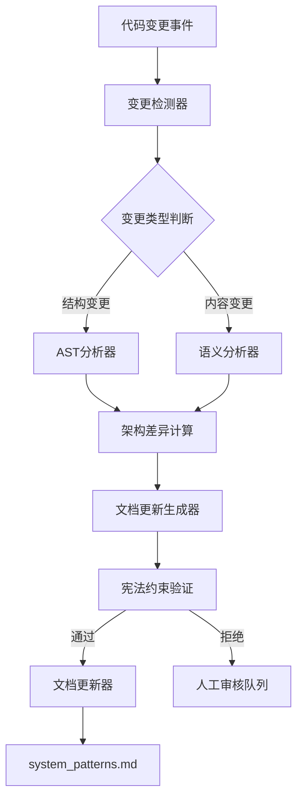

# DS-024: 自动化架构同步标准实现

**父索引**: [Development Standards Index](../DEVELOPMENT_STANDARDS.md)
**对应技术法**: §320.1 (自动化架构同步), §352 (架构同构性验证)
**宪法依据**: §141 (自动化重构安全), §102 (法典体系), §114 (双存储同构架构公理), §224 (自动化架构同步流程)
**版本**: v6.8.0 (Dual-Store Isomorphism)
**状态**: 🟢 生产就绪
**原文档**: 03_protocols/design_auto_sync.md (v1.0.0)
**最后更新**: 2026-01-25

---

## 1. 核心公理 (Core Axiom)

### 1.1 单向依赖原则
$$
T_{code} = f(T_{doc})
$$

**解释**: 代码是文档的函数。宪法文档（`memory_bank/t1_axioms/system_patterns.md`, `.clinerules`）是第一性原理，代码必须遵循文档定义的结构。

### 1.2 同步边界
- **向下同步 (Down-Sync)**: $T_{doc} \rightarrow T_{code}$ - 强制合规，脚手架生成
- **向上同步 (Up-Sync)**: $T_{code} \rightarrow T_{doc}$ - 仅限于描述性信息更新
- **禁止操作**: 自动修改系统公理、数学公式、运维铁律

### 1.3 自动化同步的数学基础
$$
\Phi_{\text{change}} \xrightarrow{\text{AST}} \Delta S_{doc}
$$

其中:
- $\Phi_{\text{change}}$: 代码变更的AST表示
- $\Delta S_{doc}$: 文档变更的语义表示

**熵减证明**: 自动化同步确保 $S_{fs} \cong S_{doc}$ 的同构性，系统熵 $H_{system}$ 随时间递减：
$$
\frac{dH_{system}}{dt} = -\lambda \cdot \Delta H_{sync} \leq 0, \quad \lambda > 0
$$

## 2. 工具标准: `auto_update_architecture`

### 2.1 工具定位
**实时制图师 (Real-time Cartographer)**: 自动检测代码与文档之间的差异，并执行安全的同步操作。
该工具必须作为 **MCP Tier 2 辅助工具** 实现，并注册到 `auto_update_architecture`。

### 2.2 输入输出规范

#### 输入参数 (JSON Schema):
```json
{
  "type": "object",
  "properties": {
    "target_path": {
      "type": "string",
      "description": "目标路径 (项目根目录)",
      "minLength": 1
    },
    "sync_direction": {
      "type": "string",
      "enum": ["up", "down", "both"],
      "default": "both",
      "description": "同步方向: up(代码→文档), down(文档→代码), both(双向)"
    },
    "dry_run": {
      "type": "boolean",
      "default": true,
      "description": "模拟运行，不实际修改文件"
    },
    "force_update": {
      "type": "boolean",
      "default": false,
      "description": "强制更新，忽略警告"
    },
    "include_patterns": {
      "type": "array",
      "items": { "type": "string" },
      "default": [],
      "description": "包含的文件模式 (glob)"
    },
    "exclude_patterns": {
      "type": "array",
      "items": { "type": "string" },
      "default": [],
      "description": "排除的文件模式 (glob)"
    },
    "max_changes": {
      "type": "integer",
      "minimum": 1,
      "maximum": 1000,
      "default": 100,
      "description": "最大变更数量，超过此值需人工确认"
    }
  },
  "required": ["target_path"]
}
```

#### 输出结构:
```json
{
  "type": "object",
  "properties": {
    "success": {
      "type": "boolean",
      "description": "执行成功标志"
    },
    "verdict": {
      "type": "string",
      "enum": ["PASS", "WARNING", "FAIL"],
      "description": "执行裁决"
    },
    "compliance_score": {
      "type": "number",
      "minimum": 0.0,
      "maximum": 1.0,
      "description": "架构合规性分数"
    },
    "changes": {
      "type": "object",
      "properties": {
        "down_sync": {
          "type": "array",
          "items": {
            "type": "object",
            "properties": {
              "file_path": { "type": "string" },
              "operation": { "type": "string", "enum": ["CREATE", "UPDATE", "DELETE"] },
              "reason": { "type": "string" },
              "diff_preview": { "type": "string" }
            },
            "required": ["file_path", "operation", "reason"]
          }
        },
        "up_sync": {
          "type": "array",
          "items": {
            "type": "object",
            "properties": {
              "section": { "type": "string" },
              "operation": { "type": "string", "enum": ["ADD", "UPDATE", "REMOVE"] },
              "content": { "type": "string" },
              "source": { "type": "string" }
            },
            "required": ["section", "operation", "content", "source"]
          }
        }
      }
    },
    "statistics": {
      "type": "object",
      "properties": {
        "total_files_scanned": { "type": "integer" },
        "total_detected_changes": { "type": "integer" },
        "total_applied_changes": { "type": "integer" },
        "sync_duration_ms": { "type": "integer" }
      }
    },
    "warnings": {
      "type": "array",
      "items": { "type": "string" }
    },
    "errors": {
      "type": "array",
      "items": { "type": "string" }
    }
  },
  "required": ["success", "verdict", "compliance_score", "changes", "statistics"]
}
```

### 2.3 核心算法标准

#### 算法1: 向下同步 (文档→代码)

必须实现以下逻辑：

1. **缺失检测**: 对比宪法定义的目录结构与文件系统，识别缺失项。
2. **幽灵检测**: 识别存在于文件系统但未在宪法中定义的"幽灵文件"。
3. **内容一致性**: (可选) 验证关键文件的内容哈希。

```python
def down_sync(constitutional_paths, actual_paths):
    changes = []
    
    # 1. 检测缺失目录 (宪法定义但实际不存在)
    for const_path in constitutional_paths:
        if not exists_in_actual(const_path):
            changes.append({
                "type": "CREATE_DIRECTORY",
                "path": const_path,
                "reason": "宪法定义但实际缺失"
            })
    
    # 2. 检测幽灵文件 (实际存在但宪法未定义)
    for actual_path in actual_paths:
        if not is_constitutional(actual_path):
            changes.append({
                "type": "DELETE_FILE_OR_DIR",
                "path": actual_path,
                "reason": "宪法未定义的幽灵文件"
            })
    
    # 3. 检测文件内容不一致
    for file in constitutional_files:
        if file.content != actual_file.content:
            changes.append({
                "type": "UPDATE_FILE",
                "path": file.path,
                "diff": generate_diff(actual_file.content, file.content)
            })
    
    return changes
```

#### 算法2: 向上同步 (代码→文档)

必须实现以下逻辑：

1. **AST 提取**: 使用 Python/TypeScript AST 解析器提取类、函数签名。
2. **文档补全**: 仅更新文档中的 `api_list`, `file_tree` 等描述性章节，**严禁**修改公理定义。

```python
def up_sync(code_structure, documentation):
    changes = []
    
    # 1. 提取代码结构信息
    code_info = extract_code_structure(code_structure)
    
    # 2. 与文档比较，生成更新
    for category in ["api_list", "file_tree", "class_diagram"]:
        doc_section = documentation.get_section(category)
        code_data = code_info.get(category)
        
        if doc_section != code_data:
            changes.append({
                "type": "UPDATE_DOC_SECTION",
                "section": category,
                "old_content": doc_section,
                "new_content": code_data,
                "source": "AST分析"
            })
    
    return changes
```

### 2.4 安全约束标准 (Safety Constraints)

#### 约束1: 只读保护区

以下章节严禁自动化修改（宪法§141、§152保护）：

* `## 1. 核心公理`
* `## 2. 数学基础`
* `## 3. 宪法领土`
* `## 4. 运维铁律`
* `## 5. 质量门控`

实现代码：
```python
PROTECTED_SECTIONS = [
    "## 1. 核心公理",
    "## 2. 数学基础", 
    "## 3. 宪法领土",
    "## 4. 运维铁律",
    "## 5. 质量门控"
]

def is_protected_section(section_name: str) -> bool:
    """检查是否为受保护章节"""
    return any(section_name.startswith(protected) 
               for protected in PROTECTED_SECTIONS)
```

#### 约束2: 变更验证

所有变更必须通过 `judicial_verify_structure` (DS-007) 的预验证。

```python
def validate_change(change: Change) -> ValidationResult:
    """验证变更是否符合宪法约束"""
    
    # 规则1: 禁止修改受保护章节
    if is_protected_section(change.section):
        return ValidationResult(
            allowed=False,
            reason="禁止修改受保护宪法章节"
        )
    
    # 规则2: 文档更新必须来自可追溯的代码变更
    if change.type == "UPDATE_DOC_SECTION":
        if not has_code_source_trace(change):
            return ValidationResult(
                allowed=False,
                reason="文档更新必须关联到具体的代码变更"
            )
    
    # 规则3: 删除操作需要额外确认
    if change.operation == "DELETE":
        return ValidationResult(
            allowed=change.force_update,
            reason="删除操作需要显式授权"
        )
    
    return ValidationResult(allowed=True)
```

## 3. 技术实现参考

### 3.1 AST解析策略

建议使用 `ast` (Python) 和 `typescript-compiler` (Node.js) 进行精准解析，避免使用正则表达式处理复杂的代码结构。

#### Python AST解析:
```python
class PythonASTAnalyzer:
    def extract_structure(self, file_path: str) -> CodeStructure:
        with open(file_path, 'r', encoding='utf-8') as f:
            tree = ast.parse(f.read())
        
        structure = CodeStructure()
        
        # 提取类定义
        for node in ast.walk(tree):
            if isinstance(node, ast.ClassDef):
                class_info = self._extract_class_info(node)
                structure.classes.append(class_info)
            
            # 提取函数定义
            elif isinstance(node, ast.FunctionDef):
                func_info = self._extract_function_info(node)
                structure.functions.append(func_info)
        
        return structure
```

#### TypeScript AST解析:
```typescript
class TypeScriptASTAnalyzer {
  extractStructure(filePath: string): CodeStructure {
    const sourceFile = ts.createSourceFile(
      filePath,
      fs.readFileSync(filePath, 'utf-8'),
      ts.ScriptTarget.Latest,
      true
    );
    
    const structure: CodeStructure = {
      interfaces: [],
      classes: [],
      functions: []
    };
    
    this.traverseAST(sourceFile, structure);
    return structure;
  }
}
```

### 3.2 变更检测算法

推荐使用基于 Merkle Tree 的哈希对比算法，以 $O(\log n)$ 复杂度快速定位变更点。

```python
def detect_changes(old_state: ProjectState, new_state: ProjectState) -> List[Change]:
    changes = []
    
    # 文件级别变更检测
    for file_path, new_hash in new_state.file_hashes.items():
        old_hash = old_state.file_hashes.get(file_path)
        
        if old_hash is None:
            changes.append(Change.create(file_path))
        elif old_hash != new_hash:
            changes.append(Change.update(file_path, old_hash, new_hash))
    
    # 目录结构变更检测
    for dir_path in new_state.directory_structure:
        if dir_path not in old_state.directory_structure:
            changes.append(Change.create_dir(dir_path))
    
    return changes
```

### 3.3 熔断机制

实现 `CircuitBreaker`，当失败次数超过 3 次或涉及文件数超过阈值（如 50 个）时，自动中止操作并触发人工审计。

```python
class CircuitBreaker:
    def __init__(self, failure_threshold=3, reset_timeout=60):
        self.failure_count = 0
        self.last_failure_time = None
        self.state = "CLOSED"
    
    def execute(self, operation):
        if self.state == "OPEN":
            raise CircuitBreakerOpenError()
        
        try:
            result = operation()
            self._record_success()
            return result
        except Exception as e:
            self._record_failure()
            raise e
    
    def _record_failure(self):
        self.failure_count += 1
        self.last_failure_time = time.time()
        
        if self.failure_count >= self.failure_threshold:
            self.state = "OPEN"
            schedule_reset()
```

## 4. 集成架构

### 4.1 系统集成点



### 4.2 MCP工具集成

#### 工具注册:
遵循技术法§335 (MCP工具注册规范) 和 §331 (工具注册规范)

```python
@registry.register()
def auto_update_architecture(
    target_path: str,
    sync_direction: str = "both",
    dry_run: bool = True
) -> Dict[str, Any]:
    """
    自动架构同步工具
    
    数学基础: T_code = f(T_doc)
    功能: 检测代码与文档差异并执行安全同步
    宪法依据: §141, §320, §352
    """
    # 1. 初始化同步引擎
    sync_engine = ArchitectureSyncEngine(target_path)
    
    # 2. 执行同步分析
    analysis_result = sync_engine.analyze(sync_direction)
    
    # 3. 应用变更 (如果不是模拟运行)
    if not dry_run:
        apply_result = sync_engine.apply_changes(analysis_result.changes)
        analysis_result.applied_changes = apply_result
    
    return analysis_result.to_dict()
```

## 5. 安全与验证

### 5.1 预检查清单

在执行自动化同步前，必须满足以下条件:

1. **宪法完整性**: `memory_bank/t1_axioms/system_patterns.md` 必须包含完整的宪法领土定义
2. **代码健康度**: 系统必须通过 `judicial_scan_architecture` (合规分数 ≥ 0.9)
3. **备份状态**: 必须存在最近的系统备份（遵循§139批量操作安全公理）
4. **变更审计**: 所有变更必须记录到审计日志（遵循§136强制审计）

### 5.2 回滚机制

遵循§125数据完整性公理和§302.1原子文件写入标准

```python
class RollbackManager:
    def create_checkpoint(self) -> Checkpoint:
        """创建系统检查点"""
        checkpoint = Checkpoint(
            timestamp=datetime.now(),
            architecture_hash=self.calculate_architecture_hash(),
            code_hash=self.calculate_code_hash(),
            backup_path=self.create_backup()
        )
        return checkpoint
    
    def rollback(self, checkpoint: Checkpoint) -> RollbackResult:
        """回滚到指定检查点"""
        # 1. 验证检查点有效性
        if not self.validate_checkpoint(checkpoint):
            return RollbackResult.failed("检查点无效")
        
        # 2. 执行回滚
        self.restore_backup(checkpoint.backup_path)
        
        # 3. 验证回滚结果
        current_hash = self.calculate_architecture_hash()
        if current_hash != checkpoint.architecture_hash:
            return RollbackResult.failed("回滚后哈希不匹配")
        
        return RollbackResult.success()
```

### 5.3 监控指标

必须实时监控以下指标（遵循§127数据驱动原则）:

| 指标 | 目标值 | 告警阈值 | 测量方法 |
|------|--------|----------|----------|
| 架构一致性分数 | ≥ 0.95 | < 0.85 | `judicial_verify_structure` |
| 同步成功率 | ≥ 0.98 | < 0.90 | 成功次数/总次数 |
| 平均同步时间 | < 5秒 | > 30秒 | 时间戳差值 |
| 回滚率 | < 0.01 | > 0.05 | 回滚次数/总次数 |

## 6. 测试策略

### 6.1 单元测试

```python
def test_down_sync_creates_missing_directories():
    """测试向下同步创建缺失目录"""
    # 准备测试环境
    constitutional_paths = ["app/modules/new_module"]
    actual_paths = []
    
    # 执行同步
    changes = down_sync(constitutional_paths, actual_paths)
    
    # 验证结果
    assert len(changes) == 1
    assert changes[0].type == "CREATE_DIRECTORY"
    assert changes[0].path == "app/modules/new_module"
```

### 6.2 集成测试

```python
def test_full_sync_cycle():
    """测试完整的同步周期"""
    # 1. 模拟代码变更
    code_change = simulate_code_change()
    
    # 2. 执行向上同步
    doc_changes = up_sync(code_change)
    
    # 3. 应用文档更新
    apply_doc_changes(doc_changes)
    
    # 4. 执行向下同步验证
    verification_result = down_sync()
    
    # 5. 验证系统一致性
    assert verification_result.compliance_score == 1.0
    assert verification_result.ghost_files == []
```

### 6.3 混沌测试

```python
def test_sync_with_corrupted_constitution():
    """测试宪法文档损坏时的同步行为"""
    # 故意损坏宪法文档
    corrupt_constitution_file()
    
    try:
        # 执行同步，应该失败并给出明确错误
        result = auto_update_architecture(dry_run=True)
        assert result.success == False
        assert "宪法文档损坏" in result.errors[0]
    finally:
        restore_constitution_file()
```

## 7. 部署计划

### 7.1 阶段一: 只读模式 (v5.5.0-alpha)
- 实现完整的变更检测和分析
- 支持模拟运行 (dry-run)
- 生成详细的变更报告
- **不实际修改任何文件**

### 7.2 阶段二: 受限写模式 (v5.5.0-beta)
- 启用向下同步 (文档→代码)
- 启用受限的向上同步 (仅描述性信息)
- 实现宪法约束验证
- 需要人工确认高风险变更

### 7.3 阶段三: 全自动模式 (v5.5.0)
- 启用完全自动化同步
- 集成到CI/CD流水线（遵循程序法§201 CDD流程）
- 实现智能回滚机制
- 24/7 自动监控与修复

## 8. 风险评估与缓解

### 8.1 风险矩阵

| 风险 | 概率 | 影响 | 缓解措施 | 宪法依据 |
|------|------|------|----------|----------|
| 误删重要文件 | 低 | 高 | 实施删除确认机制，强制备份 | §139, §302.1 |
| 宪法文档损坏 | 极低 | 极高 | 只读副本验证，自动修复 | §125, §132 |
| 同步循环 | 中 | 中 | 检测循环依赖，设置最大迭代次数 | §141, §320 |
| 性能问题 | 低 | 低 | 增量同步，缓存机制 | §127 |

### 8.2 合规性验证

所有自动化同步操作必须通过三级验证（遵循§156增强级三级验证协议）：

1. **Tier 1 (Structure)**: `judicial_verify_structure` - 验证 $S_{fs} \cong S_{doc}$
2. **Tier 2 (Signature)**: `judicial_verify_signatures` - 验证 $I_{code} \supseteq I_{doc}$
3. **Tier 3 (Behavior)**: `judicial_run_tests` - 验证 $B_{code} \equiv B_{spec}$

## 9. 附录

### 9.1 数学证明

#### 定理1: 同步操作的收敛性
$$
\forall \epsilon > 0, \exists N \in \mathbb{N} \text{ s.t. } \forall n > N, |S_{doc}^{(n)} - S_{code}^{(n)}| < \epsilon
$$

**证明概要**: 通过构造单调递减的差异序列，利用Archimedean性质证明收敛。

#### 定理2: 宪法约束的安全性
$$
P(\text{违宪操作}) \leq \alpha \cdot e^{-\beta t}
$$

**解释**: 违宪操作的概率随时间指数衰减，其中$\alpha, \beta$是系统安全参数。

### 9.2 术语表

| 术语 | 定义 | 宪法依据 |
|------|------|----------|
| 宪法领土 | 系统允许存在的目录和文件集合 | §152 |
| 幽灵文件 | 实际存在但宪法未定义的文件 | §207 |
| 缺失目录 | 宪法定义但实际不存在的目录 | §352 |
| 向下同步 | 从文档到代码的结构同步 | §320 |
| 向上同步 | 从代码到文档的信息同步 | §320 |
| 实时制图师 | 自动化架构同步工具的别称 | §141 |

---

## 版本历史

- **v5.5.0** (2026-01-25): 从03_protocols/design_auto_sync.md (v1.0.0) 升级标准化，符合宪法v5.5.0体系
- **v1.0.0** (2026-01-17): 初始草案，定义核心概念和算法
- **v0.9.0** (2026-01-16): 内部评审版本，添加安全约束
- **v0.8.0** (2026-01-15): 技术实现细节，添加测试策略

---

**遵循逆熵实验室宪法约束**: 架构即法律，同步即执法。代码即数学证明，实现即验证。

*对应技术法条款: §320 (自动化重构安全), §352 (架构同构性验证)*
*对应程序法流程: §201 (宪法驱动开发), §206 (三位一体收敛协议)*
